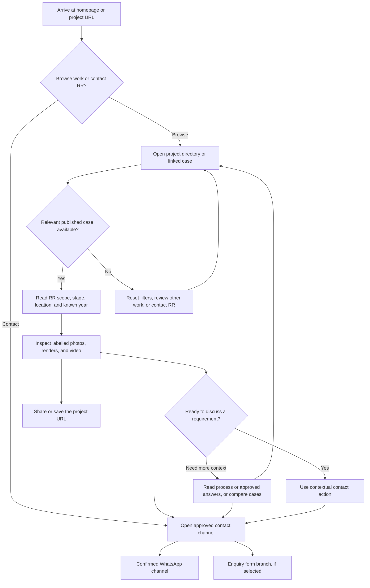
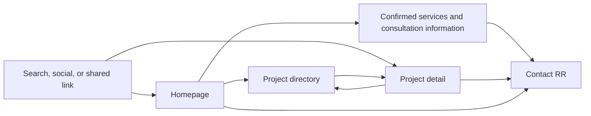
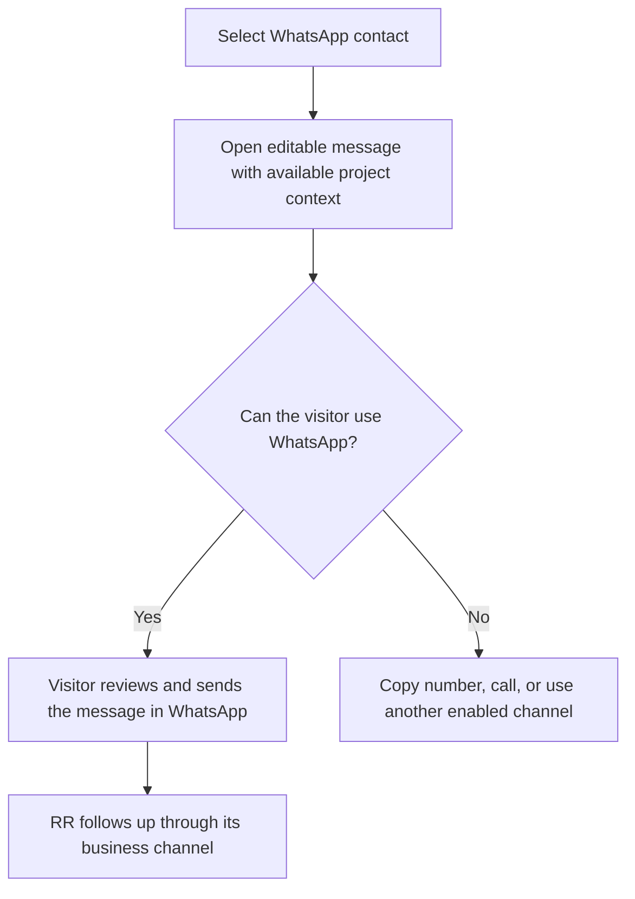
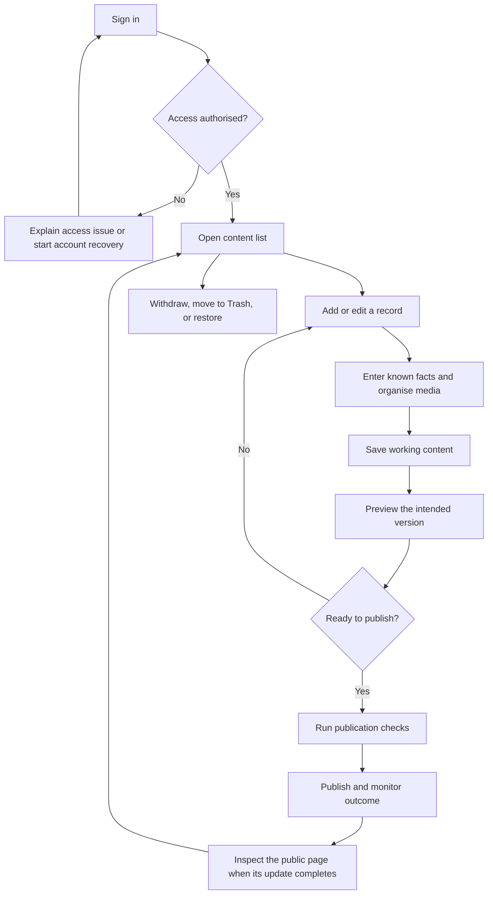
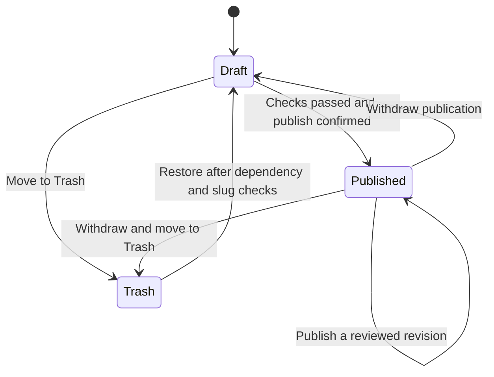
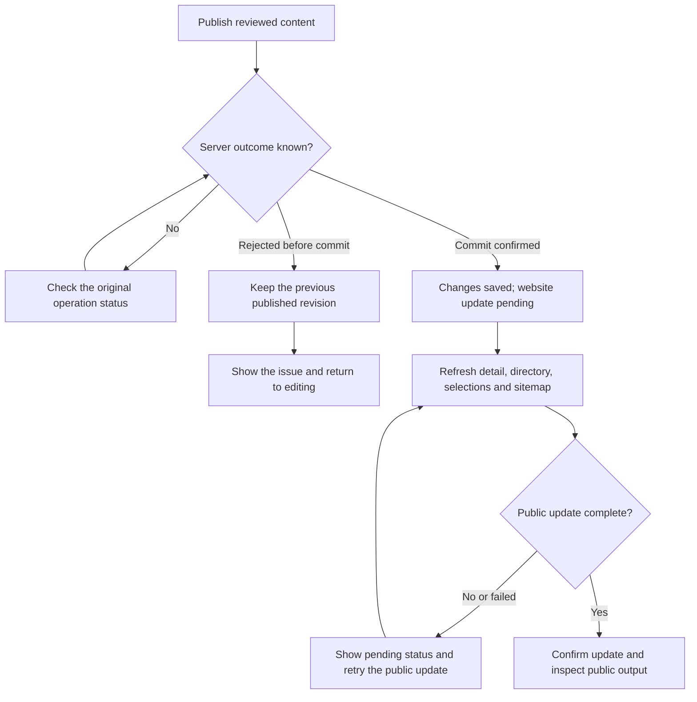
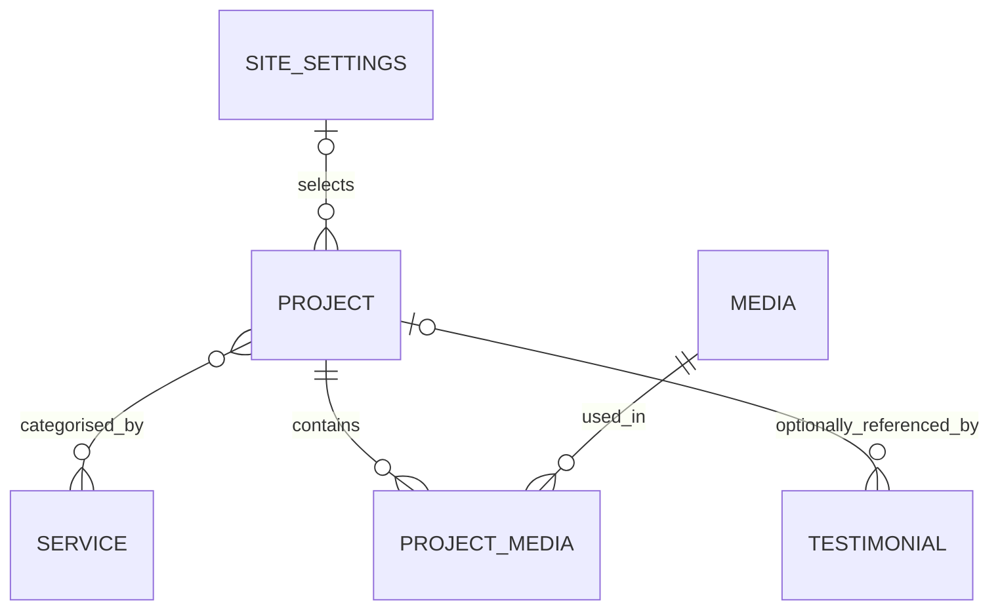
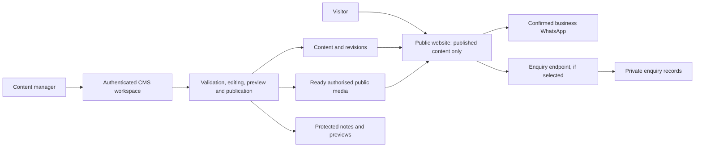

# RR Interior Construction: Final Consolidated Website Architecture

Version 1.0 | 2 October 2026 | Professional business specification

**Document status:** Final consolidated record of the current brief, research, selected colour system and proposed workflows. Open implementation and business decisions are explicitly registered below; the word Final does not imply that those decisions, publication rights or a production website have been approved.

**Scope:** Customer company-profile website and simple no-code content management. Public research snapshot: 1 October 2026, Asia/Jakarta. Latest contact and brand confirmations: Sir Vidd's current brief. No production changes, messages, deployment or new customer study occurred in preparing this consolidation.

## Document Navigation

1. [Business objective and review status](#section-1)
2. [Brand, Colour System and Theme Behaviour](#section-2)
3. [Evidence that shapes this architecture](#section-3)
4. [Customer journey and user stories](#section-4)
5. [Public pages and component purpose](#section-5)
6. [Consultation and enquiry handling](#section-6)
7. [Content management and admin journey](#section-7)
8. [Publication, withdrawal and recovery](#section-8)
9. [Content model and evidence rules](#section-9)
10. [System responsibilities and access boundaries](#section-10)
11. [CMS selection and editing constraints](#section-11)
12. [Anti-slop experience requirements](#section-12)
13. [Measurement and user validation](#section-13)
14. [Acceptance criteria before launch](#section-14)
15. [Launch readiness and handover](#section-15)
16. [Consolidated Business and Evidence Recap](#section-16)
17. [Complete Media Archive: All 244 Files](#section-17)
18. [Consolidation Review, Open Decisions and Handover](#section-18)

**Reading path:** Sections 1 and 2 define the confirmed brief and theme. Sections 3 to 15 define customer/admin behaviour and delivery requirements. Section 16 consolidates business findings. Section 17 accounts for every archived file. Section 18 records verification and unresolved decisions.

<a id="section-1"></a>

## 1. Business objective and review status

The website should help prospective customers assess RR's work through relevant project documentation, understand RR's contribution, and start a consultation. Content managers should maintain the website through structured forms without writing code.

The proposed product has three primary public destinations: the homepage, the project directory, and individual project pages. A CMS manages their content. Published project records generate the directory entries and detail pages automatically.

This consolidation applies the anti-slop core, copywriting, UI, human accessibility and mobile layout principles to the architecture and colour specification. Each component must answer a buyer question, use appropriate evidence, and define its behaviour when content is missing or an action fails. The document uses professional business English. **The public website language remains subject to D03.**

This is an architecture specification. No interface has been built, no customer usability study has been completed, and no deployment has taken place. Requirements, illustrative labels, and proposed workflows describe future behaviour. They do not establish that the existing website already supports it.

### 1.1 Confirmation ledger and decision ownership

| Item | Current value or direction | Authority and implication |
| --- | --- | --- |
| Instagram | [@rrinterior.construction](https://www.instagram.com/rrinterior.construction/) | User confirmed; use this exact destination |
| WhatsApp | **08568122119**; international **+62 856 8122 119**; [Click to Chat](https://wa.me/628568122119) | User confirmed; canonical digits are **628568122119**. No contact message or delivery test was performed |
| Brand primary | **#70360A**, supplied as #70360a | User confirmed; hexadecimal case does not change the colour |
| Brand secondary | **#FFFCEF**, supplied as #fffcef | User confirmed; retain the exact cream value |
| Portfolio direction | Dark, cinematic, immersive, gallery/showreel focused | User confirmed intent; genuine documented work provides the content |
| Business-information direction | Light, editorial, clean, premium; appropriate to About, Services and Contact | User confirmed intent; readable information supports a consultation decision |
| Document language | Professional business English | User requested; this does not decide the public website language |
| Derived colour roles and interaction shades | Section 2 | Selected here in response to the request to determine the theme; these are design decisions rather than scraped facts |
| Page-default theme behaviour and visual dials | Section 2 | Selected design specification; not a statement that Sir Vidd separately approved every interaction |
| Platform, public language, publishing roles and optional form | D01 to D08 below | Retain their open or partial status; do not infer approval from a confirmed phone number or palette |

The brown/cream pair is the brand core. Warm neutral shades support readability and hierarchy; semantic colours identify actual system states. The black/grey example supplied in the brief establishes the requested token structure, not replacement brand colours. All further business statements retain their source status in section 16.

### 1.2 Decisions awaiting confirmation

| ID | Decision | Working proposal for review | Consequence of another choice |
| --- | --- | --- | --- |
| D01 | Enquiry-channel scope, partly resolved | WhatsApp is confirmed and selected as the primary consultation action in this specification; WhatsApp-only versus an additional form remains open | A form adds private enquiry storage, spam controls, notifications, retention and a follow-up owner; it is not included by default |
| D02 | Content editing scope | Structured content within fixed templates | Section reordering requires a controlled block model; unrestricted layout editing is a separate page-builder scope |
| D03 | Public website language | Indonesian remains the previous working proposal | Bilingual content adds translation readiness, language-specific URLs and testing; this English document does not approve either option |
| D04 | Publishers and approval | One content manager can save, preview, and explicitly publish | Separate editors and publishers require submission, review, rejection, and permission rules |
| D05 | Platform and maintenance | Assess the existing WordPress setup against the agreed workflow | A required custom frontend may justify Payload; hosting, costs, access, and maintenance remain undecided |
| D06 | Priority customer segment | Residential and commercial customers, with priority to be agreed | Changes project selection, homepage emphasis, service context, and consultation prompts |
| D07 | Content readiness and portfolio groups | Prioritise documented site work; enable Design work or Concepts separately if selected | Design deliverables can be presented accurately without substituting for completed construction |
| D08 | Public identity and remaining contact details, partly resolved | Instagram and WhatsApp are confirmed; public name, approved logo, primary email, address/area, hours and business claims still need RR's confirmation | Confirmed contacts may be used in the brief; other identity and operational fields must not be guessed |

The confirmation ledger resolves only its listed inputs. The remaining D01 to D08 choices are working proposals, not approvals. Enquiry forms, bilingual delivery, separate approval roles and unrestricted layout editing remain conditional. Requirements below define the proposed first-release behaviour, subject to closing those specific decisions before implementation is frozen.

### 1.3 Delivery scope

| Area | Proposed first release | Optional extension requiring a decision |
| --- | --- | --- |
| Customer website | Homepage, project directory, project details, contact access, appropriate privacy information, unavailable-page handling | Separate service pages when useful content exists; Design work and Concepts under D07 |
| Content management | Projects, media, approved services, website settings; confirmed questions and testimonials when available | Enquiry inbox under D01; multiple publishing roles under D04; controlled layout blocks under D02 |
| Customer access | Public browsing and sharing without an account | A client portal would require a separate brief |
| Commercial interaction | Consultation handoff through the selected channel | Booking calendars, automatic quotations, payments, CRM, construction management, and ecommerce are outside the proposed release |

Routine no-code editing begins after the developer configures the CMS, templates, permissions, validation, and media handling. Content managers add records, not custom page code.

<a id="section-2"></a>

## 2. Brand, Colour System and Theme Behaviour

### 2.1 Design read and purpose

Reading this as an interior/construction company-profile website for prospective residential and commercial customers, with a warm editorial business presentation and a dark portfolio presentation. Its purpose is to help a customer assess RR's actual contribution through credible, labelled case documentation and then start a consultation.

| Design dial | Selected level | Purpose and constraint |
| --- | --- | --- |
| ENERGY | 2 | A clear RR introduction and one relevant work image establish the focal point; brown/cream provides recognition without decorative effects competing with the work |
| RHYTHM | 2 | Keep navigation and case metadata consistent; vary introduction, selected work, service explanation and process composition according to their content |
| MOTION | 2 | Use restrained gallery changes, modal transitions and immediate state feedback. Content remains available without animation; reduced motion removes nonessential movement |

These levels are inferred from the supplied direction. Cinematic means well-presented genuine media, a quiet dark canvas and controlled inspection, not a promise of a showreel that has not been assembled. Select a suitable typeface and official logo master during design review. Keep body text readable and avoid an oversized type treatment that hides project context. Use structural spacing, restrained component corners and functional elevation for menus/dialogs; project photography supplies visual character. No background grid, generic decorative illustration, glow, repeated glass panels or template animation is required by this brief.

### 2.2 Requested theme reference

```text
BRAND
├── Primary                 #70360A
└── Secondary               #FFFCEF

LIGHT MODE
├── Background              #FFFCEF
├── Background Alt          #F5EEDF
├── Surface                 #FFFFFF
├── Surface Hover           #F0E3D0
├── Text Primary            #261B13
├── Text Secondary          #554437
├── Text Muted              #65564A
├── Border                  #E4D7C5   decorative only
└── Strong Border           #806A55   essential controls

DARK MODE
├── Background              #130F0B
├── Background Deep         #0B0806
├── Background Alt          #261E17
├── Surface                 #1D1712
├── Surface Hover           #31271D
├── Text Primary            #FFFCEF
├── Text Secondary          #D6C5B0
├── Text Muted              #BCAA95
├── Border                  #473729   decorative only
└── Strong Border           #A68C70   essential controls

PRIMARY CTA
Light Mode
├── Background              #70360A
├── Text                    #FFFCEF
├── Hover Background        #5D2C08
└── Active Background       #472107

Dark Mode
├── Background              #FFFCEF
├── Text                    #70360A
├── Hover Background        #F3E4C8
└── Active Background       #E6CFA5

SEMANTIC TEXT
                          Light       Dark
├── Success               #27613A     #A8D8AF
├── Warning               #7A430C     #F1CA8C
├── Error                 #A32927     #F5B0A9
└── Info                  #275979     #AFD1E8
```

Background Deep is a dark-only recessed gallery/media surround. Surface Hover is an alias of the validated secondary-hover role. Border is a separator, not a sufficient input boundary or focus indicator. The semantic values above are text roles with matching background/outline roles in the complete table below. They do not authorise arbitrary bright fills or white text on every status colour.

### 2.3 Complete component tokens

The following role system is platform-neutral. Keep the two brand constants separate from component-primary, whose fill intentionally inverts in dark mode. Role aliases can share a value without becoming additional brand colours.

| Role | Light | Dark | Intended use |
| --- | --- | --- | --- |
| `canvas` | `#FFFCEF` | `#130F0B` | Page background |
| `background-subtle` | `#F5EEDF` | `#261E17` | Quiet section/container background |
| `surface` | `#FFFFFF` | `#1D1712` | Cards, menus and forms |
| `surface-raised` | `#FFFFFF` | `#31271D` | Dialogs and raised panels |
| `surface-inverse` | `#70360A` | `#FFFCEF` | Explicit inverse panel; dedicated foreground only |
| `foreground` | `#261B13` | `#FFFCEF` | Headings and body |
| `foreground-secondary` | `#554437` | `#D6C5B0` | Supporting body information |
| `foreground-muted` | `#65564A` | `#BCAA95` | Metadata, help and placeholder text |
| `foreground-inverse` | `#FFFCEF` | `#70360A` | Text on the inverse panel |
| `border-subtle` | `#E4D7C5` | `#473729` | Decorative separators only |
| `border-strong` | `#806A55` | `#A68C70` | Essential control boundaries and informative outlines |
| `border-hover` | `#70360A` | `#D6C5B0` | Emphasised/selected boundary; include non-colour cue |
| `link` | `#70360A` | `#FFFCEF` | Underlined text link |
| `link-hover` | `#5D2C08` | `#F3E4C8` | Underlined link on hover |
| `link-active` | `#472107` | `#E6CFA5` | Underlined link while pressed |
| `link-visited` | `#6F4C35` | `#DAC19D` | Visited link, still underlined |
| `primary` | `#70360A` | `#FFFCEF` | Primary consultation/action fill |
| `primary-foreground` | `#FFFCEF` | `#70360A` | Primary label in default, hover and active states |
| `primary-hover` | `#5D2C08` | `#F3E4C8` | Primary fill on hover |
| `primary-active` | `#472107` | `#E6CFA5` | Primary fill while pressed |
| `secondary` | `#FFFCEF` | `#1D1712` | Secondary button fill |
| `secondary-foreground` | `#70360A` | `#FFFCEF` | Secondary label across its states |
| `secondary-border` | `#70360A` | `#A68C70` | Secondary button outline |
| `secondary-hover` | `#F0E3D0` | `#31271D` | Secondary fill on hover |
| `secondary-active` | `#E4CFB0` | `#423221` | Secondary fill while pressed |
| `focus-ring` | `#70360A` | `#FFFCEF` | External focus on general solid containers |
| `focus-inverse` | `#FFFCEF` | `#70360A` | External focus/meaningful border on inverse panels |
| `input` | `#FFFFFF` | `#1D1712` | Input field fill |
| `input-foreground` | `#261B13` | `#FFFCEF` | Entered value |
| `input-placeholder` | `#65564A` | `#BCAA95` | Placeholder, not a replacement for its label |
| `input-border` | `#806A55` | `#A68C70` | Default identifiable input boundary |
| `selection` | `#E4CFB0` | `#70360A` | Text-selection highlight only |
| `selection-foreground` | `#261B13` | `#FFFCEF` | Selected text |
| `disabled` | `#EBE2D4` | `#30261F` | Genuinely inactive control fill |
| `disabled-foreground` | `#65564A` | `#BCAA95` | Readable inactive control label |
| `disabled-border` | `#CFC0AD` | `#6E5743` | Inactive outline, not an enabled boundary |
| `skeleton` | `#EBE2D4` | `#30261F` | Decorative loading placeholder; also show status text |
| `overlay` | `rgba(0, 0, 0, 0.65)` | `rgba(0, 0, 0, 0.65)` | Modal backdrop only; no text directly on this alpha value |
| `media-caption` | `#130F0B` | `#130F0B` | Solid gallery caption/control plate |
| `media-caption-foreground` | `#FFFCEF` | `#FFFCEF` | Caption and control label on that plate |
| `danger` | `#A32927` | `#F5B0A9` | Confirmed destructive action fill, where applicable |
| `danger-foreground` | `#FFFCEF` | `#341C1A` | Destructive action label across its states |
| `danger-hover` | `#8B2220` | `#F9C7C2` | Destructive action hover |
| `danger-active` | `#701918` | `#E39189` | Destructive action pressed state |
| `success-background` | `#EEF6EE` | `#19291E` | Success message tint |
| `success-foreground` | `#27613A` | `#A8D8AF` | Success text |
| `success-border` | `#427850` | `#73AC7B` | Success icon/outline |
| `warning-background` | `#FFF3DD` | `#332615` | Warning message tint |
| `warning-foreground` | `#7A430C` | `#F1CA8C` | Warning text |
| `warning-border` | `#9B651F` | `#C49B58` | Warning icon/outline |
| `error-background` | `#FBEDEC` | `#341C1A` | Error message tint |
| `error-foreground` | `#A32927` | `#F5B0A9` | Error text |
| `error-border` | `#B8423E` | `#D88279` | Error icon/outline |
| `info-background` | `#EDF4F9` | `#182934` | Information message tint |
| `info-foreground` | `#275979` | `#AFD1E8` | Information text |
| `info-border` | `#3E7295` | `#7CACCC` | Information icon/outline |
| `background-deep`, dark only | Not used | `#0B0806` | Recessed media surround; dark foregrounds and control roles only |

### 2.4 Pairing and component rules

1. General headings, body, supporting text, metadata and links may use their matching theme foreground on `canvas`, `background-subtle`, `surface`, `surface-raised`, `secondary-hover`, `secondary-active`, and the four semantic message tints. Dark mode also permits the independently checked Background Deep. This complete allowlist is tested, including the darkest light-mode pressed container and the lightest dark-mode pressed container. Do not reuse a general foreground on primary/danger fills or an inverse panel; use that area's designated foreground.
2. Primary labels use `primary-foreground` in all three fill states; secondary labels use `secondary-foreground`. Active, hover and focus states preserve the tested pairing. Visited/inline links retain an underline; link identity does not rely on colour alone.
3. `border-strong` and `input-border` identify enabled controls. `border-subtle` is decoration only and must not identify an input, focus, selected state or status. A truly inactive control may use the disabled tokens; never use them for ordinary helper text or an enabled control.
4. Use an external **3 CSS px focus ring with 3 CSS px offset** on a tested solid container. The gap inherits its actual surrounding surface. This is a chosen design treatment, not a claim that WCAG AA mandates those exact dimensions. Use `focus-inverse` on inverse panels. Do not remove focus or let a container clip/obscure it. [W3C Focus Appearance](https://www.w3.org/WAI/WCAG22/Understanding/focus-appearance.html).
5. Inverse panels use `foreground-inverse` and `focus-inverse` for text and meaningful outlines. General muted text and ordinary input boundaries are not approved directly on inverse panels; place a form/control on its validated solid surface instead.
6. Gallery caption/control plates use solid `#130F0B` with `#FFFCEF` text in either page theme. Controls on that plate use the dark component scheme, including `#FFFCEF` focus. A light-theme brown focus ring is not suitable on that plate. Text directly on photography, gradients, translucent scrims or video requires testing the actual composited background; no such pairing is certified by this solid-colour matrix. The modal overlay token is a backdrop, not a text surface.
7. Semantic messages combine their tint, text and icon/outline. Include an understandable label, icon and recovery action where appropriate; never communicate success, warning, error, work stage or publishing outcome by hue alone. [W3C Use of Color](https://www.w3.org/WAI/WCAG22/Understanding/use-of-color.html).
8. Changing between hover and default colours does not itself need a 3:1 ratio. Essential information in each state must contrast with its adjacent background. These roles deliberately exceed that requirement for tested control fills, boundaries and focus. Decorative rules are excluded only when they carry no necessary information. [W3C Non-text Contrast](https://www.w3.org/WAI/WCAG22/Understanding/non-text-contrast.html).

### 2.5 Contrast method and evidence

For sRGB, convert each 8-bit channel to c = value/255. Linearise with c/12.92 when c ≤ 0.04045, otherwise ((c + 0.055)/1.055)^2.4. Relative luminance is 0.2126R + 0.7152G + 0.0722B. Ratio = (lighter luminance + 0.05)/(darker luminance + 0.05). Decisions compare the **unrounded ratio**; two-decimal values below are display only. The current breakpoint is 0.04045. [W3C WCAG 2.2 luminance definition](https://www.w3.org/TR/WCAG22/#dfn-relative-luminance).

Normal text requires ≥4.5:1. Large text has the ≥3:1 exception only at ≥24 CSS px regular or ≥18⅔ CSS px bold; ordinary 18px text is not automatically large. Essential non-text UI information requires ≥3:1 against adjacent colours. These role mappings target normal-text contrast rather than depending on the large-text exception. [W3C Contrast Minimum](https://www.w3.org/WAI/WCAG22/Understanding/contrast-minimum.html), [W3C Non-text Contrast](https://www.w3.org/WAI/WCAG22/Understanding/non-text-contrast.html).

The base matrix contains **454 pair checks: 440 required pairings, all passing**. The primary author independently recomputed every base ratio and verified the pass/fail comparisons, finding zero discrepancies. An additional **22 dark Background Deep checks** pass: seven normal-text/link roles and fifteen meaningful UI/fill roles. The resulting calculation covers **476 pairs, including 462 required pairings**, with zero required failures. The remaining 14 are deliberately excluded: two decorative separators and twelve prohibited dark-mode brown mappings. Lowest general-text ratios are 4.642733249297344:1 light and 5.452020493733523:1 dark. Lowest general essential-boundary ratios are 3.3695200878183598:1 light and 3.863844172995607:1 dark.

| Theme | Foreground / background role | Display ratio | Result and purpose |
| --- | --- | --- | --- |
| Light | `foreground-muted` / `secondary-active` | 4.64:1 | Normal text: lowest allowed general-text pairing |
| Light | `primary-foreground` / `primary` | 9.20:1 | Normal text: primary button label |
| Light | `primary-foreground` / `primary-hover` | 11.16:1 | Normal text: primary button label |
| Light | `primary-foreground` / `primary-active` | 13.72:1 | Normal text: primary button label |
| Light | `secondary-foreground` / `secondary-active` | 6.24:1 | Normal text: secondary pressed label |
| Light | `border-strong` / `secondary-active` | 3.37:1 | Essential UI: lowest general boundary pairing |
| Light | `focus-ring` / `canvas` | 9.20:1 | Essential UI: page focus ring |
| Light | `focus-ring` / `secondary-active` | 6.24:1 | Essential UI: focus on pressed container |
| Light | `focus-inverse` / `surface-inverse` | 9.20:1 | Essential UI: inverse-panel focus |
| Light | `success-foreground` / `success-background` | 6.67:1 | Normal text: semantic label |
| Light | `success-border` / `success-background` | 4.72:1 | Essential UI: semantic outline/icon |
| Light | `warning-foreground` / `warning-background` | 7.25:1 | Normal text: semantic label |
| Light | `warning-border` / `warning-background` | 4.47:1 | Essential UI: semantic outline/icon |
| Light | `error-foreground` / `error-background` | 6.35:1 | Normal text: semantic label |
| Light | `error-border` / `error-background` | 4.74:1 | Essential UI: semantic outline/icon |
| Light | `info-foreground` / `info-background` | 6.77:1 | Normal text: semantic label |
| Light | `info-border` / `info-background` | 4.67:1 | Essential UI: semantic outline/icon |
| Dark | `foreground-muted` / `secondary-active` | 5.45:1 | Normal text: lowest allowed general-text pairing |
| Dark | `primary-foreground` / `primary` | 9.20:1 | Normal text: primary button label |
| Dark | `primary-foreground` / `primary-hover` | 7.54:1 | Normal text: primary button label |
| Dark | `primary-foreground` / `primary-active` | 6.23:1 | Normal text: primary button label |
| Dark | `secondary-foreground` / `secondary-active` | 11.94:1 | Normal text: secondary pressed label |
| Dark | `border-strong` / `secondary-active` | 3.86:1 | Essential UI: lowest general boundary pairing |
| Dark | `focus-ring` / `canvas` | 18.55:1 | Essential UI: page focus ring |
| Dark | `focus-ring` / `secondary-active` | 11.94:1 | Essential UI: focus on pressed container |
| Dark | `focus-inverse` / `surface-inverse` | 9.20:1 | Essential UI: inverse-panel focus |
| Dark | `success-foreground` / `success-background` | 9.52:1 | Normal text: semantic label |
| Dark | `success-border` / `success-background` | 5.75:1 | Essential UI: semantic outline/icon |
| Dark | `warning-foreground` / `warning-background` | 9.50:1 | Normal text: semantic label |
| Dark | `warning-border` / `warning-background` | 5.72:1 | Essential UI: semantic outline/icon |
| Dark | `error-foreground` / `error-background` | 8.79:1 | Normal text: semantic label |
| Dark | `error-border` / `error-background` | 5.57:1 | Essential UI: semantic outline/icon |
| Dark | `info-foreground` / `info-background` | 9.33:1 | Normal text: semantic label |
| Dark | `info-border` / `info-background` | 6.14:1 | Essential UI: semantic outline/icon |
| Dark | `#70360A` / `canvas` | 2.02:1 | Rejected pairing: prohibited dark-theme text/essential boundary |
| Light | `border-subtle` / `canvas` | 1.38:1 | Below 3:1; decorative separator only, not an essential boundary |
| Dark | `border-subtle` / `canvas` | 1.68:1 | Below 3:1; decorative separator only, not an essential boundary |
| Dark | `media-caption-foreground` / `media-caption` | 18.55:1 | Normal text and essential focus on solid media plate |

Background Deep checks have minimum normal-text contrast **8.86:1** and minimum required UI/fill contrast **6.28:1**. The dark-only surround uses the dark role scheme even on a light page; do not place light-theme brown text or focus directly on it.

**Prohibited dark usage:** `#70360A` on `#130F0B` is 2.017528100257:1. It fails both normal text and essential UI contrast. Keep exact brown for the dark cream CTA label, selected-text background with cream foreground, or an explicitly tested surface; not dark body text, links, focus or control borders.

The **base** machine-readable tokens, allowlist, 454 raw ratios, thresholds and deliberate excluded pairings are in [rrinterior-final-colour-contrast.json](/Users/piddooow/.codex/.chatgpt-projects/g-p-6abe216c93b08191a7800bb0aef2d21b/research/rrinterior-final-colour-contrast.json). The added dark-only `background-deep` token, its 22 tested foreground/UI roles and raw ratios are saved in the contrast extension within [rrinterior-final-architecture-check.json](/Users/piddooow/.codex/.chatgpt-projects/g-p-6abe216c93b08191a7800bb0aef2d21b/research/rrinterior-final-architecture-check.json); the combined count is 476/462 as stated above. These checks validate solid-colour pairs only. Rendered typography, image composites, focus area/visibility, interaction states and full accessibility still need implementation testing; no website compliance or delivery pass is claimed here.


### 2.6 Theme selection and page defaults

This is the selected interaction design, not an observed feature of the existing website. Offer three understandable choices: **Page default**, **Light**, and **Dark**. Do not use an unexplained sun/moon icon as the only accessible label.

| Context | Page default | Reason |
| --- | --- | --- |
| Homepage introduction and business content | Light | Readable editorial presentation of identity, services, profile, process and contact |
| Homepage selected-work section | Dark portfolio section | Gives the genuine work a focused gallery setting, with locally correct dark controls |
| Project directory and detail pages | Dark | Supports inspection of portfolio photos, video and documentation |
| Gallery modal / video viewing | Inherit the current page theme; media caption/control plates use their explicit dark scheme | Prevent mismatched controls and keep readable labels around varying media |
| About / Services / Contact | Light sections on the homepage | Separate pages are not required; if later enabled, their Page default is light |
| Privacy information and general unavailable page | Light | Prioritise clear reading and recovery actions |
| Admin workspace | Light operator default | Prioritise forms, lists and status; if the chosen CMS supplies a theme option, configure and test its supported modes independently |

1. Page default uses the context table on a first visit. It does not follow operating-system colour preference; no System option is part of this selected interaction.
2. Choosing Light or Dark overrides public page defaults and the homepage portfolio section. Preserve that selection across navigation and later visits using a theme-preference value only. If storage is unavailable, retain the current choice in session memory without breaking browsing. Do not store contact details in the preference.
3. Choosing Page default clears the manual override and restores contextual defaults. Display the selected choice and actual page mode understandably.
4. Apply the resolved theme before the first visible page paint where the chosen platform allows it. Keep content readable during initial resolution; implement and test transitions across homepage sections and deep links.
5. Header, menus, filters, forms, dialogs, footer and unavailable/error/loading states use the mode of their actual container. The solid media caption plate has its own explicit dark scheme. Never rely on a global text colour inside an inverse surface.
6. Manual theme changes preserve the URL, selected filters, gallery item, focus and typed form content. A theme control changes presentation, not project classification or publication state.
7. Public preference does not silently alter the CMS interface or authenticated workflows. The selected CMS determines whether a separate supported admin theme preference is appropriate.
8. The theme selector is an implementation requirement under this selected design. Test all three choices; it is not described as already working.

### 2.7 Component application and media direction

| Component or state | Colour treatment | Behaviour and content purpose |
| --- | --- | --- |
| Primary consultation CTA | Light brown/cream, dark cream/brown; validated hover and active fills | Name the consultation action; use the confirmed WhatsApp destination and case context where available |
| Secondary project/navigation action | Secondary fill, foreground and strong outline in the current theme | Distinct from the consultation emphasis; avoid invented disabled destinations |
| Selected filter or media item | Validated boundary with text/check/selection state | Selection is understandable without colour alone; use semantic selected-state exposure |
| Forms and admin fields | Input foreground, placeholder, fill and strong border | Persistent label, help and field-level errors. A placeholder is not the only instruction |
| Saved / accepted / pending / failed | Actual outcome text plus the appropriate semantic roles | Success only follows known completion; uncertainty and refresh-pending states retain the recovery contracts |
| Destructive action | Danger fill and its dedicated foreground | Confirm the named target and dependencies; routine removal remains recoverable Trash |
| Disabled action | Disabled role set only when actually unavailable | Explain the reason nearby; do not use disabled/muted styling to hide an enabled action |
| Keyboard focus | 3px external ring, 3px offset, local tested container | Visible, unclipped and unobscured; dedicated inverse/dark-plate rules prevent colour mismatch |
| Photograph or video caption | Solid dark label plate with cream text; or separately tested actual composite | No assumption that cream on every photograph passes contrast |
| Gallery / showreel | Dark surrounding canvas, genuine mapped media, visible controls and labels | Play on request; retain original composition and visible Render/Site documentation context |

Use suitable originals rather than enlarged thumbnails for finishing-detail inspection. Do not filter images so heavily that they misrepresent material colour or finish. Keep before/after pairs tied to the same space and usable as two labelled images. A showreel is optional until RR supplies cleared, mapped clips and editorial context; the unknown 12-second MP4 does not automatically become a portfolio hero video. Avoid autoplay audio and heavy autoplay backgrounds. Media labels, scope, year and stage remain factual text in either mode.

### 2.8 Theme acceptance additions

| ID | Future implementation scenario | Required outcome |
| --- | --- | --- |
| QC25 | First visit under Page default; homepage, directory, detail and business sections | The context table is applied, with correct local foreground, boundary and focus roles |
| QC26 | Select Light, Dark and Page default; navigate and return; storage unavailable | Each mode works completely; preference behaviour matches section 2.6; no content, filter or input loss |
| QC27 | Inspect CTA, links, fields, semantic messages, borders and focus in default/hover/active states | Allowed pairings are maintained with measured rendered/composite contrast; decorative borders never identify essential controls |
| QC28 | Open gallery, captions, an inverse surface and a video in both public themes | Controls and focus use the correct local scheme; labels remain readable over tested backgrounds |
| QC29 | Reduced motion, slow media and missing approved showreel | Core evidence remains available; motion is suppressed appropriately; no fabricated clip or autoplay audio |

These supplement QC01 to QC24 and QC03a. They are future tests, not completed click-through results.


<a id="section-3"></a>

## 3. Evidence that shapes this architecture

### 3.1 RR-specific findings

| Research finding | Architecture response |
| --- | --- |
| The current website uses RR Design & Build, while the supplied Instagram account is @rrinterior.construction | Confirm the public identity under D08 and use it consistently across pages and contact channels |
| Six named project visuals on the website appear to be renders; their delivery status and RR's role remain unresolved | Keep these candidates in Draft until scope, stage, provenance, and publication rights are confirmed |
| A Facebook post describes a Tangerang home renovation as a 2024 project with Completed status | Treat it as a candidate case study based on a business claim; confirm the media mapping, scope, stage, and permissions |
| The research archive contains 244 media files, including decorative assets, variants, templates, and unidentified material | Select files by project. The file count is not a project count or a customer count |
| Public service information covers design and cost planning, civil works, MEP, interiors, and furniture | Use confirmed service categories; a listed service does not imply a documented case exists for that category |
| The full address, basis for the 500+ client claim, survey fees, warranties, and response times remain unconfirmed | Omit unsupported commercial promises and numerical trust claims |

The observations and their source status are recorded in the [RR information file](/Users/piddooow/.codex/.chatgpt-projects/g-p-6abe216c93b08191a7800bb0aef2d21b/information-rrinterior.construction.md). The public sources include the [RR website](https://rrinteriorconstruction.com/) and [Tangerang renovation post](https://www.facebook.com/rrinterior.cons/posts/pfbid0ZUX4g85KmJ71Lrw4c5p3aFqNoVYdPpCtDWLKKamYaRaKbi4W4gQZMEFmozPEHL6fl). Owner confirmation is editorial evidence, not an independent audit of construction quality.

### 3.2 Research basis

The proposed customer journey is a hypothesis informed by desk research. Customer interviews and task-based testing are still needed to validate what buyers prioritise and where they encounter difficulty. [NN/G: Journey Mapping 101](https://www.nngroup.com/articles/journey-mapping-101/), [NN/G: Researching Journey Maps](https://www.nngroup.com/articles/research-journey-mapping/).

The comparison research found project context and process/finish documentation at [BintoroBuild](https://bintorobuild.co.id/project/project-100-renovasi-rumah-ibu-yn-depok/), project metadata and related work at [Airmas Asri](https://www.airmasasri.com/project-details/south-gate), and a needs-and-design narrative at [DELUTION](https://delution.co.id/projects/residential/treei-house/). These observations inform information requirements. They do not demonstrate higher conversion, proven usability, or RR's pricing.

The supporting research remains available: [customer research](/Users/piddooow/.codex/.chatgpt-projects/g-p-6abe216c93b08191a7800bb0aef2d21b/research/rrinterior-architecture-customer-research.md), [CMS assessment](/Users/piddooow/.codex/.chatgpt-projects/g-p-6abe216c93b08191a7800bb0aef2d21b/research/rrinterior-architecture-cms-research.md), and [content model and QC research](/Users/piddooow/.codex/.chatgpt-projects/g-p-6abe216c93b08191a7800bb0aef2d21b/research/rrinterior-architecture-content-and-qc.md). The main brief takes precedence over broader research options: a separate Archive menu and complex evidence databases are not part of the proposed release.

<a id="section-4"></a>

## 4. Customer journey and user stories

### 4.1 Journey to a consultation

The working scenario is a buyer assessing whether RR's documented experience fits a renovation, interior, or commercial-space requirement. The priority segment remains open under D06. The questions below are research hypotheses, not quotations from interviewed RR customers.

| Stage | Buyer question | Website support | Observable outcome |
| --- | --- | --- | --- |
| Arrival | Is this the business I found, and does it cover my need? | Consistent identity, confirmed service scope and area, direct access to projects | The buyer reaches relevant work or contact information |
| Selection | Has RR worked on a similar space or requirement? | Project summaries with work type, general location, stage, and documentation category | The buyer selects a relevant case or understands the available evidence |
| Assessment | Is this a built result or a design, and what did RR deliver? | Scope statement, visible media labels, contextual documentation, and confirmed stage | The buyer can distinguish RR's contribution, renders, progress, and results |
| Comparison | Can I review this with my family or team? | Stable project URLs, useful link previews, related work, and return navigation | The buyer can share and revisit the same case |
| Preparation | What happens next, and what information should I prepare? | Confirmed consultation process and relevant, approved questions | The buyer understands the next step without assuming a quotation or booking |
| Contact | Can I discuss a similar requirement? | Confirmed contextual WhatsApp handoff; an additional form only if selected under D01 | A contact handoff occurs or an enquiry is stored, according to the channel |
| Follow-up | Who will respond and through which channel? | Expectations consistent with RR's confirmed operating process | RR handles the conversation; the website makes no unconfirmed response-time promise |

### 4.2 Customer user stories

| ID | Customer need | Acceptance condition |
| --- | --- | --- |
| C01 | Recognise RR from an external link | Identity, services, area, and contact details are consistent |
| C02 | Find relevant work | Useful categories reflect actual published records; empty results have a recovery action |
| C03 | Distinguish documentation from visualisation | Renders and design animation have visible labels independent of project stage |
| C04 | Understand RR's role | The case identifies RR's assignment and work scope without implying responsibility for the entire property |
| C05 | Inspect the evidence | Photos can be examined, media has context, and a failed asset does not remove the project narrative |
| C06 | Understand consultation requirements | Process information and approved answers avoid unsupported fees, timing, or warranties |
| C07 | Contact RR with project context | The selected project can accompany an editable message or form submission |
| C08 | Share and return | A stable URL opens the same case and supports return to the directory |
| C09 | Continue without a matching case | Clear reset, alternative work, and contact actions remain available |

### 4.3 Primary customer flow



Contact remains available throughout. A direct project link provides the same identity, scope, evidence context, directory access, and contact action as a visit through the homepage.

<a id="section-5"></a>

## 5. Public pages and component purpose

### 5.1 Page structure

| Destination | Proposed route | Purpose |
| --- | --- | --- |
| Homepage | `/` | Orient the buyer, introduce documented work, explain confirmed services and consultation steps |
| Project directory | `/proyek` | Help buyers select relevant published cases and identify their documentation category |
| Project detail | `/proyek/{slug}` | Explain RR's contribution and present evidence with a contextual contact action |
| Privacy information | `/privasi` | Explain data handling for the features actually enabled, before a relevant form or analytics feature launches |
| Unavailable page | Invalid or withdrawn URL | Explain that the case is unavailable and offer the directory and contact options |
| CMS administration | Protected route defined by the selected CMS | Provide authenticated content management and preview |

These routes preserve the previous proposal. English documentation does not change the public URL language. Service, profile, process, approved questions, and contact content can remain on the homepage; separate service pages require sufficient useful content.



The directory prioritises **Site work**. Design work and Concepts, if enabled under D07, appear as separate labelled groups. An empty Site work group stays visibly empty; the system does not populate it with renders from another group. Homepage selections also disclose the group and stage.

### 5.2 Homepage component contract

The proposed reading order starts with RR's identity and relevant work, then answers the questions needed to begin a consultation. Components launch only when their evidence and content are ready. Their composition follows the content rather than a repeated heading-and-card template.

| Component | Buyer question | Required RR content | Launch condition and purpose |
| --- | --- | --- | --- |
| Identity and work introduction | Who is RR, and what can I assess here? | Confirmed name, concise service/area description, one suitable project image, project and contact actions | Visual context takes priority. A render carries its label and is never introduced as a built result |
| Selected project work | What relevant work can I inspect? | Published cases with scope, stage, group and usable documentation | Use actual cases, not stock project tiles. If none qualifies, show an honest availability message |
| Service scope | What part of my requirement can RR handle? | Confirmed services and concise scope descriptions | Explain real service boundaries; link to related cases when available |
| Consultation process | What happens after I contact RR? | Steps confirmed by the business | Use the actual number of steps. Do not force a three-step sales pattern or invent survey terms |
| Business profile | Who would I be engaging? | Approved profile, identity, and permitted company media | Include only information that helps the buyer assess RR; do not invent team members or legal credentials |
| Customer feedback, optional | What did a customer say about a relevant assignment? | Authorised quotation and agreed identity label; project association when known | Omit the entire component until evidence exists. Screenshots do not automatically become approved quotes or ratings |
| Questions, optional | What operational concern still needs an answer? | Questions RR confirms as relevant, with approved answers | Publish useful business-specific questions. Editorial prompts are not presented as established FAQs |
| Contact and footer | How can I continue the conversation? | Confirmed primary channel, alternatives and relevant identity links | Group information by customer need; avoid an unrelated product-style four-column footer |

Statistics, client logos, and testimonials require a documented basis and publication rights. Unavailable optional components produce no empty heading, placeholder person, fake rating, or inactive navigation item.

### 5.3 Action and navigation contract

The English labels below describe behaviour for review; localise them after D03. Final wording remains subject to business approval.

| Action | Destination or behaviour | Availability rule |
| --- | --- | --- |
| View project work | Project directory | Opens the proposed directory, including an honest empty state if no cases are ready |
| Open a project title | That project's detail URL | Only for a published, available case |
| Discuss a similar project | Approved contact channel with the case reference | Customer may edit the message; no automatic quotation or booking |
| View services / About RR | The existing homepage section | Include the navigation item only when the approved section exists |
| Clear filters | Remove active criteria and refresh the directory | Visible when filtering is active |
| Copy project link | Copy the current canonical case URL | Show actual copy success; offer a selectable link if clipboard access fails |
| Open gallery / Previous / Next / Close | Inspect media and return focus when closed | Controls have names, keyboard behaviour, and touch equivalents |
| Play project video | Start the selected video on request | Provide poster, context, controls, and appropriate accessible alternatives |
| Copy contact number / Call RR | Clipboard or telephone action using the confirmed number | Always available alongside the contact handoff, where appropriate |
| Open RR on Instagram | https://www.instagram.com/rrinterior.construction/ | Confirmed external destination; visitors may encounter Instagram login. Project evidence remains available on the website |
| Change theme | Page default, Light or Dark, as defined in section 2 | Labelled, keyboard-operable selection; actual mode and active choice are understandable |

### 5.4 Project detail requirements

1. Use a descriptive title, general location, assignment scope, confirmed stage, and year only when known. A client's name and precise location are optional and require permission.
2. State whether RR provided design, construction, or both, and identify the work included. Completion refers to RR's confirmed assignment.
3. Lead Site work cases with actual documentation. Distinguish site photos, renders, progress records, final results, and design animation in visible text.
4. Explain the original requirement, RR's work, and the documented outcome when that information exists. Omit unsupported narrative rather than filling it with a plausible story.
5. Use ordered, contextual media. Before/after pairs must refer to the same case and area; retain two readable labelled images even if a comparison slider is used.
6. Provide an authorised testimonial only if available, related work only if published, and a contextual consultation action without implying identical cost or results.
7. Keep the case accessible without a customer account, mandatory download, social login, or compulsory enquiry form.

### 5.5 Customer states and recovery

| Condition | Required response |
| --- | --- |
| Directory loading | Show a meaningful loading message and stable layout; avoid a blank screen |
| No published Site work | Explain documentation availability, offer contact and separately labelled Design work if enabled |
| No filter match | Show active criteria, Clear filters, other categories, and contact; do not equate no cases with an unavailable service |
| Directory fetch error | Explain the failure, offer retry and contact; keep navigation usable |
| Small portfolio | Use a simple directory. Add only filters supported by useful data; avoid unnecessary search facets or pagination |
| Photo slow or unavailable | Keep scope and caption readable; show recovery or other relevant media without substituting another project's photo |
| External video blocked | Retain the poster and explanation, with a labelled source link if appropriate; core evidence does not depend on social login |
| Invalid or withdrawn case | Show an unavailable page and useful onward links; do not expose the draft or redirect to an unrelated case |
| Returning from a case | Preserve filter context and directory position within the same navigation session |
| Buyer lacks budget, dimensions or timing | Allow contact to begin; do not make uncertain optional information a barrier |
| Requirement outside the stated area | Explain the confirmed area and invite a feasibility discussion; do not promise national delivery |
| Gallery or share action fails | Keep the page usable, explain the failure, and provide a relevant retry or manual alternative |
| Narrow screen or keyboard use | Keep labels, controls and content accessible; no hover-only, swipe-only or obscured actions |

<a id="section-6"></a>

## 6. Consultation and enquiry handling

### 6.1 Confirmed WhatsApp consultation channel

Sir Vidd confirmed **08568122119** for this brief. Display it as **0856-8122-119** or **+62 856 8122 119**, using [https://wa.me/628568122119](https://wa.me/628568122119) for Click to Chat and **tel:+628568122119** for an appropriate telephone action. Use digits **628568122119** in the WhatsApp destination, without the domestic leading zero. Confirmation of the number is not a test of account availability or RR's response process.

A project contact action can prepare an editable draft such as: “Hello RR, I would like to discuss [work type] in [city]. Reference: [project title] [project URL].” Bracketed fields are an illustrative message structure, not invented customer information. The visitor can change the message and must press Send in WhatsApp. Click to Chat opens the channel and may prefill text; it does not send the message. [WhatsApp Click to Chat](https://faq.whatsapp.com/5913398998672934).



The decision in this diagram describes the visitor's experience. The website cannot reliably confirm that WhatsApp opened or that a message was sent. Copy-number, telephone, and other enabled alternatives remain available throughout. The website must not show a message-sent or booking-confirmed screen after a WhatsApp click.

For a WhatsApp-only release, the CMS does not need an enquiry inbox or automatic storage of customer phone numbers. RR manages conversations in its business channel; the website does not copy chat history into the CMS.

### 6.2 Form branch, only if selected

| Requirement | Proposed behaviour |
| --- | --- |
| Required information | Preferred name, one contact channel, work type, city, and a brief requirement |
| Optional information | Project reference, approximate area, budget, and intended timing; allow unknown values |
| Initial scope | No compulsory precise home address, identity document, contract, or file upload |
| Submission | Show progress, validate on the server, limit spam, and prevent duplicate records when the visitor retries |
| Acceptance | Confirm receipt with an enquiry reference only after the server stores the record; receipt is not a booking or acceptance of the work |
| Validation or storage failure | Explain the relevant issue, preserve valid input, allow correction or retry, and provide an active contact alternative |
| Uncertain timeout | Check the original operation before resubmitting; do not create a second enquiry when the first was already accepted |
| Notification failure after storage | Keep the accepted enquiry; flag the notification problem for the responsible team instead of asking the visitor to submit again |
| Private administration | List and inspect enquiries; assign responsibility; use New, Follow-up, and Closed statuses without treating the inbox as a full CRM |

Before activation, confirm the follow-up owner, notification channel, data-handling information, retention policy, and routine inbox review. The form must have clear labels, field-level error guidance, and accessible receipt feedback. [WAI form notifications](https://www.w3.org/WAI/tutorials/forms/notifications/).

<a id="section-7"></a>

## 7. Content management and admin journey

### 7.1 Admin workspace

| Area | Content manager actions | Control |
| --- | --- | --- |
| Projects | Create, search, edit, preview, publish, withdraw, move to Trash, restore | Display publication status, work stage, and unpublished changes |
| Media | Upload, inspect, label, replace, view usage, and remove eligible files | Project-specific order, captions and before/after pairing belong to the project relationship |
| Services | Create, edit, order, publish and remove records | Resolve project relationships before removal |
| Questions, when confirmed | Create, edit, order, publish and remove answers | Use actual relevant business questions and approved operating information |
| Testimonials, when authorised | Create, edit, link to a project if known, publish and remove | Preserve approved wording, identity and permission; no invented rating |
| Website settings | Maintain identity, homepage content, profile, consultation steps, selected work and contacts | One public configuration; use versioned content if draft/preview/publish is required |
| Enquiries, if enabled | Review private requirements, responsibility, status and notification issues | Restricted access and retention under the selected form policy |

Projects, media, services, questions and testimonials are collections. Website settings are a single configuration; content managers read and update it rather than create competing copies or delete all contact information. Templates generate the public output. Flexible section order and unrestricted page design remain subject to D02.

Every content list and media view has loading, empty and error states, with a relevant recovery action. An empty editable collection offers Add content when the manager has creation permission; an empty enquiry inbox explains that no enquiries have been received. A filtered empty list offers Clear filters; a fetch failure offers Retry. Each state uses perceivable text, not colour alone.

### 7.2 Admin user stories

| ID | Content manager need | Acceptance condition |
| --- | --- | --- |
| A01 | Sign in and recover access | Individual account, server-enforced permissions, accessible authentication with password-manager and paste support, and supported password recovery |
| A02 | Add a project without coding | A structured form generates the project record, directory entry, and detail page |
| A03 | Save incomplete work | A title can start a Draft; unresolved facts remain empty and unavailable in public project records |
| A04 | Manage documentation | Per-file progress and failure handling, accurate labels, cover selection and accessible reordering |
| A05 | Review before publishing | Protected preview of the intended revision, with desktop and mobile review |
| A06 | Change published content safely | The current public revision remains intact until an explicit publishing action under the agreed CMS workflow |
| A07 | Withdraw, delete and restore | Public placements update, dependencies remain valid, and restoration returns the record to Draft |
| A08 | Maintain business information | Approved text, services and contact details change through CMS forms |
| A09 | Understand action outcomes | Clear saved, failed, pending or unknown status; retry does not duplicate records |
| A10 | Trace changes | Record the acting account, time and revision; enforce the agreed publishing roles |

### 7.3 Routine admin flow



This is the operator's sequence. Section 8 defines publication and failure handling; the selected CMS must support or explicitly adapt that workflow. The interface should present the manager's task rather than expose cache or database terminology.

### 7.4 Create, read and update

1. Create a Draft with a title. Enter the confirmed assignment scope, work stage, general location and known project information; unresolved data stays unresolved.
2. Upload files with visible limits, individual progress, processing status, cancellation and retry. Keep successful files when another file fails.
3. Select a ready cover; set media type, video content, project role, captions, alternative text and order. Provide Move up/Move down controls alongside drag interaction.
4. Record the source, confirming person/date, publication rights and privacy review internally. The initial CMS does not need a contracts module or client identity documents.
5. Save and preview. Distinguish Preview working content from View published page. Show incomplete requirements before the publication attempt.
6. On an existing published record, maintain a working revision as supported by the agreed platform. Show whether changes remain unpublished; validate before replacing the public revision.
7. Use content search and status filters for administration. Protect Drafts and previews from unauthorised access. Detect conflicting edits through locking or revision checks.

Saving a draft revision of already published content is a product workflow to confirm under D04/D05, not an assumed native CMS capability. Section 11 records the WordPress and Payload constraints.

<a id="section-8"></a>

## 8. Publication, withdrawal and recovery

### 8.1 Simple content lifecycle



Draft, Published and Trash are the visible management states; Trash may be represented separately in the selected CMS. A published record can have unpublished working changes without changing its current public state. Business work stage is independent of publication state.

### 8.2 Publication outcome contract

The system distinguishes data persistence from public-page refresh. One served page must use a consistent revision with ready media. Updating every cache and placement at the same instant is not promised.



| Outcome | Operator feedback | System response |
| --- | --- | --- |
| Confirmed rejection before commit | Could not save changes. The published version is unchanged. | Preserve the earlier revision and explain the specific issue |
| Request times out with an unknown result | We are checking whether this action completed. | Inspect operation status before retrying; do not assume failure or create duplicate records |
| Commit succeeds, public refresh pending | Changes saved; website update pending. | Refresh the affected placements; show progress or a recoverable issue |
| Public refresh fails after commit | Changes are saved. The website update needs another attempt. | Retry synchronisation rather than resubmitting content or claiming automatic rollback |
| Commit and refresh succeed | Website updated. | Provide View published page and the confirmed public revision |

Apply the same distinction to withdrawal and deletion. A saved Draft/Trash status does not prove every cached public placement has already disappeared. Define the refresh/removal time limit and verification mechanism during implementation; test it on the selected hosting and delivery setup.

### 8.3 Withdrawal, deletion and restoration

| Action | Intended end state | Dependency and recovery rule |
| --- | --- | --- |
| Withdraw publication | Return to Draft; remove the case from public detail, directory, selected/related work, sitemap and public API | Retain editable content; track public removal separately until complete |
| Move project to Trash | Withdraw public availability and retain a recoverable record | Confirm the named project and affected placements before the action |
| Restore from Trash | Return to Draft | Check slug conflicts, media readiness and rights; never overwrite a different case or republish automatically |
| Remove media | Remove only files no longer required by content or retained revisions | Show where the file is used; replace or detach references first |
| Remove a service | Remove the service after resolving project relationships | Reassign or explicitly remove the relationship; do not delete the linked projects |
| Remove a question or testimonial | Withdraw its placements, then move the record to Trash | Hide an empty optional component rather than leave placeholder content |
| Restore an earlier revision | Create working content for review under the agreed workflow | Revalidate old facts, media and rights; publish explicitly, rather than assuming native Restore creates a draft |
| Permanent deletion | Not a routine first-release action | Agree retention, backups and permissions before enabling it |

For withdraw/delete/restore, a failed data transaction retains the previously stored state. A confirmed commit with a failed public refresh needs separate status and retry. An unknown timeout needs a status check. Confirmation of successful public removal follows the removal checks, not the initial button click.

Keep slugs stable after publication. If the slug changes, redirect the old address to the new address for the same public case. Preserve valid internal relationships by ID, prevent conflicting slugs and redirect loops, and ensure old aliases cannot reveal a withdrawn Draft. A broken URL must not silently redirect to an unrelated project.

### 8.4 Admin exceptions

| Condition | Required behaviour |
| --- | --- |
| Invalid login or insufficient role | Reject access or mutation on the server; provide a safe, understandable recovery message |
| Session expires during editing | Request re-authentication and clearly distinguish saved from unsaved work; implement and test the selected recovery policy |
| Manager leaves with unsaved changes | Warn and offer to remain; do not imply that autosave guaranteed recovery |
| File too large or unsupported | Show limits before selection; validate actual content and size on the server; explain the per-file issue |
| Upload completes but processing fails | Keep the asset unavailable for publication, retain successful files and offer retry |
| Save, publish or removal times out | Check whether the original action completed before a retry |
| Preview exposes an issue | Return to editing without changing the public revision |
| Publication evidence incomplete | Identify the missing facts, permissions or media and retain the Draft |
| Public refresh fails | Keep saved-data and public-refresh status separate, with a retry path |
| Two managers edit one record | Lock or detect a revision conflict; require review instead of silently overwriting changes |
| Contact change removes the active primary channel | Reject the configuration change and retain the previous valid public configuration |
| Old revision uses revoked or unavailable media | Restore as working content only; block publication until references and rights are valid |
| Rights revoked or private information found | Stop public delivery of affected files and derivatives, update caches, and withdraw any case that no longer meets its gate |

Removing managed delivery cannot retrieve copies that visitors already downloaded. The implementation must still remove the origin and derivatives it controls; merely hiding the image on a page is insufficient for a rights or privacy withdrawal.

<a id="section-9"></a>

## 9. Content model and evidence rules

### 9.1 Minimum content structure

These are logical records, not a database or API decision. Use stable IDs for relationships; use slugs for public addresses.



A testimonial may reference zero or one project. The single website-settings configuration may select zero or more projects, and a project need not be selected. Selected projects appear publicly only while published; their homepage order belongs to the settings selection. CMS revision history and internal notes are not public collections.

| Record | Required content structure | Optional information and safeguards |
| --- | --- | --- |
| Project | Title, slug, summary, service category, assignment scope, RR work description, general location, stage, cover, ordered media, publication state | Known year, requirement/work/outcome narrative and permitted client label; do not derive project dates from upload timestamps |
| Media | File, actual format, content type, base alternative text, ready/failed status, internal source and rights information | Poster, duration and content category for video; capture date if known |
| ProjectMedia | Project and media IDs, role, order, contextual caption and alternative text | Before/after pairing and area; one file can have different valid context in different projects |
| Service | Name, description, confirmed scope, order and publication state | Related projects and authorised supporting media |
| Question | Question, approved answer, order and publication state | Grouping if the collection needs it |
| Testimonial | Authorised quotation, agreed identity label, permission and publication state | Optional project relationship and permitted photo/logo; a rating only when the real source provides one |
| Website settings | Confirmed identity/logo, introduction, profile, consultation information, contacts, social links and ordered selected-project references | Verified hours, address and statistics; optional components can be hidden |
| Enquiry, conditional | Requirement/contact data, reference, receipt time, responsibility and status | Private access and agreed retention; never a public case study |

Drafts may be incomplete. Publication gates determine required readiness. Record source, confirming person/date, rights and privacy review in simple internal fields. Separate Evidence, Permission, Client or Contract databases are unnecessary for the proposed scope.

Public output excludes private notes, personal client contacts, contracts, precise residential locations without permission, and sensitive location metadata in delivered derivatives. Appropriate public labels can use a generic client description and city instead.

### 9.2 Independent classifications

| Classification | Values for the proposed model | Rule |
| --- | --- | --- |
| Assignment scope | Design only / Construction / Design and construction | Completed design does not imply completed construction |
| Stage within RR's scope | Unknown in Draft / Concept / In progress / Completed after confirmation | Customer-facing stage wording follows the assignment |
| Media content type | Site photo / Render / Video | A render remains a render wherever it appears |
| Video content | Site documentation / Design animation / Mixed / Unknown | An animation is not execution evidence; mixed media needs clear context |
| Project media role | Overview / Detail / Before / During / After | Role and sequence do not change the content type |
| Publication | Draft / Published, with Trash separately | A completed assignment may remain Draft; ongoing work may be published |
| File readiness | Uploading / Processing / Ready / Failed | Only Ready assets can support a publication attempt |

### 9.3 Public group and publication gate

| Public group | Minimum publication gate | Public presentation |
| --- | --- | --- |
| Site work: completed | RR's assignment includes construction; scope and stage confirmed; city known; at least one genuine site record mapped to the case; rights/privacy approved; ready cover uses actual documentation or an appropriate documentary video poster | Completed work, with visible documentation labels; additional renders remain labelled |
| Site work: in progress | Construction scope and stage confirmed; relevant site documentation; rights/privacy approved; ready media | Work in progress; excluded from completed-construction counts |
| Design work, if enabled | Design assignment and design stage confirmed; RR's deliverable and source established; rights/privacy approved | Design completed or Design in progress; no site photo required, no implication of built work |
| Concepts, if enabled | Concept status confirmed; visual provenance and publication rights established | Concept design, visibly separate from construction results |
| Unknown scope, stage or provenance | May be saved and previewed internally | Publication blocked with a specific explanation |

Site work means RR's documented on-site construction, renovation, interior or installation assignment, as confirmed for each case. A final-looking image does not prove handover. A minimum media gate is not a claim that one image provides enough detail for a buyer's full assessment; selected cases need useful spatial and work context.

Example rule: if RR completed the design but did not construct the interior, the case can appear as Design completed when that group is enabled and confirmed. It cannot be labelled a completed built result. For design-and-construction assignments with different progress, the Site work stage follows construction; explain design progress separately. The six render candidates remain Draft until their scope and stage are known.

<a id="section-10"></a>

## 10. System responsibilities and access boundaries



The boxes represent responsibilities and access boundaries. A single CMS/application may provide several functions. They do not require separate servers or a particular hosting architecture.

1. Enforce read/mutation/publish permissions on the server, including direct requests. Hiding admin buttons or the login route is insufficient.
2. Serve public content from the approved revision. Protect internal notes, private enquiries and previews. A noindex directive does not secure content or files.
3. Decide draft-media delivery explicitly. Ordinary WordPress Media Library URLs must not be assumed private. Do not upload contracts or personal evidence into a public media library.
4. Validate uploads against actual content, allowed formats and configured size limits; do not trust filenames or browser-supplied content types alone. [OWASP File Upload Cheat Sheet](https://cheatsheetseries.owasp.org/cheatsheets/File_Upload_Cheat_Sheet.html).
5. Select video storage, processing and delivery limits from real sample files and the chosen platform. Display those limits to managers before upload; do not promise unlimited storage.
6. Define and test content/media backups, recovery, retention and public-refresh/removal behaviour before handover.

### 10.1 Publishing responsibilities

RR confirms business facts, assignment scope, work stage, publication rights, identity and commercial terms. Content managers maintain the approved material. The implementation/maintenance team configures access, delivery, backup and platform operation. The named people responsible for these functions remain to be agreed.

If D04 selects separate roles, an editor submits a working revision; a publisher approves and publishes it or returns it with a reason. Rejected work remains Draft, and an existing published version remains active during review. Technical administration requires separate privileges from routine content editing where the selected CMS supports this distinction.

<a id="section-11"></a>

## 11. CMS selection and editing constraints

Assess structured WordPress against the agreed workflow before selecting a platform. The research identifies WordPress on the existing site, but access, hosting condition, maintenance ownership and required integrations have not been audited. The architecture does not authorise a migration or modification of the current site.

| Option | Appropriate condition | Developer setup and responsibility | Constraint to resolve |
| --- | --- | --- | --- |
| Structured WordPress with custom templates | Continue the existing ecosystem with familiar content administration | Project type, structured fields, relationships, validation, media controls, public templates, permissions and workflow | Native autosave/revisions do not automatically provide a separately saved working revision of published content or a full approval process |
| Custom frontend with Payload CMS | A frontend framework is required or schema/workflow control warrants it | Schema, roles, authentication, uploads/storage, drafts/versions, previews, frontend and hosting | Features need configuration; maintenance, delivery setup and costs remain undecided |
| Bespoke admin application | A confirmed requirement cannot be met appropriately by a CMS | Sessions, account recovery, permissions, uploads, content models, drafts, previews, conflicts, recovery and ongoing maintenance | The current brief does not establish a business reason for this additional scope |

Structured models and generated administration can support the proposed workflow, but they require implementation. [WordPress custom post types](https://developer.wordpress.org/plugins/post-types/registering-custom-post-types/), [Payload administration](https://payloadcms.com/docs/admin/overview), [Payload drafts](https://payloadcms.com/docs/versions/drafts).

### 11.1 Workflow details to preserve

1. WordPress supports new Drafts and preview. A separately saved draft of changes to an already published post requires workflow assessment. If the simpler edit-preview-Update workflow is selected, describe it accurately and explicitly adapt the working-draft requirement. [WordPress editor](https://wordpress.org/documentation/article/wordpress-block-editor/), [WordPress revisions](https://wordpress.org/documentation/article/revisions/).
2. Native WordPress revision restore updates the main post. A restore-to-working-draft, review-and-publish sequence needs an additional workflow; it must not be presented as the standard Restore button. [WordPress revision restore](https://developer.wordpress.org/reference/functions/wp_restore_post_revision/).
3. Profile, homepage and contacts must use versioned content if they require draft/preview/publish. Ordinary options updates do not supply that lifecycle by themselves. [WordPress options](https://developer.wordpress.org/reference/functions/update_option/).
4. Payload requires appropriate configuration for drafts, versions, preview, permissions, storage and Trash. Test restoration to Draft rather than assuming the default is suitable. [Payload versions](https://payloadcms.com/docs/versions/overview), [Payload preview](https://payloadcms.com/docs/admin/preview), [Payload collections](https://payloadcms.com/docs/configuration/collections).
5. Restoring a revision differs from restoring a deleted record. Both must meet the agreed publication safeguards. Neither platform removes the need to validate data, relationships, media rights and public delivery.

The selected solution must demonstrate the agreed workflow before commitment. No assumption of free plugins, zero hosting costs or ready-made completion of every requirement is made here.

<a id="section-12"></a>

## 12. Anti-slop experience requirements

### 12.1 Content and interaction purpose

| Decision | Required reason and implementation direction |
| --- | --- |
| Project-led homepage | Prioritise documented work because assessing RR's work is the proposed website objective. Present relevant evidence before extended promotional copy |
| Project summaries | Support selection using scope, location, group and stage; avoid decorative feature icons and equal-sized marketing cards without a content reason |
| Project detail sequence | Connect the requirement, RR's assignment, documentation, known outcome and consultation action; omit unsupported narrative |
| Status labels | Prevent confusion between design, ongoing work and completed delivery. Use visible plain wording, not decorative trust badges |
| Gallery and comparison | Enable inspection. Controls must work and alternatives remain readable; media is not a background ornament |
| Consultation actions | Describe the actual next action, such as Discuss your renovation or Discuss your design project when scope supports it; Contact RR is the fallback |
| Optional content | Omit unconfirmed feedback, statistics and irrelevant questions. Useful confirmed answers can sit beside process/contact content instead of forcing a thin FAQ section |
| Motion | Use only movement that supports navigation, feedback or media inspection; honour reduced-motion preferences as a product requirement |
| Visual identity | Preserve the user-confirmed brown/cream brand and light/dark direction in section 2; use genuine mapped project media. Approve typography and the logo master before interface production; no invented team or portfolio imagery |

Section 2 records the confirmed brand inputs, selected theme behaviour, full colour roles and inferred ENERGY 2 / RHYTHM 2 / MOTION 2 direction. Typography and the approved logo master remain open. This document defines the proposed interface treatment; no rendered screen or production visual approval is claimed. Major composition and interaction choices must retain their stated buyer purpose.

### 12.2 Mobile and accessibility contract

The implementation target is WCAG 2.2 AA. This specification does not establish compliance; test the final public and routine admin flows. [WCAG 2.2](https://www.w3.org/TR/WCAG22/).

| Area | Requirement for implementation |
| --- | --- |
| Responsive composition | Reflow media, metadata, navigation and forms at the widths where content needs it. Inspect narrow, intermediate and wide states across the viewport range |
| Reflow and zoom | Keep core content functional at 320 CSS px or equivalent zoom, and at 200% text resizing; do not clip content. Genuine two-dimensional plans may have a separate inspection view |
| Touch controls | Use at least 44×44 CSS px hit areas with suitable spacing as the product standard. WCAG AA SC 2.5.8 has a 24×24 minimum or its allowed exceptions; 44×44 is the stronger design requirement here |
| Navigation and fixed controls | Keep project/contact access discoverable, label Menu, respect safe areas, and prevent sticky controls from covering focused elements, media or the final action |
| Mobile forms | Keep focused fields visible above the on-screen keyboard; do not obstruct the submit/correction path |
| Keyboard and focus | Logical focus order, visible focus, appropriate keyboard activation, closeable dialogs and focus return; file-picker and reorder alternatives are available without drag |
| Text and contrast | Measure contrast: 4.5:1 for normal text and 3:1 for WCAG-defined large text. Large text is 18pt regular or 14pt bold, not a general 18px threshold. Compare unrounded ratios and check text over the actual image/background. Required visual cues for controls and states meet 3:1 against adjacent colours under the applicable criteria |
| Feedback | Announce loading, saved, failed and pending states appropriately. Use text and relevant controls rather than colour or an unexplained spinner alone |
| Images | Provide contextual alternative text for informative images and empty alternatives for decoration; keep documentation labels visible |
| Video | Supply controls and captions, description or alternatives appropriate to the content; a transcript alone does not always satisfy all video accessibility requirements |

Primary references: [Reflow](https://www.w3.org/WAI/WCAG22/Understanding/reflow.html), [Target size](https://www.w3.org/WAI/WCAG22/Understanding/target-size-minimum.html), [Contrast minimum](https://www.w3.org/WAI/WCAG22/Understanding/contrast-minimum.html), [Non-text contrast](https://www.w3.org/WAI/WCAG22/Understanding/non-text-contrast.html), [WAI images](https://www.w3.org/WAI/tutorials/images/), and [WAI media](https://www.w3.org/WAI/media/av/). Reduced-motion support is an explicit product choice; the separate [Animation from Interactions criterion](https://www.w3.org/WAI/WCAG22/Understanding/animation-from-interactions.html) is Level AAA, not an additional AA claim.

### 12.3 Performance and discovery

Use responsive media with declared dimensions. Load important introduction media promptly and defer suitable below-the-fold media. Avoid heavy autoplay video and autoplay audio. Keep project content and navigation usable when an asset is delayed.

The performance target is LCP ≤2.5 seconds at the 75th percentile, assessed separately for mobile and desktop. It is a target, not an existing RR measurement or guarantee. Use pre-launch lab checks, then field data when sufficient traffic exists. [web.dev LCP](https://web.dev/articles/lcp).

Published cases need useful titles/descriptions, canonical stable URLs, appropriate share previews, and a sitemap limited to public content. Do not invent metadata, ratings or business claims to populate search features. Language-specific URLs and translation readiness depend on D03.

<a id="section-13"></a>

## 13. Measurement and user validation

| Indicator | What it records | Interpretation limit |
| --- | --- | --- |
| Project detail view | Inspection of a case | Does not demonstrate trust or purchase intent |
| Gallery/video interaction | Use of documentation | Does not validate construction quality |
| WhatsApp or telephone click | Contact-channel handoff | Does not prove a sent message, accepted lead or contract |
| Accepted form enquiry, if enabled | Server-confirmed stored enquiry | Does not confirm a booking or work acceptance |
| Conversation received by RR | Operational confirmation by the team | Cannot be inferred automatically from a website click |

Analytics is optional, not a prerequisite for the portfolio. If adopted, agree the data handling and exclude customer numbers and message contents from public event data. No conversion improvement is claimed in this research.

Before freezing interface design, ask suitable prospective clients to find a relevant case, explain what is a render versus site documentation, identify RR's assignment, share the case and start contact. Ask a nontechnical content manager to add, organise, preview, publish, correct and restore a test case. Record misunderstood labels, missing information, failed tasks and needed assistance. These studies remain planned work.

<a id="section-14"></a>

## 14. Acceptance criteria before launch

These are implementation tests, not reported test results. Conditional cases apply only when the relevant feature is selected. The original QC identifiers are retained for traceability.

| ID | Scenario | Required outcome |
| --- | --- | --- |
| QC01 | Arrival through the homepage or a project deep link | Identity, assignment context, stage and contact are available without an account |
| QC02 | A case contains renders and site photos | Renders remain visibly labelled; media type does not set the stage |
| QC03 | A proposed completed construction case contains only renders or animation | Block publication in Site work until genuine site documentation and confirmation meet the gate |
| QC03a | A completed design-only assignment has no site photo | If Design work is enabled and confirmed, publish as Design completed without entering built-work counts |
| QC04 | All cases are Draft or filters return no result | Honest empty state, useful reset/alternatives and contact; no fabricated work |
| QC05 | A media file fails or an external video is blocked | Scope/captions remain useful; core evidence does not require social login |
| QC06 | WhatsApp handoff is clicked or unusable | No sent-message claim; number-copy and other active alternatives remain available |
| QC07 | Optional form validation, storage failure, uncertain timeout or notification failure | Preserve input; accept the enquiry once; separate accepted data from failed notification; accurate feedback |
| QC08 | A new project is saved with only a title | Retain an internal Draft; exclude it from public routes, listings, API and sitemap |
| QC09 | Some uploads fail or the cover is not Ready | Preserve successful files, allow retry, and block invalid media from publication |
| QC10 | Published content is edited without publishing | Retain the previous public revision according to the agreed working-draft workflow |
| QC11 | Publishing fails before commit, succeeds fully, or commits with failed public refresh | Preserve the correct stored state; inspect unknown outcomes; retry refresh separately and verify all placements within the configured limit; no global cache-atomicity or automatic-rollback claim |
| QC12 | An anonymous or unauthorised requester attempts preview, Draft access or direct CRUD | Server rejects access/mutation; private notes and files remain protected |
| QC13 | Withdraw, move to Trash and restore selected work; include slug collision, timeout and refresh failure | Confirm public removal only after synchronisation; restore to Draft; preserve prior data on transaction failure; do not overwrite another case or misreport an unknown result |
| QC14 | Remove a media file or service still referenced by content | Show and resolve dependencies; retain valid project/revision relationships |
| QC15 | Change a slug, then withdraw the case | Old URL targets the same public case while available; aliases cannot expose the withdrawn Draft |
| QC16 | Rights are revoked or private details are identified | Remove managed files/derivatives from public delivery and caches; withdraw invalid cases until corrected |
| QC17 | Concurrent editing, expired session or navigation with unsaved work | Clear conflict/save status, appropriate recovery, and no silent overwrite |
| QC18 | Keyboard, mobile, zoom and accessible media usage | Complete core public/admin tasks with readable focus, errors and status feedback; no hidden final controls |
| QC19 | A nontechnical manager creates, edits, publishes, removes and restores a case | Complete the tasks through CMS forms without code changes; output matches the intended preview |
| QC20 | Restore content and media from backup in a test environment | Recover content, files and relationships; record the recovery result before handover |
| QC21 | Load, empty and failure states for public/admin lists and media views | Perceivable states with relevant retry, reset or Add content actions |
| QC22 | Optional content is absent or unconfirmed | Hide the component and its navigation item; no fake testimonial, unsupported statistic or empty FAQ heading |
| QC23 | Gallery, sharing and contextual contact actions | Real destinations/behaviour, honest copy failure fallback, correct project reference, and focus return |
| QC24 | Responsive range, touch, contrast, reduced motion and on-screen keyboard | Measured contrast under the correct text-size criteria; usable hit areas, reflow, focus and forms across the content-driven layout states |

Detailed scenarios are available in the [content and QC research](/Users/piddooow/.codex/.chatgpt-projects/g-p-6abe216c93b08191a7800bb0aef2d21b/research/rrinterior-architecture-content-and-qc.md). The main specification controls the release scope; broader research options do not activate themselves.

<a id="section-15"></a>

## 15. Launch readiness and handover

### 15.1 Two honest launch conditions

| Launch condition | What can be presented | What the launch achieves |
| --- | --- | --- |
| Limited documentation | Confirmed identity, services, consultation process, contacts, and separately labelled design content if selected and authorised | Provides accurate business information; it does not yet demonstrate completed construction through case documentation |
| Portfolio ready | Confirmed project assignments, stages and linked site documentation with rights/privacy clearance and suitable original files | Enables prospective clients to assess documented work within the stated evidence limits |

Do not describe a render-only or empty portfolio as meeting the documented-construction objective. An honest limited launch is a different business outcome, not an excuse to fabricate work.

### 15.2 Required preparation

1. Close the unresolved parts of D01 to D08 and name the people responsible for content, enquiries and maintenance before freezing the implementation brief. Carry forward the already confirmed Instagram, WhatsApp, brand colours and visual intent; review the selected theme interaction, typography and logo master as part of the implementation design.
2. Confirm candidate case mappings, beginning with the Tangerang renovation if RR supplies the necessary context. Establish RR's role, stage, general location, known year and publication rights. Do not automatically classify the six render candidates as completed construction.
3. Obtain suitable original media for selected cases. Archive thumbnails support inventory; they are not a promise of sufficient resolution for finishing-detail inspection.
4. Approve the profile, service scope, consultation steps and relevant answers from RR's operating information. Exclude unsupported statistics and unauthorised feedback.
5. Demonstrate the chosen CMS workflow, roles, media limits, preview/revisions, public refresh/removal, backup and any optional enquiry features against the acceptance criteria.
6. Deliver role-appropriate accounts, illustrated content-management instructions, a practical admin exercise, recovery guidance and a named maintenance responsibility. The instructions must match the implemented CMS.

### 15.3 Revision review record

This final consolidation is a new file. The preceding English v0.2 architecture and original information document remain intact. It retains the scope, evidence limits, D/C/A/QC identifiers and recovery contracts while embedding the latest confirmed contacts, complete theme specification, business recap and all 244 archive-file records.

The original Indonesian version is retained in the [before-revision snapshot](/Users/piddooow/.codex/.chatgpt-projects/g-p-6abe216c93b08191a7800bb0aef2d21b/research/architecture-v0.1-before-anti-slop-2026-10-02.md). The earlier v0.2 review is retained in the [anti-slop review report](/Users/piddooow/.codex/.chatgpt-projects/g-p-6abe216c93b08191a7800bb0aef2d21b/anti-slop/audit-001-2026-10-02.md). That historical report applies to v0.2. Section 18 records the current consolidated document gate; neither report certifies a rendered or deployed website.

<a id="section-16"></a>

## 16. Consolidated Business and Evidence Recap

Prepared for the consolidated website architecture. Public research snapshot: 1 October 2026, Asia/Jakarta. User confirmations recorded in the current brief: Instagram, WhatsApp number and the two brand colours. This recap uses the existing research files; it does not report a new scrape, independent construction audit or test of the business contact channels.

### 16.1 Evidence status and confirmed brief

| Status | Meaning and permitted interpretation |
| --- | --- |
| User confirmed | Sir Vidd supplied or confirmed the value for this website brief. This does not independently verify unrelated business claims |
| Directly observed | A public page, media file, source link or metadata value was actually obtained during research |
| Business claim | RR's public material states it; independent evidence of delivery or performance has not been obtained |
| Historical | Material comes from an older page or identity version; its continued operational validity requires confirmation |
| Visual observation | A visible characteristic of a picture or sampled video frame; it does not establish contract scope, authorship, location or completion |
| Unresolved | The research does not establish the fact or publication permission. Missing information remains missing |
| Proposed requirement | A future architecture or content rule, not a fact about the existing business or website |

| Brief item | Confirmed value | Effect on the architecture |
| --- | --- | --- |
| Instagram | [@rrinterior.construction](https://www.instagram.com/rrinterior.construction/) | Use this account as the confirmed Instagram destination; the confirmation does not remove the research access limitations |
| WhatsApp | **08568122119** | Domestic display may be formatted **0856-8122-119**; international form **+628568122119**; Click to Chat destination [wa.me/628568122119](https://wa.me/628568122119) |
| Primary brand colour | **#70360a** | User-specified design input, not a colour inferred from a scraped logo |
| Secondary brand colour | **#fffcef** | User-specified design input; component use and measured solid-colour contrast are defined in section 2; rendered checks remain pending |
| Final document language | Professional business English | Does not silently change the public website language or approve bilingual delivery |

The Instagram and WhatsApp identifiers no longer need to be treated as awaiting confirmation by Sir Vidd. Primary email, public brand name, legal identity, office location, service area, operating hours, response commitments and all project facts remain separate decisions. A confirmed number does not prove that a message was sent, received or answered. No message or call was made during research.

### 16.2 Public identity, contacts and business location

| Field | Research finding | Status and website treatment |
| --- | --- | --- |
| Current website display name | RR Design & Build | Directly observed on the homepage; final public identity remains to be selected |
| Older website name | RR Interior Construction; one logo reads RR Interior & Construction | Historical display variants; do not infer a formal legal rebrand |
| Website | [rrinteriorconstruction.com](https://rrinteriorconstruction.com/) | Linked to the exact supplied Instagram handle and consistent business contact; supports platform association |
| Facebook | [rrinterior.cons](https://www.facebook.com/rrinterior.cons) | Linked from the website; matching contact and branding support association, not a separate legal-identity verification |
| Current Instagram | [rrinterior.construction](https://www.instagram.com/rrinterior.construction/) | User confirmed; the initial observed tab title also used RR Design & Build |
| Historical Instagram link | [rrinterior.cons](https://www.instagram.com/rrinterior.cons/) | Found on older pages; current activity and account history were not established |
| Website email | **admin@rrinteriorconstruction.com** | Published by website pages; primary-channel selection and deliverability unresolved |
| Facebook email | **frtinterior@gmail.com** | Published on Facebook About; do not silently correct, replace or treat it as a typo |
| Full office address / map pin | Not established | Do not publish a guessed address or map marker |
| Business-location clue | Tangerang | Third-party directory entry, not a verified office street address |
| Legal entity, PT/CV, owner, NIB, licences, certifications | Not established | Do not invent credentials, a founder or a legal company name |
| Named team members and professional roles | Not established | No fictional team profiles, qualifications or portraits |

The homepage slogan is “Mewujudkan Ruang, Membangun Kepercayaan”. It is observed company wording, not an independently established performance promise. Keep or translate it only through the agreed editorial/brand decision.

The directory clue comes from [Data Base Arsitek Kontraktor](https://www.scribd.com/document/569194675/Data-Base-Arsitek-Kontraktor#page=11), row 124, under a header referring to Arsitag. A direct official Arsitag profile was not obtained. The Bogor address **CVH6+CPV, Citaringgul, Babakan Madang** belongs to the following row, WMW INTERIOR, and must not be assigned to RR.

### 16.3 Services, locations and commercial information

#### 16.3.1 Published service candidates

These are service statements from company pages. They are not verified case-study assignments, current packages or proven capability in every listed category. The detailed older RR page supplies much of the scope; the homepage supplies current branding, sector labels and broader positioning. Confirm the service descriptions before importing them as live website content.

| Service candidate | Published scope | Source context |
| --- | --- | --- |
| Planning and cost planning / RAB | Layout, structure, 3D visualisation and budget planning | Detailed RR Interior Construction page; business claim |
| Civil works | Structure, concrete, walls, partitions, ceilings and finishing | Detailed RR Interior Construction page; business claim |
| MEP | Electrical work and water piping | Detailed RR Interior Construction page; business claim |
| Interior and furniture | 2D/3D design and custom furniture | Detailed RR Interior Construction page; business claim |
| Renovation | Offered in current public information | Scope, exclusions and package terms remain unresolved |
| Steel construction and exterior work | Factories, warehouses, shophouses and exterior finishing | Older /beranda/ and /interior/ material; historical scope requiring current confirmation |

The homepage names residential/cluster properties, apartments, cafés/restaurants, clinics, offices, retail, warehouses, function halls and hotels. A named sector does not establish that RR has a verified completed case in it. Likewise, a service category on a project tile is a source label, not proof of the full contractual assignment.

#### 16.3.2 Coverage

The homepage states Jabodetabek and surrounding areas. Older pages list Jakarta, BSD, Tangerang, Gading Serpong, Karawaci, Bekasi and Bogor. Karawang occurs in a labelled project candidate. These findings do not establish a national service offer or current willingness to undertake work outside the stated region. Confirm the present area before using it in contact content or business metadata.

#### 16.3.3 Published process and terms

The homepage describes **consultation → survey → design/RAB → execution → handover**. This is RR's stated process, not a record that every archived case followed these stages.

| Topic | Published statement | Unresolved detail |
| --- | --- | --- |
| Initial consultation | Described as free | Eligibility, scope and channel; do not extend the claim to a free site survey |
| Design-only appointment | Can be ordered separately | Package, deliverables, revision allowance and terms |
| Payments | Staged according to progress | Percentages, deposits, milestones, due dates and contractual conditions |
| Price and duration | Depend on the project | No established rate card, guaranteed duration or binding online quotation |
| Budget flexibility | Materials and scope can be adjusted | Actual specifications, exclusions and minimum assignment requirements |
| Survey | A step in the published process | Fee, booking procedure, geographical constraints and availability |
| Progress reporting, QC and handover | Coordination, quality, communication and QC supervision are promoted | Reporting frequency, acceptance procedure, measurable standards and assigned responsibility |
| Warranty / aftercare | Not established in usable detail | Period, coverage, exclusions and claim process |
| Enquiry follow-up | Not established | Business hours, named owner, response time and escalation process |

Do not import competitor prices, guarantees, survey terms or project durations into RR's content. Initial contact is a consultation handoff, not a booking or accepted construction contract.

#### 16.3.4 Experience and numerical claims

| Claim found in company material | Editorial status |
| --- | --- |
| Started in 2019 | Business claim; founding-year evidence or confirmation needed |
| 500+ clients | Business claim; counting basis and period not established |
| Seven years / more than seven years | Inconsistent wording on the homepage; do not increment automatically over time |
| Number one in Indonesia | No ranking basis obtained; do not present as fact |
| Quality, professionalism, coordination and flexible budget | Promotional claims; do not convert into audited quality, guaranteed savings or customer satisfaction |

Website publication dates, Facebook page creation and old copyright dates are not the founding date of the business.

### 16.4 Named project candidates and evidence limits

#### 16.4.1 Six website-labelled candidates

The six labels appear on the older detailed page and the same files appear on the current homepage. Their names and displayed location/category are source facts. RR's contractual role, completed stage, client identity, project year, full address, area and contract value remain unresolved. All six visuals **appear to be renders** in the existing visual inspection; they are not documented photographs of completed work.

| Candidate | Source location | Homepage scope label | Media ID and archive file | Import readiness |
| --- | --- | --- | --- | --- |
| Function hall | Cijantung, East Jakarta | Interior | 936, `16.png` | Draft; appears to be a render |
| Restaurant | Taman Mini, East Jakarta | Interior | 934, `14.png` | Draft; appears to be a render |
| Sushi restaurant | Taman Mini, East Jakarta | Partition | 931, `11.png` | Draft; appears to be a render |
| Cake shop | Karawang | Interior | 937, `17.png` | Draft; appears to be a render |
| Andilia clinic | Bogor | Civil works | 1020, `19.png` | Draft; appears to be a render |
| Food stall | PGC, Cililitan | Furniture | 938, `18.png` | Draft; appears to be a render |

Each listed source image is 800×600 according to the library metadata. Text reading LESTARI CAKES & BEYOND and Oma Nina appears in two renders; it is a visual observation, not a verified client list. April 2022 upload metadata does not establish project creation, construction or handover dates.

Render-only material does not establish that the assignment was merely a concept. After RR confirms the scope and stage, a completed design-only appointment may be labelled Design completed in the optional Design work group. A verified concept belongs in the separate Concepts group. A construction case requires genuine linked site documentation before it can enter Site work; additional renders remain visibly labelled.

#### 16.4.2 Tangerang renovation candidate

[The Facebook post displayed as 7 March 2025](https://www.facebook.com/rrinterior.cons/posts/pfbid0ZUX4g85KmJ71Lrw4c5p3aFqNoVYdPpCtDWLKKamYaRaKbi4W4gQZMEFmozPEHL6fl) states home renovation, Tangerang, **project year 2024**, and **Completed**. This remains a business claim, not independent handover verification. Four photo IDs and a video player were observed initially in the post; a fifth photo was subsequently verified in the same album. All five gallery files are included in section 17. Owner identity, precise location, area, RR's scope and contract details remain unresolved.

The publicly playable video is approximately 22 seconds, with [stable video permalink](https://www.facebook.com/rrinterior.cons/videos/1193520945450336/). **No Facebook video file is stored in the archive.** Its source link and observed playback metadata are retained. It must not be described as the downloaded 12-second website clip, and it must not be merged with the six website candidates without evidence.

This is a promising first candidate for editorial confirmation. Publication still requires verified case-media mapping, assignment scope, stage, permission, privacy review and suitable originals. A caption stating Completed and a final-looking image are not an independent audit of delivery or construction quality.

### 16.5 Website media, logos, testimonials and video

#### 16.5.1 Website library

The two public WordPress media-list pages returned 176 distinct attachment IDs. All 176 main files were archived: 175 images/animations and one MP4, totalling **26,843,504 bytes**. The formats are 109 JPEG, 62 PNG, three WebP, one GIF and one MP4. All 175 image files passed the recorded format/dimension checks. There are 174 distinct SHA-256 values within this website set; two duplicate pairs were retained for traceability.

| Preliminary website classification | Entries | Meaning for import |
| --- | --- | --- |
| Explicitly labelled project visual | 6 | Name mapping exists; appears to be design visualisation, with assignment and stage unresolved |
| Gallery / filename context | 32 | Individual project identification and scope unresolved |
| Testimonial screenshot | 3 | Published by the business; quotation, identity and reuse consent not established |
| Logo / brand image | 4 | Different identity versions; select the approved brand assets |
| Decoration / template / UI | 83 | Not RR portfolio proof; do not import as project work |
| Unidentified | 47 | No invented project name, author, client or location |
| Video, project unknown | 1 | Media exists; project identification and rights need confirmation |

The library recorded 805 unique source/size-variant URLs; not all variants were downloaded. Four examined HTML pages contained 88 unique upload references. The main-library upload period is 3 November 2020 to 12 August 2026 WIB. These are attachment metadata dates, not a business activity timeline or project dates.

The duplicate pairs are IDs 1139/43 (`Project-1.jpg` / `Project.jpg`) and 887/692 (`placeholder-1.png` / `placeholder.png`). Foreign/template filenames, including `walt-disney-concert-hall-in-usa.jpg`, `r-plus-j-house-dp-plus-hs-architects_1.jpg` and a PEPE logo, do not prove RR authorship. The additional `hubungi-kami.jpeg` link returned HTTP 404 and contributes no inferred contact information.

#### 16.5.2 Logo assets

| ID | File | Reported dimensions | Observed identity |
| --- | --- | --- | --- |
| 1197 | `rr-logo.jpg` | 1280×1280 | RR Design & Build, brown background and monogram lines |
| 1198 | `cropped-rr-logo.jpg` | 512×512 | Cropped site-icon version |
| 1114 | `RR-Interior-Construction-1-e1677160124835.png` | 500×330 | RR Interior & Construction variant |
| 27 | `rr-interior-construction.jpg` | 128×128 | Older identity version |

No verified official SVG/AI/EPS master was obtained. JPEG is not a transparent cutout. Selecting exact colours does not select a logo master or confirm a legal rebrand. Media 1114 has an API file-size discrepancy: reported 35,934 bytes, archived 20,343 bytes; use the actual archived size and retain the discrepancy note.

#### 16.5.3 Downloaded website MP4

| Field | Recorded value |
| --- | --- |
| Media ID | 196 |
| Filename | `WhatsApp-Video-2020-11-09-at-12.54.31-PM.mp4` |
| Public source | [website MP4](https://rrinteriorconstruction.com/wp-content/uploads/WhatsApp-Video-2020-11-09-at-12.54.31-PM.mp4) |
| Duration | API 12 seconds; browser display 0:12 |
| Reported resolution | 848×480 |
| Archived size | 2,601,909 bytes |
| Upload metadata | 9 November 2020, 13:18:31 WIB |
| Sampled visual observation | Work-site wall/block and floor surfaces, with vertical content/black space in the playback presentation |
| Project / location / capture date | Unknown |
| Page context | Public library attachment, not embedded on the four examined pages |

Browser playback was observed, but every frame and the audio were not fully transcribed. The filename and upload timestamp do not establish the recording date. Keep it as unassigned editorial media until RR confirms the case, content and permissions.

#### 16.5.4 Testimonial material

Three homepage screenshots were archived: `testimoni-01-cafe.webp`, `testimoni-02-rumah.webp` and `testimoni-03-renovasi-1.webp`, each 610×1130. Page context relates them to a business premises, a house/floor and renovation. They remain business-published screenshots, not independently verified reviews.

No new testimonial quotation, client identity, star rating or response date was created from these screenshots. Before reuse, RR must approve the actual wording and visible identity, establish the relevant assignment where possible, and confirm consent/privacy treatment. Hide customer-feedback components until authorised content is ready.

### 16.6 Social inventory and research access limits

#### 16.6.1 Facebook snapshot

Observed on 1 October 2026: page name rrinterior.cons; category Interest; 28 followers, zero following; no rating and zero reviews; page ID 104160634759463; creation date 2 September 2020. The transparency view showed no current ads at that snapshot, not an absence of all historical advertising. These values are time-specific platform observations, not current performance claims, company age or a five-star rating.

Seven post permalinks and 64 photo permalinks were recorded. The image archive contains **68 actual JPEG files**, totalling **1,461,931 bytes**, with 68 unique hashes within that set. Most are 414×414 gallery thumbnails, not full-resolution originals. Four additional observed profile/cover/variant assets are 80×80, 320×180, 480×480 and 1280×720; they are not four extra projects. Eight archive filenames end in `.webp`, but file decoding established JPEG content. Preserve those exact paths and describe the actual format accurately.

| Displayed date | Recorded subject | Date/status limit |
| --- | --- | --- |
| 9 July | RRdesign&build, architecture-related hashtags; three photo IDs | Year not verified |
| 18 June | Home/interior/Jakarta-related hashtags; four photo IDs | Year not verified; hashtag is not a project address |
| 21 May | RRinteriorconstruction, architecture/interior hashtags; three photo IDs | Year not verified |
| 8 April | Bedroom and toilet design; three photo IDs, player element observed | Year not verified; caption truncated |
| 2 April | Kitchen-set design and lighting; two photo IDs | Year not verified; caption truncated |
| 1 April | Nature/classic-themed living-room design; three photo IDs, player element observed | Year not verified; caption truncated |
| 7 March 2025 | Tangerang renovation; four photo IDs initially observed, a fifth verified in the same album, and approximately 22-second video | Five gallery files archived; project year 2024 / Completed are the company's caption claims |

The feed and gallery stopped at a mandatory login modal. This is not the complete Facebook history. Signed CDN links may expire; local files and stable permalinks support traceability. Player/music/blob elements on photo posts were not counted as additional archived original videos. A later higher-resolution attempt ended without a final success result and contributed no extra files to the 68-image count.

#### 16.6.2 Instagram and other platforms

Instagram initially displayed a tab title including RR Design & Build and the supplied handle, then redirected to login/two-step verification. The research did not obtain the full bio, follower/post count, Highlights, Stories, post/reel captions, comments, post locations or a verified media inventory. Text and image-index searches did not produce reliably attributable target post/reel permalinks. This means the records were not obtained, not that the account has no content.

The website/Facebook archive does not replace an Instagram inventory. Private, deleted and expired Stories are outside the collected material. No credentials, private admin users or messages were collected.

No reliable company association was established for TikTok, YouTube, LinkedIn, Google Maps, legal registers, certifications, official Arsitag archives or independent press coverage during this search. Similar names on `rrinterior.co.id`, RR Interior Studio, RR Interior LTD in the UK, R&R Construction in Canada and unrelated design handles were not merged with RR.

### 16.7 Source history and collection coverage

| Source | Role in the recap | Recorded sitemap update |
| --- | --- | --- |
| [Current homepage](https://rrinteriorconstruction.com/) | Current display identity, contacts, sector labels, process and claims | 19 August 2026 |
| [Older /beranda/](https://rrinteriorconstruction.com/beranda/) | Historical branding, scope and gallery; 32 original gallery links | 19 January 2021 |
| [Older /interior/](https://rrinteriorconstruction.com/interior/) | Historical scope and gallery; 31 original gallery links | 23 February 2023 |
| [Older detailed RR page](https://rrinteriorconstruction.com/rr-interior-construction/) | Six named candidates and detailed service statements | 12 August 2025 |
| [Public media page 1](https://rrinteriorconstruction.com/wp-json/wp/v2/media?per_page=100&page=1) and [page 2](https://rrinteriorconstruction.com/wp-json/wp/v2/media?per_page=100&page=2) | 100 + 76 library entries | Snapshot 1 October 2026 |
| [Facebook About](https://www.facebook.com/rrinterior.cons/about) and [transparency](https://www.facebook.com/rrinterior.cons/about_profile_transparency) | Business contact and platform metadata | Snapshot 1 October 2026 |

The homepage endpoint records publication on 12 August 2026 and modification on 19 August 2026. Sitemap lastmod, page publication, old copyright 2020 and attachment dates are not project/founding dates. Four HTML pages and both media-list pages were obtained publicly; an API-root timeout does not invalidate successful media endpoints. Collection does not guarantee coverage of the whole internet or every social asset.

### 16.8 Content import readiness and architecture consequences

| Content | Import treatment | What still blocks public use |
| --- | --- | --- |
| Confirmed Instagram / WhatsApp / two colours | Carry into the consolidated brief as user-confirmed inputs | Actual contact behaviour, rendered/composite contrast and other business facts are separate checks |
| Identity/profile/services/area/process | Structured editorial drafts | Current wording, scope, official name, relevant terms and ownership approval |
| Six render candidates | Project drafts with recorded labels and source-media mapping | Assignment, stage, client/location detail, authorship and publication rights |
| Tangerang renovation | Candidate case draft | Media-case mapping, RR contribution, completion context, permission/privacy and suitable originals |
| Unknown MP4 and unmapped galleries/FB images | Unassigned internal media | Case identity, content role, capture context and rights |
| Templates, foreign/third-party branding and decoration | Archive/reference only; exclude from RR project proof | No evidence that they are RR assignments |
| Logo versions | Brand-review material | Approved identity version and suitable master asset |
| Three testimonial screenshots | Internal evidence candidates | Approved quotation, identity treatment, assignment context and consent |
| Unsupported statistics/ranking | Do not publish as business fact | Evidence and permitted wording |
| All downloaded media | File inventory, not ready-to-publish portfolio | Technical validity does not establish ownership, consent, project mapping or sufficient image quality |

The archive total is **244 files: 176 website files + 68 Facebook images**, comprising **243 images/animations and one MP4**. Combined main-file size is **28,305,435 bytes**. This is an archive-file count, not 244 projects, clients, original photos or cleared assets. Registered website variants and social player references do not increase the archived count.

Keep assignment scope, work stage, media type, publication state and readiness distinct. Design completed does not imply constructed. Site work requires confirmed RR execution and linked genuine documentation. The publicly archived 12-second MP4 and the unarchived 22-second Facebook video must remain separate records. Where documentation is limited, an honest company-profile launch does not yet establish the completed-work portfolio objective.

Section 17 embeds the full 244-item appendix from the existing manifests, preserving stable IDs, exact local paths, actual format, dimensions, archived bytes, source URL/permalink and documented context. Per-file SHA-256 and detailed raw metadata remain in the audit manifests rather than bloating every business-document row.

### 16.9 Supporting record references

1. [Original business and media information](</Users/piddooow/.codex/.chatgpt-projects/g-p-6abe216c93b08191a7800bb0aef2d21b/information-rrinterior.construction.md>)
2. [Current architecture](</Users/piddooow/.codex/.chatgpt-projects/g-p-6abe216c93b08191a7800bb0aef2d21b/architecture-rrinterior.construction.md>)
3. [Website media library](</Users/piddooow/.codex/.chatgpt-projects/g-p-6abe216c93b08191a7800bb0aef2d21b/research/rrinterior-media-library.json>) and [download manifest](</Users/piddooow/.codex/.chatgpt-projects/g-p-6abe216c93b08191a7800bb0aef2d21b/research/rrinterior-download-manifest.json>)
4. [Facebook public inventory](</Users/piddooow/.codex/.chatgpt-projects/g-p-6abe216c93b08191a7800bb0aef2d21b/research/rrinterior-facebook-public.json>) and [68-file Facebook manifest](</Users/piddooow/.codex/.chatgpt-projects/g-p-6abe216c93b08191a7800bb0aef2d21b/assets-rrinterior.construction/facebook/manifest.json>)
5. [English 244-item media appendix](</Users/piddooow/.codex/.chatgpt-projects/g-p-6abe216c93b08191a7800bb0aef2d21b/research/rrinterior-final-media-appendix.md>)

All findings in this recap retain the evidence limitations above. The latest user-confirmed contact and colour inputs update only those specific fields; they do not approve pending architecture choices or elevate company claims into audited facts.

<a id="section-17"></a>

## 17. Complete Media Archive: All 244 Files

This appendix lists every archived main file, without deduplicating equal content or renaming media. It is factual inventory and an editorial import proposal, not a declaration that all files are RR-owned, original-resolution, cleared or ready to publish. No Instagram media or Facebook video file was archived. Collection snapshot: 1 October 2026, Asia/Jakarta.

### 17.1 Inventory totals and readiness

| Set | Files | Actual archived formats | Archived bytes | Import boundary |
| --- | --- | --- | --- | --- |
| Website main library | 176 | 109 JPEG, 62 PNG, 3 WebP, 1 GIF, 1 MP4 | 26,843,504 | 175 images/animations and one unassigned 12-second video; includes templates, unknown assets, screenshots and duplicate content |
| Facebook | 68 | 68 JPEG | 1,461,931 | Primarily thumbnails: 64 photo permalinks and four additional observed profile/cover/variant assets |
| Combined archive | 244 | 243 images/animations and 1 MP4 | 28,305,435 | File count, not project, client, unique scene or cleared-publication count |

Website group metadata: six labelled render candidates, 32 gallery/filename-context records, three testimonial screenshots, four logo/brand images, 83 decorative/template/UI records, 47 unidentified records and one video with unknown project identity. Classification is preliminary and does not establish ownership. The website set includes two duplicate pairs: 1139/43 and 887/692, retained as separate attachment records.

Eight Facebook filenames end in `.webp`, but the recorded file decoding established actual JPEG content. Their existing names and paths are preserved. Facebook dimensions describe saved gallery/profile assets, not original camera files. Source CDN URLs may expire; photo permalinks and the local archive are preferred for traceability. The four additional assets lack individual photo permalinks, so the observed CDN source is retained.

Upload dates in the website table are attachment metadata in WIB, not project dates. Facebook dates are the observation date, not capture/upload dates. Six post display dates without a year remain year-unverified. Exact filenames are preserved as source data, including historical names and non-English wording.

Readiness labels below describe proposed import treatment. Draft candidate means editorial preparation, not an existing CMS record or approval. Public use still requires case mapping, assignment/stage confirmation, provenance, rights/privacy review, and suitable image quality. Technical file validity is a separate check. Website logo ID 1114 has API size 35,934 bytes but actual archived size 20,343 bytes; the row uses the actual size.

### 17.2 Website: all 176 archived files

| Stable archive key | Exact local file | Public source | Format and dimensions | Actual bytes | Upload metadata, WIB | Documented context and proposed import treatment |
| --- | --- | --- | --- | --- | --- | --- |
| WEB-1248 | [1248-testimoni-03-renovasi-1.webp](</Users/piddooow/.codex/.chatgpt-projects/g-p-6abe216c93b08191a7800bb0aef2d21b/assets-rrinterior.construction/website/1248-testimoni-03-renovasi-1.webp>) | [source](<https://rrinteriorconstruction.com/wp-content/uploads/testimoni-03-renovasi-1.webp>) | WebP 610×1130 | 59,586 | 2026-08-12T15:48:27+07:00 | Testimonial screenshot; Internal candidate: approved wording, identity and consent needed |
| WEB-1247 | [1247-testimoni-02-rumah.webp](</Users/piddooow/.codex/.chatgpt-projects/g-p-6abe216c93b08191a7800bb0aef2d21b/assets-rrinterior.construction/website/1247-testimoni-02-rumah.webp>) | [source](<https://rrinteriorconstruction.com/wp-content/uploads/testimoni-02-rumah.webp>) | WebP 610×1130 | 65,256 | 2026-08-12T15:45:16+07:00 | Testimonial screenshot; Internal candidate: approved wording, identity and consent needed |
| WEB-1246 | [1246-testimoni-01-cafe.webp](</Users/piddooow/.codex/.chatgpt-projects/g-p-6abe216c93b08191a7800bb0aef2d21b/assets-rrinterior.construction/website/1246-testimoni-01-cafe.webp>) | [source](<https://rrinteriorconstruction.com/wp-content/uploads/testimoni-01-cafe.webp>) | WebP 610×1130 | 53,688 | 2026-08-12T15:44:21+07:00 | Testimonial screenshot; Internal candidate: approved wording, identity and consent needed |
| WEB-1198 | [1198-cropped-rr-logo.jpg](</Users/piddooow/.codex/.chatgpt-projects/g-p-6abe216c93b08191a7800bb0aef2d21b/assets-rrinterior.construction/website/1198-cropped-rr-logo.jpg>) | [source](<https://rrinteriorconstruction.com/wp-content/uploads/cropped-rr-logo.jpg>) | JPEG 512×512 | 10,985 | 2025-01-05T07:29:17+07:00 | Logo / brand version; Brand review: approved identity/master needed |
| WEB-1197 | [1197-rr-logo.jpg](</Users/piddooow/.codex/.chatgpt-projects/g-p-6abe216c93b08191a7800bb0aef2d21b/assets-rrinterior.construction/website/1197-rr-logo.jpg>) | [source](<https://rrinteriorconstruction.com/wp-content/uploads/rr-logo.jpg>) | JPEG 1280×1280 | 38,355 | 2025-01-05T07:29:10+07:00 | Logo / brand version; Brand review: approved identity/master needed |
| WEB-1139 | [1139-Project-1.jpg](</Users/piddooow/.codex/.chatgpt-projects/g-p-6abe216c93b08191a7800bb0aef2d21b/assets-rrinterior.construction/website/1139-Project-1.jpg>) | [source](<https://rrinteriorconstruction.com/wp-content/uploads/Project-1.jpg>) | JPEG 360×470 | 77,515 | 2024-10-24T14:33:50+07:00 | Unidentified; Unassigned: provenance, project and rights unresolved |
| WEB-1130 | [1130-r-plus-j-house-dp-plus-hs-architects_1.jpg](</Users/piddooow/.codex/.chatgpt-projects/g-p-6abe216c93b08191a7800bb0aef2d21b/assets-rrinterior.construction/website/1130-r-plus-j-house-dp-plus-hs-architects_1.jpg>) | [source](<https://rrinteriorconstruction.com/wp-content/uploads/r-plus-j-house-dp-plus-hs-architects_1.jpg>) | JPEG 750×629 | 141,329 | 2024-10-24T13:57:55+07:00 | Decoration / template / UI; Archive only: not RR project evidence |
| WEB-1114 | [1114-RR-Interior-Construction-1-e1677160124835.png](</Users/piddooow/.codex/.chatgpt-projects/g-p-6abe216c93b08191a7800bb0aef2d21b/assets-rrinterior.construction/website/1114-RR-Interior-Construction-1-e1677160124835.png>) | [source](<https://rrinteriorconstruction.com/wp-content/uploads/RR-Interior-Construction-1-e1677160124835.png>) | PNG 500×330 | 20,343 | 2023-02-23T20:41:39+07:00 | Logo / brand version; Brand review: approved identity/master needed |
| WEB-1020 | [1020-19.png](</Users/piddooow/.codex/.chatgpt-projects/g-p-6abe216c93b08191a7800bb0aef2d21b/assets-rrinterior.construction/website/1020-19.png>) | [source](<https://rrinteriorconstruction.com/wp-content/uploads/19.png>) | PNG 800×600 | 377,538 | 2022-04-09T21:09:58+07:00 | Andilia clinic, Bogor; appears to be a render; Draft candidate: assignment, stage and rights unresolved |
| WEB-948 | [948-Logo-Pepe-White.png](</Users/piddooow/.codex/.chatgpt-projects/g-p-6abe216c93b08191a7800bb0aef2d21b/assets-rrinterior.construction/website/948-Logo-Pepe-White.png>) | [source](<https://rrinteriorconstruction.com/wp-content/uploads/Logo-Pepe-White.png>) | PNG 1093×285 | 9,252 | 2022-04-09T19:54:50+07:00 | Decoration / template / UI; Archive only: not RR project evidence |
| WEB-938 | [938-18.png](</Users/piddooow/.codex/.chatgpt-projects/g-p-6abe216c93b08191a7800bb0aef2d21b/assets-rrinterior.construction/website/938-18.png>) | [source](<https://rrinteriorconstruction.com/wp-content/uploads/18.png>) | PNG 800×600 | 617,818 | 2022-04-09T19:50:17+07:00 | Food stall, PGC, Cililitan; appears to be a render; Draft candidate: assignment, stage and rights unresolved |
| WEB-937 | [937-17.png](</Users/piddooow/.codex/.chatgpt-projects/g-p-6abe216c93b08191a7800bb0aef2d21b/assets-rrinterior.construction/website/937-17.png>) | [source](<https://rrinteriorconstruction.com/wp-content/uploads/17.png>) | PNG 800×600 | 647,674 | 2022-04-09T19:50:13+07:00 | Cake shop, Karawang; appears to be a render; Draft candidate: assignment, stage and rights unresolved |
| WEB-936 | [936-16.png](</Users/piddooow/.codex/.chatgpt-projects/g-p-6abe216c93b08191a7800bb0aef2d21b/assets-rrinterior.construction/website/936-16.png>) | [source](<https://rrinteriorconstruction.com/wp-content/uploads/16.png>) | PNG 800×600 | 638,197 | 2022-04-09T19:38:44+07:00 | Function hall, Cijantung, East Jakarta; appears to be a render; Draft candidate: assignment, stage and rights unresolved |
| WEB-935 | [935-15.png](</Users/piddooow/.codex/.chatgpt-projects/g-p-6abe216c93b08191a7800bb0aef2d21b/assets-rrinterior.construction/website/935-15.png>) | [source](<https://rrinteriorconstruction.com/wp-content/uploads/15.png>) | PNG 800×600 | 540,137 | 2022-04-09T19:38:40+07:00 | Unidentified; Unassigned: provenance, project and rights unresolved |
| WEB-934 | [934-14.png](</Users/piddooow/.codex/.chatgpt-projects/g-p-6abe216c93b08191a7800bb0aef2d21b/assets-rrinterior.construction/website/934-14.png>) | [source](<https://rrinteriorconstruction.com/wp-content/uploads/14.png>) | PNG 800×600 | 599,555 | 2022-04-09T19:38:36+07:00 | Restaurant, Taman Mini, East Jakarta; appears to be a render; Draft candidate: assignment, stage and rights unresolved |
| WEB-933 | [933-13.png](</Users/piddooow/.codex/.chatgpt-projects/g-p-6abe216c93b08191a7800bb0aef2d21b/assets-rrinterior.construction/website/933-13.png>) | [source](<https://rrinteriorconstruction.com/wp-content/uploads/13.png>) | PNG 800×600 | 585,790 | 2022-04-09T19:38:32+07:00 | Unidentified; Unassigned: provenance, project and rights unresolved |
| WEB-932 | [932-12.png](</Users/piddooow/.codex/.chatgpt-projects/g-p-6abe216c93b08191a7800bb0aef2d21b/assets-rrinterior.construction/website/932-12.png>) | [source](<https://rrinteriorconstruction.com/wp-content/uploads/12.png>) | PNG 800×600 | 328,538 | 2022-04-09T19:38:28+07:00 | Unidentified; Unassigned: provenance, project and rights unresolved |
| WEB-931 | [931-11.png](</Users/piddooow/.codex/.chatgpt-projects/g-p-6abe216c93b08191a7800bb0aef2d21b/assets-rrinterior.construction/website/931-11.png>) | [source](<https://rrinteriorconstruction.com/wp-content/uploads/11.png>) | PNG 800×600 | 610,673 | 2022-04-09T19:38:24+07:00 | Sushi restaurant, Taman Mini, East Jakarta; appears to be a render; Draft candidate: assignment, stage and rights unresolved |
| WEB-930 | [930-10.png](</Users/piddooow/.codex/.chatgpt-projects/g-p-6abe216c93b08191a7800bb0aef2d21b/assets-rrinterior.construction/website/930-10.png>) | [source](<https://rrinteriorconstruction.com/wp-content/uploads/10.png>) | PNG 800×600 | 504,193 | 2022-04-09T19:38:19+07:00 | Unidentified; Unassigned: provenance, project and rights unresolved |
| WEB-929 | [929-9-1.png](</Users/piddooow/.codex/.chatgpt-projects/g-p-6abe216c93b08191a7800bb0aef2d21b/assets-rrinterior.construction/website/929-9-1.png>) | [source](<https://rrinteriorconstruction.com/wp-content/uploads/9-1.png>) | PNG 800×600 | 326,110 | 2022-04-09T19:38:16+07:00 | Unidentified; Unassigned: provenance, project and rights unresolved |
| WEB-928 | [928-8-1.png](</Users/piddooow/.codex/.chatgpt-projects/g-p-6abe216c93b08191a7800bb0aef2d21b/assets-rrinterior.construction/website/928-8-1.png>) | [source](<https://rrinteriorconstruction.com/wp-content/uploads/8-1.png>) | PNG 800×600 | 631,223 | 2022-04-09T19:38:13+07:00 | Unidentified; Unassigned: provenance, project and rights unresolved |
| WEB-927 | [927-7-1.png](</Users/piddooow/.codex/.chatgpt-projects/g-p-6abe216c93b08191a7800bb0aef2d21b/assets-rrinterior.construction/website/927-7-1.png>) | [source](<https://rrinteriorconstruction.com/wp-content/uploads/7-1.png>) | PNG 800×600 | 255,307 | 2022-04-09T19:38:09+07:00 | Unidentified; Unassigned: provenance, project and rights unresolved |
| WEB-926 | [926-6-1.png](</Users/piddooow/.codex/.chatgpt-projects/g-p-6abe216c93b08191a7800bb0aef2d21b/assets-rrinterior.construction/website/926-6-1.png>) | [source](<https://rrinteriorconstruction.com/wp-content/uploads/6-1.png>) | PNG 800×600 | 267,208 | 2022-04-09T19:38:06+07:00 | Unidentified; Unassigned: provenance, project and rights unresolved |
| WEB-925 | [925-5-1.png](</Users/piddooow/.codex/.chatgpt-projects/g-p-6abe216c93b08191a7800bb0aef2d21b/assets-rrinterior.construction/website/925-5-1.png>) | [source](<https://rrinteriorconstruction.com/wp-content/uploads/5-1.png>) | PNG 800×600 | 610,673 | 2022-04-09T19:38:02+07:00 | Unidentified; Unassigned: provenance, project and rights unresolved |
| WEB-924 | [924-4-1.png](</Users/piddooow/.codex/.chatgpt-projects/g-p-6abe216c93b08191a7800bb0aef2d21b/assets-rrinterior.construction/website/924-4-1.png>) | [source](<https://rrinteriorconstruction.com/wp-content/uploads/4-1.png>) | PNG 800×600 | 599,510 | 2022-04-09T19:37:58+07:00 | Unidentified; Unassigned: provenance, project and rights unresolved |
| WEB-923 | [923-3-1.png](</Users/piddooow/.codex/.chatgpt-projects/g-p-6abe216c93b08191a7800bb0aef2d21b/assets-rrinterior.construction/website/923-3-1.png>) | [source](<https://rrinteriorconstruction.com/wp-content/uploads/3-1.png>) | PNG 800×600 | 471,637 | 2022-04-09T19:37:54+07:00 | Unidentified; Unassigned: provenance, project and rights unresolved |
| WEB-922 | [922-2-1.png](</Users/piddooow/.codex/.chatgpt-projects/g-p-6abe216c93b08191a7800bb0aef2d21b/assets-rrinterior.construction/website/922-2-1.png>) | [source](<https://rrinteriorconstruction.com/wp-content/uploads/2-1.png>) | PNG 800×600 | 361,393 | 2022-04-09T19:37:51+07:00 | Unidentified; Unassigned: provenance, project and rights unresolved |
| WEB-921 | [921-1-1.png](</Users/piddooow/.codex/.chatgpt-projects/g-p-6abe216c93b08191a7800bb0aef2d21b/assets-rrinterior.construction/website/921-1-1.png>) | [source](<https://rrinteriorconstruction.com/wp-content/uploads/1-1.png>) | PNG 800×600 | 478,647 | 2022-04-09T19:37:47+07:00 | Unidentified; Unassigned: provenance, project and rights unresolved |
| WEB-918 | [918-dummy-logo-6b.png](</Users/piddooow/.codex/.chatgpt-projects/g-p-6abe216c93b08191a7800bb0aef2d21b/assets-rrinterior.construction/website/918-dummy-logo-6b.png>) | [source](<https://rrinteriorconstruction.com/wp-content/uploads/dummy-logo-6b.png>) | PNG 300×150 | 10,119 | 2022-04-09T19:22:41+07:00 | Decoration / template / UI; Archive only: not RR project evidence |
| WEB-917 | [917-dummy-logo-5b.png](</Users/piddooow/.codex/.chatgpt-projects/g-p-6abe216c93b08191a7800bb0aef2d21b/assets-rrinterior.construction/website/917-dummy-logo-5b.png>) | [source](<https://rrinteriorconstruction.com/wp-content/uploads/dummy-logo-5b.png>) | PNG 300×150 | 8,953 | 2022-04-09T19:22:39+07:00 | Decoration / template / UI; Archive only: not RR project evidence |
| WEB-916 | [916-dummy-logo-4b.png](</Users/piddooow/.codex/.chatgpt-projects/g-p-6abe216c93b08191a7800bb0aef2d21b/assets-rrinterior.construction/website/916-dummy-logo-4b.png>) | [source](<https://rrinteriorconstruction.com/wp-content/uploads/dummy-logo-4b.png>) | PNG 300×150 | 10,134 | 2022-04-09T19:22:38+07:00 | Decoration / template / UI; Archive only: not RR project evidence |
| WEB-915 | [915-dummy-logo-3b.png](</Users/piddooow/.codex/.chatgpt-projects/g-p-6abe216c93b08191a7800bb0aef2d21b/assets-rrinterior.construction/website/915-dummy-logo-3b.png>) | [source](<https://rrinteriorconstruction.com/wp-content/uploads/dummy-logo-3b.png>) | PNG 300×150 | 9,054 | 2022-04-09T19:22:37+07:00 | Decoration / template / UI; Archive only: not RR project evidence |
| WEB-914 | [914-dummy-logo-2b.png](</Users/piddooow/.codex/.chatgpt-projects/g-p-6abe216c93b08191a7800bb0aef2d21b/assets-rrinterior.construction/website/914-dummy-logo-2b.png>) | [source](<https://rrinteriorconstruction.com/wp-content/uploads/dummy-logo-2b.png>) | PNG 300×150 | 8,136 | 2022-04-09T19:22:36+07:00 | Decoration / template / UI; Archive only: not RR project evidence |
| WEB-913 | [913-dummy-logo-1b.png](</Users/piddooow/.codex/.chatgpt-projects/g-p-6abe216c93b08191a7800bb0aef2d21b/assets-rrinterior.construction/website/913-dummy-logo-1b.png>) | [source](<https://rrinteriorconstruction.com/wp-content/uploads/dummy-logo-1b.png>) | PNG 300×150 | 8,551 | 2022-04-09T19:22:35+07:00 | Decoration / template / UI; Archive only: not RR project evidence |
| WEB-912 | [912-testimony-3.jpg](</Users/piddooow/.codex/.chatgpt-projects/g-p-6abe216c93b08191a7800bb0aef2d21b/assets-rrinterior.construction/website/912-testimony-3.jpg>) | [source](<https://rrinteriorconstruction.com/wp-content/uploads/testimony-3.jpg>) | JPEG 300×300 | 21,525 | 2022-04-09T19:22:34+07:00 | Decoration / template / UI; Archive only: not RR project evidence |
| WEB-911 | [911-testimony-2.jpg](</Users/piddooow/.codex/.chatgpt-projects/g-p-6abe216c93b08191a7800bb0aef2d21b/assets-rrinterior.construction/website/911-testimony-2.jpg>) | [source](<https://rrinteriorconstruction.com/wp-content/uploads/testimony-2.jpg>) | JPEG 300×300 | 17,370 | 2022-04-09T19:22:32+07:00 | Decoration / template / UI; Archive only: not RR project evidence |
| WEB-910 | [910-testimony-1.jpg](</Users/piddooow/.codex/.chatgpt-projects/g-p-6abe216c93b08191a7800bb0aef2d21b/assets-rrinterior.construction/website/910-testimony-1.jpg>) | [source](<https://rrinteriorconstruction.com/wp-content/uploads/testimony-1.jpg>) | JPEG 300×300 | 10,528 | 2022-04-09T19:22:31+07:00 | Decoration / template / UI; Archive only: not RR project evidence |
| WEB-909 | [909-block-img-9.jpg](</Users/piddooow/.codex/.chatgpt-projects/g-p-6abe216c93b08191a7800bb0aef2d21b/assets-rrinterior.construction/website/909-block-img-9.jpg>) | [source](<https://rrinteriorconstruction.com/wp-content/uploads/block-img-9.jpg>) | JPEG 1200×800 | 82,310 | 2022-04-09T19:22:29+07:00 | Decoration / template / UI; Archive only: not RR project evidence |
| WEB-908 | [908-block-img-5.jpg](</Users/piddooow/.codex/.chatgpt-projects/g-p-6abe216c93b08191a7800bb0aef2d21b/assets-rrinterior.construction/website/908-block-img-5.jpg>) | [source](<https://rrinteriorconstruction.com/wp-content/uploads/block-img-5.jpg>) | JPEG 1200×800 | 190,744 | 2022-04-09T19:22:28+07:00 | Decoration / template / UI; Archive only: not RR project evidence |
| WEB-907 | [907-block-img-3.jpg](</Users/piddooow/.codex/.chatgpt-projects/g-p-6abe216c93b08191a7800bb0aef2d21b/assets-rrinterior.construction/website/907-block-img-3.jpg>) | [source](<https://rrinteriorconstruction.com/wp-content/uploads/block-img-3.jpg>) | JPEG 1200×800 | 251,900 | 2022-04-09T19:22:25+07:00 | Decoration / template / UI; Archive only: not RR project evidence |
| WEB-906 | [906-block-img-6.jpg](</Users/piddooow/.codex/.chatgpt-projects/g-p-6abe216c93b08191a7800bb0aef2d21b/assets-rrinterior.construction/website/906-block-img-6.jpg>) | [source](<https://rrinteriorconstruction.com/wp-content/uploads/block-img-6.jpg>) | JPEG 1200×800 | 146,594 | 2022-04-09T19:22:23+07:00 | Decoration / template / UI; Archive only: not RR project evidence |
| WEB-905 | [905-block-img-7.jpg](</Users/piddooow/.codex/.chatgpt-projects/g-p-6abe216c93b08191a7800bb0aef2d21b/assets-rrinterior.construction/website/905-block-img-7.jpg>) | [source](<https://rrinteriorconstruction.com/wp-content/uploads/block-img-7.jpg>) | JPEG 1200×800 | 148,129 | 2022-04-09T19:22:20+07:00 | Decoration / template / UI; Archive only: not RR project evidence |
| WEB-904 | [904-block-img-4.jpg](</Users/piddooow/.codex/.chatgpt-projects/g-p-6abe216c93b08191a7800bb0aef2d21b/assets-rrinterior.construction/website/904-block-img-4.jpg>) | [source](<https://rrinteriorconstruction.com/wp-content/uploads/block-img-4.jpg>) | JPEG 1200×800 | 113,572 | 2022-04-09T19:22:18+07:00 | Decoration / template / UI; Archive only: not RR project evidence |
| WEB-903 | [903-block-img-2.jpg](</Users/piddooow/.codex/.chatgpt-projects/g-p-6abe216c93b08191a7800bb0aef2d21b/assets-rrinterior.construction/website/903-block-img-2.jpg>) | [source](<https://rrinteriorconstruction.com/wp-content/uploads/block-img-2.jpg>) | JPEG 1200×800 | 83,185 | 2022-04-09T19:22:16+07:00 | Decoration / template / UI; Archive only: not RR project evidence |
| WEB-902 | [902-block-img-8.jpg](</Users/piddooow/.codex/.chatgpt-projects/g-p-6abe216c93b08191a7800bb0aef2d21b/assets-rrinterior.construction/website/902-block-img-8.jpg>) | [source](<https://rrinteriorconstruction.com/wp-content/uploads/block-img-8.jpg>) | JPEG 1200×800 | 121,988 | 2022-04-09T19:22:14+07:00 | Decoration / template / UI; Archive only: not RR project evidence |
| WEB-901 | [901-hero-3.jpg](</Users/piddooow/.codex/.chatgpt-projects/g-p-6abe216c93b08191a7800bb0aef2d21b/assets-rrinterior.construction/website/901-hero-3.jpg>) | [source](<https://rrinteriorconstruction.com/wp-content/uploads/hero-3.jpg>) | JPEG 1920×1280 | 201,770 | 2022-04-09T19:22:11+07:00 | Decoration / template / UI; Archive only: not RR project evidence |
| WEB-900 | [900-hero-2.jpg](</Users/piddooow/.codex/.chatgpt-projects/g-p-6abe216c93b08191a7800bb0aef2d21b/assets-rrinterior.construction/website/900-hero-2.jpg>) | [source](<https://rrinteriorconstruction.com/wp-content/uploads/hero-2.jpg>) | JPEG 1920×1280 | 410,963 | 2022-04-09T19:22:09+07:00 | Decoration / template / UI; Archive only: not RR project evidence |
| WEB-899 | [899-hero-1.jpg](</Users/piddooow/.codex/.chatgpt-projects/g-p-6abe216c93b08191a7800bb0aef2d21b/assets-rrinterior.construction/website/899-hero-1.jpg>) | [source](<https://rrinteriorconstruction.com/wp-content/uploads/hero-1.jpg>) | JPEG 1920×1280 | 201,516 | 2022-04-09T19:22:06+07:00 | Decoration / template / UI; Archive only: not RR project evidence |
| WEB-893 | [893-builderon-img34.jpg](</Users/piddooow/.codex/.chatgpt-projects/g-p-6abe216c93b08191a7800bb0aef2d21b/assets-rrinterior.construction/website/893-builderon-img34.jpg>) | [source](<https://rrinteriorconstruction.com/wp-content/uploads/builderon-img34.jpg>) | JPEG 400×400 | 54,218 | 2022-04-09T19:12:18+07:00 | Decoration / template / UI; Archive only: not RR project evidence |
| WEB-892 | [892-builderon-img30.jpg](</Users/piddooow/.codex/.chatgpt-projects/g-p-6abe216c93b08191a7800bb0aef2d21b/assets-rrinterior.construction/website/892-builderon-img30.jpg>) | [source](<https://rrinteriorconstruction.com/wp-content/uploads/builderon-img30.jpg>) | JPEG 400×400 | 56,032 | 2022-04-09T19:12:17+07:00 | Decoration / template / UI; Archive only: not RR project evidence |
| WEB-891 | [891-builderon-img35.jpg](</Users/piddooow/.codex/.chatgpt-projects/g-p-6abe216c93b08191a7800bb0aef2d21b/assets-rrinterior.construction/website/891-builderon-img35.jpg>) | [source](<https://rrinteriorconstruction.com/wp-content/uploads/builderon-img35.jpg>) | JPEG 400×500 | 79,246 | 2022-04-09T19:12:17+07:00 | Decoration / template / UI; Archive only: not RR project evidence |
| WEB-890 | [890-builderon-img29.jpg](</Users/piddooow/.codex/.chatgpt-projects/g-p-6abe216c93b08191a7800bb0aef2d21b/assets-rrinterior.construction/website/890-builderon-img29.jpg>) | [source](<https://rrinteriorconstruction.com/wp-content/uploads/builderon-img29.jpg>) | JPEG 400×400 | 49,171 | 2022-04-09T19:12:16+07:00 | Decoration / template / UI; Archive only: not RR project evidence |
| WEB-889 | [889-builderon-img28.jpg](</Users/piddooow/.codex/.chatgpt-projects/g-p-6abe216c93b08191a7800bb0aef2d21b/assets-rrinterior.construction/website/889-builderon-img28.jpg>) | [source](<https://rrinteriorconstruction.com/wp-content/uploads/builderon-img28.jpg>) | JPEG 400×300 | 51,593 | 2022-04-09T19:12:14+07:00 | Decoration / template / UI; Archive only: not RR project evidence |
| WEB-888 | [888-builderon-img27.jpg](</Users/piddooow/.codex/.chatgpt-projects/g-p-6abe216c93b08191a7800bb0aef2d21b/assets-rrinterior.construction/website/888-builderon-img27.jpg>) | [source](<https://rrinteriorconstruction.com/wp-content/uploads/builderon-img27.jpg>) | JPEG 400×400 | 63,861 | 2022-04-09T19:12:14+07:00 | Decoration / template / UI; Archive only: not RR project evidence |
| WEB-887 | [887-placeholder-1.png](</Users/piddooow/.codex/.chatgpt-projects/g-p-6abe216c93b08191a7800bb0aef2d21b/assets-rrinterior.construction/website/887-placeholder-1.png>) | [source](<https://rrinteriorconstruction.com/wp-content/uploads/placeholder-1.png>) | PNG 1200×800 | 6,146 | 2022-04-09T19:12:09+07:00 | Decoration / template / UI; Archive only: not RR project evidence |
| WEB-886 | [886-builderon-img25.png](</Users/piddooow/.codex/.chatgpt-projects/g-p-6abe216c93b08191a7800bb0aef2d21b/assets-rrinterior.construction/website/886-builderon-img25.png>) | [source](<https://rrinteriorconstruction.com/wp-content/uploads/builderon-img25.png>) | PNG 216×507 | 2,507 | 2022-04-09T19:12:07+07:00 | Decoration / template / UI; Archive only: not RR project evidence |
| WEB-885 | [885-builderon-img26.png](</Users/piddooow/.codex/.chatgpt-projects/g-p-6abe216c93b08191a7800bb0aef2d21b/assets-rrinterior.construction/website/885-builderon-img26.png>) | [source](<https://rrinteriorconstruction.com/wp-content/uploads/builderon-img26.png>) | PNG 216×507 | 2,517 | 2022-04-09T19:12:05+07:00 | Decoration / template / UI; Archive only: not RR project evidence |
| WEB-884 | [884-builderon-img49.png](</Users/piddooow/.codex/.chatgpt-projects/g-p-6abe216c93b08191a7800bb0aef2d21b/assets-rrinterior.construction/website/884-builderon-img49.png>) | [source](<https://rrinteriorconstruction.com/wp-content/uploads/builderon-img49.png>) | PNG 1920×265 | 76,098 | 2022-04-09T19:12:04+07:00 | Decoration / template / UI; Archive only: not RR project evidence |
| WEB-883 | [883-builderon-img01.png](</Users/piddooow/.codex/.chatgpt-projects/g-p-6abe216c93b08191a7800bb0aef2d21b/assets-rrinterior.construction/website/883-builderon-img01.png>) | [source](<https://rrinteriorconstruction.com/wp-content/uploads/builderon-img01.png>) | PNG 400×256 | 122,875 | 2022-04-09T19:12:00+07:00 | Decoration / template / UI; Archive only: not RR project evidence |
| WEB-882 | [882-builderon-img33.jpg](</Users/piddooow/.codex/.chatgpt-projects/g-p-6abe216c93b08191a7800bb0aef2d21b/assets-rrinterior.construction/website/882-builderon-img33.jpg>) | [source](<https://rrinteriorconstruction.com/wp-content/uploads/builderon-img33.jpg>) | JPEG 1400×900 | 120,226 | 2022-04-09T19:11:57+07:00 | Decoration / template / UI; Archive only: not RR project evidence |
| WEB-766 | [766-worker_asset.png](</Users/piddooow/.codex/.chatgpt-projects/g-p-6abe216c93b08191a7800bb0aef2d21b/assets-rrinterior.construction/website/766-worker_asset.png>) | [source](<https://rrinteriorconstruction.com/wp-content/uploads/worker_asset.png>) | PNG 550×450 | 99,071 | 2022-04-09T12:49:22+07:00 | Decoration / template / UI; Archive only: not RR project evidence |
| WEB-765 | [765-modern-glass-building.jpg](</Users/piddooow/.codex/.chatgpt-projects/g-p-6abe216c93b08191a7800bb0aef2d21b/assets-rrinterior.construction/website/765-modern-glass-building.jpg>) | [source](<https://rrinteriorconstruction.com/wp-content/uploads/modern-glass-building.jpg>) | JPEG 2000×1331 | 606,235 | 2022-04-09T12:49:16+07:00 | Decoration / template / UI; Archive only: not RR project evidence |
| WEB-764 | [764-abstract-exterior-of-a-university-sports-club.jpg](</Users/piddooow/.codex/.chatgpt-projects/g-p-6abe216c93b08191a7800bb0aef2d21b/assets-rrinterior.construction/website/764-abstract-exterior-of-a-university-sports-club.jpg>) | [source](<https://rrinteriorconstruction.com/wp-content/uploads/abstract-exterior-of-a-university-sports-club.jpg>) | JPEG 2000×1333 | 421,395 | 2022-04-09T12:49:12+07:00 | Decoration / template / UI; Archive only: not RR project evidence |
| WEB-763 | [763-walt-disney-concert-hall-in-usa.jpg](</Users/piddooow/.codex/.chatgpt-projects/g-p-6abe216c93b08191a7800bb0aef2d21b/assets-rrinterior.construction/website/763-walt-disney-concert-hall-in-usa.jpg>) | [source](<https://rrinteriorconstruction.com/wp-content/uploads/walt-disney-concert-hall-in-usa.jpg>) | JPEG 2000×1333 | 338,330 | 2022-04-09T12:49:07+07:00 | Decoration / template / UI; Archive only: not RR project evidence |
| WEB-762 | [762-bg_line.png](</Users/piddooow/.codex/.chatgpt-projects/g-p-6abe216c93b08191a7800bb0aef2d21b/assets-rrinterior.construction/website/762-bg_line.png>) | [source](<https://rrinteriorconstruction.com/wp-content/uploads/bg_line.png>) | PNG 598×186 | 2,105 | 2022-04-09T12:49:03+07:00 | Decoration / template / UI; Archive only: not RR project evidence |
| WEB-761 | [761-outdoor-standing-portrait-of-a-black-african-american-business-m-e1629010673206.jpg](</Users/piddooow/.codex/.chatgpt-projects/g-p-6abe216c93b08191a7800bb0aef2d21b/assets-rrinterior.construction/website/761-outdoor-standing-portrait-of-a-black-african-american-business-m-e1629010673206.jpg>) | [source](<https://rrinteriorconstruction.com/wp-content/uploads/outdoor-standing-portrait-of-a-black-african-american-business-m-e1629010673206.jpg>) | JPEG 500×665 | 41,898 | 2022-04-09T12:49:01+07:00 | Decoration / template / UI; Archive only: not RR project evidence |
| WEB-760 | [760-optimistic-positive-handsome-bearded-man-e1629010214804.jpg](</Users/piddooow/.codex/.chatgpt-projects/g-p-6abe216c93b08191a7800bb0aef2d21b/assets-rrinterior.construction/website/760-optimistic-positive-handsome-bearded-man-e1629010214804.jpg>) | [source](<https://rrinteriorconstruction.com/wp-content/uploads/optimistic-positive-handsome-bearded-man-e1629010214804.jpg>) | JPEG 500×667 | 32,800 | 2022-04-09T12:48:58+07:00 | Decoration / template / UI; Archive only: not RR project evidence |
| WEB-759 | [759-young-confident-businesswoman-in-formalwear-and-eyeglasses-e1629010328265.jpg](</Users/piddooow/.codex/.chatgpt-projects/g-p-6abe216c93b08191a7800bb0aef2d21b/assets-rrinterior.construction/website/759-young-confident-businesswoman-in-formalwear-and-eyeglasses-e1629010328265.jpg>) | [source](<https://rrinteriorconstruction.com/wp-content/uploads/young-confident-businesswoman-in-formalwear-and-eyeglasses-e1629010328265.jpg>) | JPEG 500×668 | 66,649 | 2022-04-09T12:48:55+07:00 | Decoration / template / UI; Archive only: not RR project evidence |
| WEB-758 | [758-logo-5.png](</Users/piddooow/.codex/.chatgpt-projects/g-p-6abe216c93b08191a7800bb0aef2d21b/assets-rrinterior.construction/website/758-logo-5.png>) | [source](<https://rrinteriorconstruction.com/wp-content/uploads/logo-5.png>) | PNG 178×100 | 2,300 | 2022-04-09T12:48:52+07:00 | Decoration / template / UI; Archive only: not RR project evidence |
| WEB-757 | [757-logo-11.png](</Users/piddooow/.codex/.chatgpt-projects/g-p-6abe216c93b08191a7800bb0aef2d21b/assets-rrinterior.construction/website/757-logo-11.png>) | [source](<https://rrinteriorconstruction.com/wp-content/uploads/logo-11.png>) | PNG 178×100 | 1,900 | 2022-04-09T12:48:49+07:00 | Decoration / template / UI; Archive only: not RR project evidence |
| WEB-756 | [756-logo-2.png](</Users/piddooow/.codex/.chatgpt-projects/g-p-6abe216c93b08191a7800bb0aef2d21b/assets-rrinterior.construction/website/756-logo-2.png>) | [source](<https://rrinteriorconstruction.com/wp-content/uploads/logo-2.png>) | PNG 178×100 | 1,811 | 2022-04-09T12:48:47+07:00 | Decoration / template / UI; Archive only: not RR project evidence |
| WEB-755 | [755-logo-4.png](</Users/piddooow/.codex/.chatgpt-projects/g-p-6abe216c93b08191a7800bb0aef2d21b/assets-rrinterior.construction/website/755-logo-4.png>) | [source](<https://rrinteriorconstruction.com/wp-content/uploads/logo-4.png>) | PNG 178×100 | 2,193 | 2022-04-09T12:48:44+07:00 | Decoration / template / UI; Archive only: not RR project evidence |
| WEB-754 | [754-smiling-construction-worker-in-reflective-vest-and-hardhat-talking-on-smartphone.jpg](</Users/piddooow/.codex/.chatgpt-projects/g-p-6abe216c93b08191a7800bb0aef2d21b/assets-rrinterior.construction/website/754-smiling-construction-worker-in-reflective-vest-and-hardhat-talking-on-smartphone.jpg>) | [source](<https://rrinteriorconstruction.com/wp-content/uploads/smiling-construction-worker-in-reflective-vest-and-hardhat-talking-on-smartphone.jpg>) | JPEG 2000×1335 | 257,418 | 2022-04-09T12:48:40+07:00 | Decoration / template / UI; Archive only: not RR project evidence |
| WEB-753 | [753-rows-of-yellow-and-blue-stadium-seats-on-soccer-field-stadium.jpg](</Users/piddooow/.codex/.chatgpt-projects/g-p-6abe216c93b08191a7800bb0aef2d21b/assets-rrinterior.construction/website/753-rows-of-yellow-and-blue-stadium-seats-on-soccer-field-stadium.jpg>) | [source](<https://rrinteriorconstruction.com/wp-content/uploads/rows-of-yellow-and-blue-stadium-seats-on-soccer-field-stadium.jpg>) | JPEG 2000×1335 | 637,759 | 2022-04-09T12:48:36+07:00 | Decoration / template / UI; Archive only: not RR project evidence |
| WEB-752 | [752-businesswoman-walking-outside-public-transportation-station-businesswoman-traveler-with-suitcase.jpg](</Users/piddooow/.codex/.chatgpt-projects/g-p-6abe216c93b08191a7800bb0aef2d21b/assets-rrinterior.construction/website/752-businesswoman-walking-outside-public-transportation-station-businesswoman-traveler-with-suitcase.jpg>) | [source](<https://rrinteriorconstruction.com/wp-content/uploads/businesswoman-walking-outside-public-transportation-station-businesswoman-traveler-with-suitcase.jpg>) | JPEG 2000×1333 | 463,484 | 2022-04-09T12:48:31+07:00 | Decoration / template / UI; Archive only: not RR project evidence |
| WEB-751 | [751-modern-office-buildings.jpg](</Users/piddooow/.codex/.chatgpt-projects/g-p-6abe216c93b08191a7800bb0aef2d21b/assets-rrinterior.construction/website/751-modern-office-buildings.jpg>) | [source](<https://rrinteriorconstruction.com/wp-content/uploads/modern-office-buildings.jpg>) | JPEG 2000×1333 | 831,899 | 2022-04-09T12:48:26+07:00 | Decoration / template / UI; Archive only: not RR project evidence |
| WEB-750 | [750-donau-city-office-buildings-in-vienna-austria.jpg](</Users/piddooow/.codex/.chatgpt-projects/g-p-6abe216c93b08191a7800bb0aef2d21b/assets-rrinterior.construction/website/750-donau-city-office-buildings-in-vienna-austria.jpg>) | [source](<https://rrinteriorconstruction.com/wp-content/uploads/donau-city-office-buildings-in-vienna-austria.jpg>) | JPEG 2000×1333 | 497,215 | 2022-04-09T12:48:21+07:00 | Decoration / template / UI; Archive only: not RR project evidence |
| WEB-749 | [749-escalator-in-modern-shopping-mall-shopping-centre.jpg](</Users/piddooow/.codex/.chatgpt-projects/g-p-6abe216c93b08191a7800bb0aef2d21b/assets-rrinterior.construction/website/749-escalator-in-modern-shopping-mall-shopping-centre.jpg>) | [source](<https://rrinteriorconstruction.com/wp-content/uploads/escalator-in-modern-shopping-mall-shopping-centre.jpg>) | JPEG 2000×1333 | 648,420 | 2022-04-09T12:48:16+07:00 | Decoration / template / UI; Archive only: not RR project evidence |
| WEB-748 | [748-roofing-construction-job.jpg](</Users/piddooow/.codex/.chatgpt-projects/g-p-6abe216c93b08191a7800bb0aef2d21b/assets-rrinterior.construction/website/748-roofing-construction-job.jpg>) | [source](<https://rrinteriorconstruction.com/wp-content/uploads/roofing-construction-job.jpg>) | JPEG 2000×1333 | 415,841 | 2022-04-09T12:48:11+07:00 | Decoration / template / UI; Archive only: not RR project evidence |
| WEB-747 | [747-yellow-construction-crane-against-the-blue-sky-infrastructure.jpg](</Users/piddooow/.codex/.chatgpt-projects/g-p-6abe216c93b08191a7800bb0aef2d21b/assets-rrinterior.construction/website/747-yellow-construction-crane-against-the-blue-sky-infrastructure.jpg>) | [source](<https://rrinteriorconstruction.com/wp-content/uploads/yellow-construction-crane-against-the-blue-sky-infrastructure.jpg>) | JPEG 1333×2000 | 315,189 | 2022-04-09T12:48:06+07:00 | Decoration / template / UI; Archive only: not RR project evidence |
| WEB-746 | [746-9.png](</Users/piddooow/.codex/.chatgpt-projects/g-p-6abe216c93b08191a7800bb0aef2d21b/assets-rrinterior.construction/website/746-9.png>) | [source](<https://rrinteriorconstruction.com/wp-content/uploads/9.png>) | PNG 132×35 | 1,914 | 2022-04-09T12:48:03+07:00 | Unidentified; Unassigned: provenance, project and rights unresolved |
| WEB-745 | [745-8.png](</Users/piddooow/.codex/.chatgpt-projects/g-p-6abe216c93b08191a7800bb0aef2d21b/assets-rrinterior.construction/website/745-8.png>) | [source](<https://rrinteriorconstruction.com/wp-content/uploads/8.png>) | PNG 132×35 | 1,647 | 2022-04-09T12:48:00+07:00 | Unidentified; Unassigned: provenance, project and rights unresolved |
| WEB-744 | [744-7.png](</Users/piddooow/.codex/.chatgpt-projects/g-p-6abe216c93b08191a7800bb0aef2d21b/assets-rrinterior.construction/website/744-7.png>) | [source](<https://rrinteriorconstruction.com/wp-content/uploads/7.png>) | PNG 132×35 | 1,860 | 2022-04-09T12:47:58+07:00 | Unidentified; Unassigned: provenance, project and rights unresolved |
| WEB-743 | [743-6.png](</Users/piddooow/.codex/.chatgpt-projects/g-p-6abe216c93b08191a7800bb0aef2d21b/assets-rrinterior.construction/website/743-6.png>) | [source](<https://rrinteriorconstruction.com/wp-content/uploads/6.png>) | PNG 100×51 | 2,124 | 2022-04-09T12:47:55+07:00 | Unidentified; Unassigned: provenance, project and rights unresolved |
| WEB-742 | [742-5.png](</Users/piddooow/.codex/.chatgpt-projects/g-p-6abe216c93b08191a7800bb0aef2d21b/assets-rrinterior.construction/website/742-5.png>) | [source](<https://rrinteriorconstruction.com/wp-content/uploads/5.png>) | PNG 124×32 | 2,054 | 2022-04-09T12:47:53+07:00 | Unidentified; Unassigned: provenance, project and rights unresolved |
| WEB-741 | [741-4.png](</Users/piddooow/.codex/.chatgpt-projects/g-p-6abe216c93b08191a7800bb0aef2d21b/assets-rrinterior.construction/website/741-4.png>) | [source](<https://rrinteriorconstruction.com/wp-content/uploads/4.png>) | PNG 140×30 | 2,161 | 2022-04-09T12:47:50+07:00 | Unidentified; Unassigned: provenance, project and rights unresolved |
| WEB-740 | [740-3.png](</Users/piddooow/.codex/.chatgpt-projects/g-p-6abe216c93b08191a7800bb0aef2d21b/assets-rrinterior.construction/website/740-3.png>) | [source](<https://rrinteriorconstruction.com/wp-content/uploads/3.png>) | PNG 138×30 | 2,242 | 2022-04-09T12:47:48+07:00 | Unidentified; Unassigned: provenance, project and rights unresolved |
| WEB-739 | [739-2.png](</Users/piddooow/.codex/.chatgpt-projects/g-p-6abe216c93b08191a7800bb0aef2d21b/assets-rrinterior.construction/website/739-2.png>) | [source](<https://rrinteriorconstruction.com/wp-content/uploads/2.png>) | PNG 154×34 | 2,586 | 2022-04-09T12:47:45+07:00 | Unidentified; Unassigned: provenance, project and rights unresolved |
| WEB-738 | [738-1.png](</Users/piddooow/.codex/.chatgpt-projects/g-p-6abe216c93b08191a7800bb0aef2d21b/assets-rrinterior.construction/website/738-1.png>) | [source](<https://rrinteriorconstruction.com/wp-content/uploads/1.png>) | PNG 104×74 | 3,153 | 2022-04-09T12:47:43+07:00 | Unidentified; Unassigned: provenance, project and rights unresolved |
| WEB-737 | [737-map_bg.png](</Users/piddooow/.codex/.chatgpt-projects/g-p-6abe216c93b08191a7800bb0aef2d21b/assets-rrinterior.construction/website/737-map_bg.png>) | [source](<https://rrinteriorconstruction.com/wp-content/uploads/map_bg.png>) | PNG 1080×606 | 34,831 | 2022-04-09T12:47:39+07:00 | Decoration / template / UI; Archive only: not RR project evidence |
| WEB-736 | [736-construction-crane-tower-in-sun-light-beams-on-background-of-blue-sky-2.jpg](</Users/piddooow/.codex/.chatgpt-projects/g-p-6abe216c93b08191a7800bb0aef2d21b/assets-rrinterior.construction/website/736-construction-crane-tower-in-sun-light-beams-on-background-of-blue-sky-2.jpg>) | [source](<https://rrinteriorconstruction.com/wp-content/uploads/construction-crane-tower-in-sun-light-beams-on-background-of-blue-sky-2.jpg>) | JPEG 2000×1334 | 292,446 | 2022-04-09T12:47:35+07:00 | Decoration / template / UI; Archive only: not RR project evidence |
| WEB-692 | [692-placeholder.png](</Users/piddooow/.codex/.chatgpt-projects/g-p-6abe216c93b08191a7800bb0aef2d21b/assets-rrinterior.construction/website/692-placeholder.png>) | [source](<https://rrinteriorconstruction.com/wp-content/uploads/placeholder.png>) | PNG 1200×800 | 6,146 | 2022-04-09T00:24:19+07:00 | Decoration / template / UI; Archive only: not RR project evidence |
| WEB-691 | [691-office-buildings-1.jpg](</Users/piddooow/.codex/.chatgpt-projects/g-p-6abe216c93b08191a7800bb0aef2d21b/assets-rrinterior.construction/website/691-office-buildings-1.jpg>) | [source](<https://rrinteriorconstruction.com/wp-content/uploads/office-buildings-1.jpg>) | JPEG 2000×1333 | 287,043 | 2022-04-09T00:24:17+07:00 | Decoration / template / UI; Archive only: not RR project evidence |
| WEB-690 | [690-construction-of-building-1.jpg](</Users/piddooow/.codex/.chatgpt-projects/g-p-6abe216c93b08191a7800bb0aef2d21b/assets-rrinterior.construction/website/690-construction-of-building-1.jpg>) | [source](<https://rrinteriorconstruction.com/wp-content/uploads/construction-of-building-1.jpg>) | JPEG 2000×1333 | 263,159 | 2022-04-09T00:24:14+07:00 | Decoration / template / UI; Archive only: not RR project evidence |
| WEB-689 | [689-industrial-building-1.jpg](</Users/piddooow/.codex/.chatgpt-projects/g-p-6abe216c93b08191a7800bb0aef2d21b/assets-rrinterior.construction/website/689-industrial-building-1.jpg>) | [source](<https://rrinteriorconstruction.com/wp-content/uploads/industrial-building-1.jpg>) | JPEG 2000×1333 | 247,151 | 2022-04-09T00:24:11+07:00 | Decoration / template / UI; Archive only: not RR project evidence |
| WEB-688 | [688-logoipsum-logo-25-4.png](</Users/piddooow/.codex/.chatgpt-projects/g-p-6abe216c93b08191a7800bb0aef2d21b/assets-rrinterior.construction/website/688-logoipsum-logo-25-4.png>) | [source](<https://rrinteriorconstruction.com/wp-content/uploads/logoipsum-logo-25-4.png>) | PNG 147×46 | 2,603 | 2022-04-09T00:24:03+07:00 | Decoration / template / UI; Archive only: not RR project evidence |
| WEB-687 | [687-logoipsum-logo-29-4.png](</Users/piddooow/.codex/.chatgpt-projects/g-p-6abe216c93b08191a7800bb0aef2d21b/assets-rrinterior.construction/website/687-logoipsum-logo-29-4.png>) | [source](<https://rrinteriorconstruction.com/wp-content/uploads/logoipsum-logo-29-4.png>) | PNG 154×44 | 3,016 | 2022-04-09T00:24:01+07:00 | Decoration / template / UI; Archive only: not RR project evidence |
| WEB-686 | [686-logoipsum-logo-28-5.png](</Users/piddooow/.codex/.chatgpt-projects/g-p-6abe216c93b08191a7800bb0aef2d21b/assets-rrinterior.construction/website/686-logoipsum-logo-28-5.png>) | [source](<https://rrinteriorconstruction.com/wp-content/uploads/logoipsum-logo-28-5.png>) | PNG 161×44 | 2,823 | 2022-04-09T00:24:00+07:00 | Decoration / template / UI; Archive only: not RR project evidence |
| WEB-685 | [685-logoipsum-logo-27-4.png](</Users/piddooow/.codex/.chatgpt-projects/g-p-6abe216c93b08191a7800bb0aef2d21b/assets-rrinterior.construction/website/685-logoipsum-logo-27-4.png>) | [source](<https://rrinteriorconstruction.com/wp-content/uploads/logoipsum-logo-27-4.png>) | PNG 154×34 | 2,316 | 2022-04-09T00:23:59+07:00 | Decoration / template / UI; Archive only: not RR project evidence |
| WEB-684 | [684-logoipsum-logo-26-4.png](</Users/piddooow/.codex/.chatgpt-projects/g-p-6abe216c93b08191a7800bb0aef2d21b/assets-rrinterior.construction/website/684-logoipsum-logo-26-4.png>) | [source](<https://rrinteriorconstruction.com/wp-content/uploads/logoipsum-logo-26-4.png>) | PNG 138×36 | 2,285 | 2022-04-09T00:23:58+07:00 | Decoration / template / UI; Archive only: not RR project evidence |
| WEB-676 | [676-logo-e1649438968642.jpeg](</Users/piddooow/.codex/.chatgpt-projects/g-p-6abe216c93b08191a7800bb0aef2d21b/assets-rrinterior.construction/website/676-logo-e1649438968642.jpeg>) | [source](<https://rrinteriorconstruction.com/wp-content/uploads/logo-e1649438968642.jpeg>) | JPEG 296×327 | 14,825 | 2022-04-09T00:12:45+07:00 | Decoration / template / UI; Archive only: not RR project evidence |
| WEB-671 | [671-construction-1.jpg](</Users/piddooow/.codex/.chatgpt-projects/g-p-6abe216c93b08191a7800bb0aef2d21b/assets-rrinterior.construction/website/671-construction-1.jpg>) | [source](<https://rrinteriorconstruction.com/wp-content/uploads/construction-1.jpg>) | JPEG 1333×2000 | 140,800 | 2022-04-09T00:09:02+07:00 | Decoration / template / UI; Archive only: not RR project evidence |
| WEB-670 | [670-road-construction-in-himalayas-1.jpg](</Users/piddooow/.codex/.chatgpt-projects/g-p-6abe216c93b08191a7800bb0aef2d21b/assets-rrinterior.construction/website/670-road-construction-in-himalayas-1.jpg>) | [source](<https://rrinteriorconstruction.com/wp-content/uploads/road-construction-in-himalayas-1.jpg>) | JPEG 2000×1333 | 360,957 | 2022-04-09T00:09:01+07:00 | Decoration / template / UI; Archive only: not RR project evidence |
| WEB-669 | [669-construction-concept-of-engineer-and-architect-working-at-construction-site-1.jpg](</Users/piddooow/.codex/.chatgpt-projects/g-p-6abe216c93b08191a7800bb0aef2d21b/assets-rrinterior.construction/website/669-construction-concept-of-engineer-and-architect-working-at-construction-site-1.jpg>) | [source](<https://rrinteriorconstruction.com/wp-content/uploads/construction-concept-of-engineer-and-architect-working-at-construction-site-1.jpg>) | JPEG 2000×1333 | 169,209 | 2022-04-09T00:08:59+07:00 | Decoration / template / UI; Archive only: not RR project evidence |
| WEB-665 | [665-Logo-Pepe.png](</Users/piddooow/.codex/.chatgpt-projects/g-p-6abe216c93b08191a7800bb0aef2d21b/assets-rrinterior.construction/website/665-Logo-Pepe.png>) | [source](<https://rrinteriorconstruction.com/wp-content/uploads/Logo-Pepe.png>) | PNG 1093×285 | 10,261 | 2022-04-09T00:08:48+07:00 | Decoration / template / UI; Archive only: not RR project evidence |
| WEB-611 | [611-WhatsApp-Image-2021-09-07-at-3.34.35-PM1.jpeg](</Users/piddooow/.codex/.chatgpt-projects/g-p-6abe216c93b08191a7800bb0aef2d21b/assets-rrinterior.construction/website/611-WhatsApp-Image-2021-09-07-at-3.34.35-PM1.jpeg>) | [source](<https://rrinteriorconstruction.com/wp-content/uploads/WhatsApp-Image-2021-09-07-at-3.34.35-PM1.jpeg>) | JPEG 640×360 | 43,527 | 2021-09-07T15:40:34+07:00 | Unidentified; Unassigned: provenance, project and rights unresolved |
| WEB-609 | [609-WhatsApp-Image-2021-09-07-at-3.34.35-PM.jpeg](</Users/piddooow/.codex/.chatgpt-projects/g-p-6abe216c93b08191a7800bb0aef2d21b/assets-rrinterior.construction/website/609-WhatsApp-Image-2021-09-07-at-3.34.35-PM.jpeg>) | [source](<https://rrinteriorconstruction.com/wp-content/uploads/WhatsApp-Image-2021-09-07-at-3.34.35-PM.jpeg>) | JPEG 512×512 | 36,278 | 2021-09-07T15:38:37+07:00 | Unidentified; Unassigned: provenance, project and rights unresolved |
| WEB-607 | [607-WhatsApp-Image-2021-09-07-at-3.27.33-PM-1.jpeg](</Users/piddooow/.codex/.chatgpt-projects/g-p-6abe216c93b08191a7800bb0aef2d21b/assets-rrinterior.construction/website/607-WhatsApp-Image-2021-09-07-at-3.27.33-PM-1.jpeg>) | [source](<https://rrinteriorconstruction.com/wp-content/uploads/WhatsApp-Image-2021-09-07-at-3.27.33-PM-1.jpeg>) | JPEG 512×512 | 32,775 | 2021-09-07T15:31:55+07:00 | Unidentified; Unassigned: provenance, project and rights unresolved |
| WEB-606 | [606-WhatsApp-Image-2021-09-07-at-3.22.37-PM.jpeg](</Users/piddooow/.codex/.chatgpt-projects/g-p-6abe216c93b08191a7800bb0aef2d21b/assets-rrinterior.construction/website/606-WhatsApp-Image-2021-09-07-at-3.22.37-PM.jpeg>) | [source](<https://rrinteriorconstruction.com/wp-content/uploads/WhatsApp-Image-2021-09-07-at-3.22.37-PM.jpeg>) | JPEG 512×512 | 31,089 | 2021-09-07T15:31:53+07:00 | Unidentified; Unassigned: provenance, project and rights unresolved |
| WEB-605 | [605-WhatsApp-Image-2021-09-07-at-3.27.33-PM.jpeg](</Users/piddooow/.codex/.chatgpt-projects/g-p-6abe216c93b08191a7800bb0aef2d21b/assets-rrinterior.construction/website/605-WhatsApp-Image-2021-09-07-at-3.27.33-PM.jpeg>) | [source](<https://rrinteriorconstruction.com/wp-content/uploads/WhatsApp-Image-2021-09-07-at-3.27.33-PM.jpeg>) | JPEG 640×360 | 30,073 | 2021-09-07T15:29:26+07:00 | Unidentified; Unassigned: provenance, project and rights unresolved |
| WEB-604 | [604-WhatsApp-Image-2021-09-07-at-3.22.38-PM.jpeg](</Users/piddooow/.codex/.chatgpt-projects/g-p-6abe216c93b08191a7800bb0aef2d21b/assets-rrinterior.construction/website/604-WhatsApp-Image-2021-09-07-at-3.22.38-PM.jpeg>) | [source](<https://rrinteriorconstruction.com/wp-content/uploads/WhatsApp-Image-2021-09-07-at-3.22.38-PM.jpeg>) | JPEG 640×360 | 35,124 | 2021-09-07T15:24:22+07:00 | Unidentified; Unassigned: provenance, project and rights unresolved |
| WEB-603 | [603-WhatsApp-Image-2021-09-07-at-3.18.04-PM-e1631002760968.jpeg](</Users/piddooow/.codex/.chatgpt-projects/g-p-6abe216c93b08191a7800bb0aef2d21b/assets-rrinterior.construction/website/603-WhatsApp-Image-2021-09-07-at-3.18.04-PM-e1631002760968.jpeg>) | [source](<https://rrinteriorconstruction.com/wp-content/uploads/WhatsApp-Image-2021-09-07-at-3.18.04-PM-e1631002760968.jpeg>) | JPEG 640×360 | 38,006 | 2021-09-07T15:19:08+07:00 | Unidentified; Unassigned: provenance, project and rights unresolved |
| WEB-505 | [505-tanda-panah.gif](</Users/piddooow/.codex/.chatgpt-projects/g-p-6abe216c93b08191a7800bb0aef2d21b/assets-rrinterior.construction/website/505-tanda-panah.gif>) | [source](<https://rrinteriorconstruction.com/wp-content/uploads/tanda-panah.gif>) | GIF 218×141 | 42,728 | 2021-01-27T06:04:15+07:00 | Decoration / template / UI; Archive only: not RR project evidence |
| WEB-501 | [501-MEP-dan-ICT.png](</Users/piddooow/.codex/.chatgpt-projects/g-p-6abe216c93b08191a7800bb0aef2d21b/assets-rrinterior.construction/website/501-MEP-dan-ICT.png>) | [source](<https://rrinteriorconstruction.com/wp-content/uploads/MEP-dan-ICT.png>) | PNG 150×150 | 3,882 | 2021-01-27T06:02:18+07:00 | Decoration / template / UI; Archive only: not RR project evidence |
| WEB-500 | [500-Konstruksi.png](</Users/piddooow/.codex/.chatgpt-projects/g-p-6abe216c93b08191a7800bb0aef2d21b/assets-rrinterior.construction/website/500-Konstruksi.png>) | [source](<https://rrinteriorconstruction.com/wp-content/uploads/Konstruksi.png>) | PNG 150×150 | 2,680 | 2021-01-27T06:02:18+07:00 | Decoration / template / UI; Archive only: not RR project evidence |
| WEB-499 | [499-Furnitur-Kustom.png](</Users/piddooow/.codex/.chatgpt-projects/g-p-6abe216c93b08191a7800bb0aef2d21b/assets-rrinterior.construction/website/499-Furnitur-Kustom.png>) | [source](<https://rrinteriorconstruction.com/wp-content/uploads/Furnitur-Kustom.png>) | PNG 150×150 | 1,842 | 2021-01-27T06:02:17+07:00 | Decoration / template / UI; Archive only: not RR project evidence |
| WEB-498 | [498-Desain-dan-Bangunan.png](</Users/piddooow/.codex/.chatgpt-projects/g-p-6abe216c93b08191a7800bb0aef2d21b/assets-rrinterior.construction/website/498-Desain-dan-Bangunan.png>) | [source](<https://rrinteriorconstruction.com/wp-content/uploads/Desain-dan-Bangunan.png>) | PNG 150×150 | 2,017 | 2021-01-27T06:02:16+07:00 | Decoration / template / UI; Archive only: not RR project evidence |
| WEB-469 | [469-bg-gray.jpg](</Users/piddooow/.codex/.chatgpt-projects/g-p-6abe216c93b08191a7800bb0aef2d21b/assets-rrinterior.construction/website/469-bg-gray.jpg>) | [source](<https://rrinteriorconstruction.com/wp-content/uploads/bg-gray.jpg>) | JPEG 736×552 | 6,264 | 2021-01-22T03:21:33+07:00 | Decoration / template / UI; Archive only: not RR project evidence |
| WEB-456 | [456-bg-biru.jpg](</Users/piddooow/.codex/.chatgpt-projects/g-p-6abe216c93b08191a7800bb0aef2d21b/assets-rrinterior.construction/website/456-bg-biru.jpg>) | [source](<https://rrinteriorconstruction.com/wp-content/uploads/bg-biru.jpg>) | JPEG 1024×283 | 11,487 | 2021-01-22T03:01:03+07:00 | Decoration / template / UI; Archive only: not RR project evidence |
| WEB-452 | [452-header-tower.jpg](</Users/piddooow/.codex/.chatgpt-projects/g-p-6abe216c93b08191a7800bb0aef2d21b/assets-rrinterior.construction/website/452-header-tower.jpg>) | [source](<https://rrinteriorconstruction.com/wp-content/uploads/header-tower.jpg>) | JPEG 2560×1707 | 675,292 | 2021-01-22T02:46:23+07:00 | Decoration / template / UI; Archive only: not RR project evidence |
| WEB-293 | [293-WhatsApp-Image-2020-11-12-at-3.55.13-PM.jpeg](</Users/piddooow/.codex/.chatgpt-projects/g-p-6abe216c93b08191a7800bb0aef2d21b/assets-rrinterior.construction/website/293-WhatsApp-Image-2020-11-12-at-3.55.13-PM.jpeg>) | [source](<https://rrinteriorconstruction.com/wp-content/uploads/WhatsApp-Image-2020-11-12-at-3.55.13-PM.jpeg>) | JPEG 800×600 | 29,694 | 2020-11-12T15:55:42+07:00 | Unidentified; Unassigned: provenance, project and rights unresolved |
| WEB-201 | [201-wa2-1.jpeg](</Users/piddooow/.codex/.chatgpt-projects/g-p-6abe216c93b08191a7800bb0aef2d21b/assets-rrinterior.construction/website/201-wa2-1.jpeg>) | [source](<https://rrinteriorconstruction.com/wp-content/uploads/wa2-1.jpeg>) | JPEG 512×512 | 48,472 | 2020-11-09T13:38:16+07:00 | Unidentified; Unassigned: provenance, project and rights unresolved |
| WEB-200 | [200-wa-1.jpeg](</Users/piddooow/.codex/.chatgpt-projects/g-p-6abe216c93b08191a7800bb0aef2d21b/assets-rrinterior.construction/website/200-wa-1.jpeg>) | [source](<https://rrinteriorconstruction.com/wp-content/uploads/wa-1.jpeg>) | JPEG 512×512 | 31,533 | 2020-11-09T13:38:15+07:00 | Unidentified; Unassigned: provenance, project and rights unresolved |
| WEB-199 | [199-resize-wa3.jpg](</Users/piddooow/.codex/.chatgpt-projects/g-p-6abe216c93b08191a7800bb0aef2d21b/assets-rrinterior.construction/website/199-resize-wa3.jpg>) | [source](<https://rrinteriorconstruction.com/wp-content/uploads/resize-wa3.jpg>) | JPEG 512×512 | 59,039 | 2020-11-09T13:38:14+07:00 | Unidentified; Unassigned: provenance, project and rights unresolved |
| WEB-198 | [198-resize-wa.jpg](</Users/piddooow/.codex/.chatgpt-projects/g-p-6abe216c93b08191a7800bb0aef2d21b/assets-rrinterior.construction/website/198-resize-wa.jpg>) | [source](<https://rrinteriorconstruction.com/wp-content/uploads/resize-wa.jpg>) | JPEG 512×512 | 26,297 | 2020-11-09T13:38:13+07:00 | Unidentified; Unassigned: provenance, project and rights unresolved |
| WEB-196 | [196-WhatsApp-Video-2020-11-09-at-12.54.31-PM.mp4](</Users/piddooow/.codex/.chatgpt-projects/g-p-6abe216c93b08191a7800bb0aef2d21b/assets-rrinterior.construction/website/196-WhatsApp-Video-2020-11-09-at-12.54.31-PM.mp4>) | [source](<https://rrinteriorconstruction.com/wp-content/uploads/WhatsApp-Video-2020-11-09-at-12.54.31-PM.mp4>) | MP4 848×480 | 2,601,909 | 2020-11-09T13:18:31+07:00 | Video, project unknown; 12 s; case/location unknown; Unassigned: case, context and rights unresolved |
| WEB-195 | [195-WhatsApp-Image-2020-11-09-at-12.54.31-PM.jpeg](</Users/piddooow/.codex/.chatgpt-projects/g-p-6abe216c93b08191a7800bb0aef2d21b/assets-rrinterior.construction/website/195-WhatsApp-Image-2020-11-09-at-12.54.31-PM.jpeg>) | [source](<https://rrinteriorconstruction.com/wp-content/uploads/WhatsApp-Image-2020-11-09-at-12.54.31-PM.jpeg>) | JPEG 960×1280 | 144,728 | 2020-11-09T13:18:13+07:00 | Unidentified; Unassigned: provenance, project and rights unresolved |
| WEB-194 | [194-WhatsApp-Image-2020-11-09-at-12.54.30-PM.jpeg](</Users/piddooow/.codex/.chatgpt-projects/g-p-6abe216c93b08191a7800bb0aef2d21b/assets-rrinterior.construction/website/194-WhatsApp-Image-2020-11-09-at-12.54.30-PM.jpeg>) | [source](<https://rrinteriorconstruction.com/wp-content/uploads/WhatsApp-Image-2020-11-09-at-12.54.30-PM.jpeg>) | JPEG 960×1280 | 223,644 | 2020-11-09T13:18:11+07:00 | Unidentified; Unassigned: provenance, project and rights unresolved |
| WEB-193 | [193-WhatsApp-Image-2020-11-09-at-12.54.29-PM.jpeg](</Users/piddooow/.codex/.chatgpt-projects/g-p-6abe216c93b08191a7800bb0aef2d21b/assets-rrinterior.construction/website/193-WhatsApp-Image-2020-11-09-at-12.54.29-PM.jpeg>) | [source](<https://rrinteriorconstruction.com/wp-content/uploads/WhatsApp-Image-2020-11-09-at-12.54.29-PM.jpeg>) | JPEG 1280×960 | 50,962 | 2020-11-09T13:18:09+07:00 | Unidentified; Unassigned: provenance, project and rights unresolved |
| WEB-192 | [192-WhatsApp-Image-2020-11-09-at-12.54.28-PM.jpeg](</Users/piddooow/.codex/.chatgpt-projects/g-p-6abe216c93b08191a7800bb0aef2d21b/assets-rrinterior.construction/website/192-WhatsApp-Image-2020-11-09-at-12.54.28-PM.jpeg>) | [source](<https://rrinteriorconstruction.com/wp-content/uploads/WhatsApp-Image-2020-11-09-at-12.54.28-PM.jpeg>) | JPEG 960×1280 | 86,810 | 2020-11-09T13:18:07+07:00 | Unidentified; Unassigned: provenance, project and rights unresolved |
| WEB-191 | [191-WhatsApp-Image-2020-11-09-at-12.54.27-PM.jpeg](</Users/piddooow/.codex/.chatgpt-projects/g-p-6abe216c93b08191a7800bb0aef2d21b/assets-rrinterior.construction/website/191-WhatsApp-Image-2020-11-09-at-12.54.27-PM.jpeg>) | [source](<https://rrinteriorconstruction.com/wp-content/uploads/WhatsApp-Image-2020-11-09-at-12.54.27-PM.jpeg>) | JPEG 1280×960 | 63,029 | 2020-11-09T13:18:05+07:00 | Unidentified; Unassigned: provenance, project and rights unresolved |
| WEB-190 | [190-wa2.jpeg](</Users/piddooow/.codex/.chatgpt-projects/g-p-6abe216c93b08191a7800bb0aef2d21b/assets-rrinterior.construction/website/190-wa2.jpeg>) | [source](<https://rrinteriorconstruction.com/wp-content/uploads/wa2.jpeg>) | JPEG 960×1280 | 181,461 | 2020-11-09T13:18:03+07:00 | Unidentified; Unassigned: provenance, project and rights unresolved |
| WEB-189 | [189-wa.jpeg](</Users/piddooow/.codex/.chatgpt-projects/g-p-6abe216c93b08191a7800bb0aef2d21b/assets-rrinterior.construction/website/189-wa.jpeg>) | [source](<https://rrinteriorconstruction.com/wp-content/uploads/wa.jpeg>) | JPEG 1280×960 | 104,776 | 2020-11-09T13:18:00+07:00 | Unidentified; Unassigned: provenance, project and rights unresolved |
| WEB-188 | [188-Screen-Shot-2020-11-09-at-13.17.04.png](</Users/piddooow/.codex/.chatgpt-projects/g-p-6abe216c93b08191a7800bb0aef2d21b/assets-rrinterior.construction/website/188-Screen-Shot-2020-11-09-at-13.17.04.png>) | [source](<https://rrinteriorconstruction.com/wp-content/uploads/Screen-Shot-2020-11-09-at-13.17.04.png>) | PNG 273×421 | 232,396 | 2020-11-09T13:17:56+07:00 | Unidentified; Unassigned: provenance, project and rights unresolved |
| WEB-137 | [137-WhatsApp-Image-2020-10-26-at-9.51.24-PM.jpeg](</Users/piddooow/.codex/.chatgpt-projects/g-p-6abe216c93b08191a7800bb0aef2d21b/assets-rrinterior.construction/website/137-WhatsApp-Image-2020-10-26-at-9.51.24-PM.jpeg>) | [source](<https://rrinteriorconstruction.com/wp-content/uploads/WhatsApp-Image-2020-10-26-at-9.51.24-PM.jpeg>) | JPEG 1280×1280 | 27,862 | 2020-11-06T14:09:46+07:00 | Unidentified; Unassigned: provenance, project and rights unresolved |
| WEB-103 | [103-whatsapp.png](</Users/piddooow/.codex/.chatgpt-projects/g-p-6abe216c93b08191a7800bb0aef2d21b/assets-rrinterior.construction/website/103-whatsapp.png>) | [source](<https://rrinteriorconstruction.com/wp-content/uploads/whatsapp.png>) | PNG 50×50 | 2,332 | 2020-11-03T23:02:32+07:00 | Decoration / template / UI; Archive only: not RR project evidence |
| WEB-97 | [97-Pembangunan-Rumah-8.jpg](</Users/piddooow/.codex/.chatgpt-projects/g-p-6abe216c93b08191a7800bb0aef2d21b/assets-rrinterior.construction/website/97-Pembangunan-Rumah-8.jpg>) | [source](<https://rrinteriorconstruction.com/wp-content/uploads/Pembangunan-Rumah-8.jpg>) | JPEG 512×512 | 39,638 | 2020-11-03T22:47:08+07:00 | Gallery / filename context; Unassigned: project mapping and rights unresolved |
| WEB-96 | [96-Pembangunan-Rumah-7.jpg](</Users/piddooow/.codex/.chatgpt-projects/g-p-6abe216c93b08191a7800bb0aef2d21b/assets-rrinterior.construction/website/96-Pembangunan-Rumah-7.jpg>) | [source](<https://rrinteriorconstruction.com/wp-content/uploads/Pembangunan-Rumah-7.jpg>) | JPEG 512×512 | 38,863 | 2020-11-03T22:47:01+07:00 | Gallery / filename context; Unassigned: project mapping and rights unresolved |
| WEB-94 | [94-Pembangunan-Rumah-6.jpg](</Users/piddooow/.codex/.chatgpt-projects/g-p-6abe216c93b08191a7800bb0aef2d21b/assets-rrinterior.construction/website/94-Pembangunan-Rumah-6.jpg>) | [source](<https://rrinteriorconstruction.com/wp-content/uploads/Pembangunan-Rumah-6.jpg>) | JPEG 512×512 | 50,027 | 2020-11-03T22:46:51+07:00 | Gallery / filename context; Unassigned: project mapping and rights unresolved |
| WEB-93 | [93-Pembangunan-Rumah-5.jpg](</Users/piddooow/.codex/.chatgpt-projects/g-p-6abe216c93b08191a7800bb0aef2d21b/assets-rrinterior.construction/website/93-Pembangunan-Rumah-5.jpg>) | [source](<https://rrinteriorconstruction.com/wp-content/uploads/Pembangunan-Rumah-5.jpg>) | JPEG 512×512 | 47,344 | 2020-11-03T22:46:44+07:00 | Gallery / filename context; Unassigned: project mapping and rights unresolved |
| WEB-92 | [92-Pembangunan-Rumah-4.jpg](</Users/piddooow/.codex/.chatgpt-projects/g-p-6abe216c93b08191a7800bb0aef2d21b/assets-rrinterior.construction/website/92-Pembangunan-Rumah-4.jpg>) | [source](<https://rrinteriorconstruction.com/wp-content/uploads/Pembangunan-Rumah-4.jpg>) | JPEG 512×512 | 33,390 | 2020-11-03T22:46:34+07:00 | Gallery / filename context; Unassigned: project mapping and rights unresolved |
| WEB-91 | [91-Pembangunan-Rumah-3.jpg](</Users/piddooow/.codex/.chatgpt-projects/g-p-6abe216c93b08191a7800bb0aef2d21b/assets-rrinterior.construction/website/91-Pembangunan-Rumah-3.jpg>) | [source](<https://rrinteriorconstruction.com/wp-content/uploads/Pembangunan-Rumah-3.jpg>) | JPEG 512×512 | 25,899 | 2020-11-03T22:46:27+07:00 | Gallery / filename context; Unassigned: project mapping and rights unresolved |
| WEB-90 | [90-Pembangunan-Rumah-2.jpg](</Users/piddooow/.codex/.chatgpt-projects/g-p-6abe216c93b08191a7800bb0aef2d21b/assets-rrinterior.construction/website/90-Pembangunan-Rumah-2.jpg>) | [source](<https://rrinteriorconstruction.com/wp-content/uploads/Pembangunan-Rumah-2.jpg>) | JPEG 512×512 | 64,100 | 2020-11-03T22:46:19+07:00 | Gallery / filename context; Unassigned: project mapping and rights unresolved |
| WEB-89 | [89-Pembangunan-Rumah-1.jpg](</Users/piddooow/.codex/.chatgpt-projects/g-p-6abe216c93b08191a7800bb0aef2d21b/assets-rrinterior.construction/website/89-Pembangunan-Rumah-1.jpg>) | [source](<https://rrinteriorconstruction.com/wp-content/uploads/Pembangunan-Rumah-1.jpg>) | JPEG 512×512 | 57,316 | 2020-11-03T22:46:08+07:00 | Gallery / filename context; Unassigned: project mapping and rights unresolved |
| WEB-88 | [88-Pengecoran-4.jpg](</Users/piddooow/.codex/.chatgpt-projects/g-p-6abe216c93b08191a7800bb0aef2d21b/assets-rrinterior.construction/website/88-Pengecoran-4.jpg>) | [source](<https://rrinteriorconstruction.com/wp-content/uploads/Pengecoran-4.jpg>) | JPEG 512×384 | 40,984 | 2020-11-03T22:41:00+07:00 | Gallery / filename context; Unassigned: project mapping and rights unresolved |
| WEB-87 | [87-Pengecoran-3.jpg](</Users/piddooow/.codex/.chatgpt-projects/g-p-6abe216c93b08191a7800bb0aef2d21b/assets-rrinterior.construction/website/87-Pengecoran-3.jpg>) | [source](<https://rrinteriorconstruction.com/wp-content/uploads/Pengecoran-3.jpg>) | JPEG 512×384 | 44,504 | 2020-11-03T22:40:52+07:00 | Gallery / filename context; Unassigned: project mapping and rights unresolved |
| WEB-86 | [86-Pengecoran-2.jpg](</Users/piddooow/.codex/.chatgpt-projects/g-p-6abe216c93b08191a7800bb0aef2d21b/assets-rrinterior.construction/website/86-Pengecoran-2.jpg>) | [source](<https://rrinteriorconstruction.com/wp-content/uploads/Pengecoran-2.jpg>) | JPEG 512×384 | 52,297 | 2020-11-03T22:40:42+07:00 | Gallery / filename context; Unassigned: project mapping and rights unresolved |
| WEB-85 | [85-Pengecoran-1.jpg](</Users/piddooow/.codex/.chatgpt-projects/g-p-6abe216c93b08191a7800bb0aef2d21b/assets-rrinterior.construction/website/85-Pengecoran-1.jpg>) | [source](<https://rrinteriorconstruction.com/wp-content/uploads/Pengecoran-1.jpg>) | JPEG 512×384 | 32,310 | 2020-11-03T22:40:33+07:00 | Gallery / filename context; Unassigned: project mapping and rights unresolved |
| WEB-84 | [84-Pembuatan-Partisi-4.jpg](</Users/piddooow/.codex/.chatgpt-projects/g-p-6abe216c93b08191a7800bb0aef2d21b/assets-rrinterior.construction/website/84-Pembuatan-Partisi-4.jpg>) | [source](<https://rrinteriorconstruction.com/wp-content/uploads/Pembuatan-Partisi-4.jpg>) | JPEG 512×384 | 91,861 | 2020-11-03T22:31:23+07:00 | Gallery / filename context; Unassigned: project mapping and rights unresolved |
| WEB-83 | [83-Pembuatan-Partisi-3.jpg](</Users/piddooow/.codex/.chatgpt-projects/g-p-6abe216c93b08191a7800bb0aef2d21b/assets-rrinterior.construction/website/83-Pembuatan-Partisi-3.jpg>) | [source](<https://rrinteriorconstruction.com/wp-content/uploads/Pembuatan-Partisi-3.jpg>) | JPEG 512×384 | 27,985 | 2020-11-03T22:31:22+07:00 | Gallery / filename context; Unassigned: project mapping and rights unresolved |
| WEB-82 | [82-Pembuatan-Partisi-2.jpg](</Users/piddooow/.codex/.chatgpt-projects/g-p-6abe216c93b08191a7800bb0aef2d21b/assets-rrinterior.construction/website/82-Pembuatan-Partisi-2.jpg>) | [source](<https://rrinteriorconstruction.com/wp-content/uploads/Pembuatan-Partisi-2.jpg>) | JPEG 512×384 | 23,123 | 2020-11-03T22:31:20+07:00 | Gallery / filename context; Unassigned: project mapping and rights unresolved |
| WEB-81 | [81-Pembuatan-Partisi-1.jpg](</Users/piddooow/.codex/.chatgpt-projects/g-p-6abe216c93b08191a7800bb0aef2d21b/assets-rrinterior.construction/website/81-Pembuatan-Partisi-1.jpg>) | [source](<https://rrinteriorconstruction.com/wp-content/uploads/Pembuatan-Partisi-1.jpg>) | JPEG 512×384 | 24,609 | 2020-11-03T22:31:19+07:00 | Gallery / filename context; Unassigned: project mapping and rights unresolved |
| WEB-80 | [80-Gudang-4.jpg](</Users/piddooow/.codex/.chatgpt-projects/g-p-6abe216c93b08191a7800bb0aef2d21b/assets-rrinterior.construction/website/80-Gudang-4.jpg>) | [source](<https://rrinteriorconstruction.com/wp-content/uploads/Gudang-4.jpg>) | JPEG 640×480 | 53,880 | 2020-11-03T22:24:59+07:00 | Gallery / filename context; Unassigned: project mapping and rights unresolved |
| WEB-79 | [79-Gudang-3.jpg](</Users/piddooow/.codex/.chatgpt-projects/g-p-6abe216c93b08191a7800bb0aef2d21b/assets-rrinterior.construction/website/79-Gudang-3.jpg>) | [source](<https://rrinteriorconstruction.com/wp-content/uploads/Gudang-3.jpg>) | JPEG 640×480 | 92,146 | 2020-11-03T22:24:58+07:00 | Gallery / filename context; Unassigned: project mapping and rights unresolved |
| WEB-78 | [78-Gudang-2.jpg](</Users/piddooow/.codex/.chatgpt-projects/g-p-6abe216c93b08191a7800bb0aef2d21b/assets-rrinterior.construction/website/78-Gudang-2.jpg>) | [source](<https://rrinteriorconstruction.com/wp-content/uploads/Gudang-2.jpg>) | JPEG 640×480 | 67,550 | 2020-11-03T22:24:57+07:00 | Gallery / filename context; Unassigned: project mapping and rights unresolved |
| WEB-77 | [77-Gudang-1.jpg](</Users/piddooow/.codex/.chatgpt-projects/g-p-6abe216c93b08191a7800bb0aef2d21b/assets-rrinterior.construction/website/77-Gudang-1.jpg>) | [source](<https://rrinteriorconstruction.com/wp-content/uploads/Gudang-1.jpg>) | JPEG 640×480 | 71,730 | 2020-11-03T22:24:56+07:00 | Gallery / filename context; Unassigned: project mapping and rights unresolved |
| WEB-76 | [76-design-12.jpg](</Users/piddooow/.codex/.chatgpt-projects/g-p-6abe216c93b08191a7800bb0aef2d21b/assets-rrinterior.construction/website/76-design-12.jpg>) | [source](<https://rrinteriorconstruction.com/wp-content/uploads/design-12.jpg>) | JPEG 640×360 | 84,718 | 2020-11-03T22:07:18+07:00 | Gallery / filename context; Unassigned: project mapping and rights unresolved |
| WEB-75 | [75-design-11.jpg](</Users/piddooow/.codex/.chatgpt-projects/g-p-6abe216c93b08191a7800bb0aef2d21b/assets-rrinterior.construction/website/75-design-11.jpg>) | [source](<https://rrinteriorconstruction.com/wp-content/uploads/design-11.jpg>) | JPEG 640×360 | 26,852 | 2020-11-03T22:07:17+07:00 | Gallery / filename context; Unassigned: project mapping and rights unresolved |
| WEB-74 | [74-design-10.jpg](</Users/piddooow/.codex/.chatgpt-projects/g-p-6abe216c93b08191a7800bb0aef2d21b/assets-rrinterior.construction/website/74-design-10.jpg>) | [source](<https://rrinteriorconstruction.com/wp-content/uploads/design-10.jpg>) | JPEG 640×360 | 115,141 | 2020-11-03T22:07:16+07:00 | Gallery / filename context; Unassigned: project mapping and rights unresolved |
| WEB-73 | [73-design-9.jpg](</Users/piddooow/.codex/.chatgpt-projects/g-p-6abe216c93b08191a7800bb0aef2d21b/assets-rrinterior.construction/website/73-design-9.jpg>) | [source](<https://rrinteriorconstruction.com/wp-content/uploads/design-9.jpg>) | JPEG 640×360 | 50,086 | 2020-11-03T22:07:15+07:00 | Gallery / filename context; Unassigned: project mapping and rights unresolved |
| WEB-72 | [72-design-8.jpg](</Users/piddooow/.codex/.chatgpt-projects/g-p-6abe216c93b08191a7800bb0aef2d21b/assets-rrinterior.construction/website/72-design-8.jpg>) | [source](<https://rrinteriorconstruction.com/wp-content/uploads/design-8.jpg>) | JPEG 640×360 | 30,972 | 2020-11-03T22:07:14+07:00 | Gallery / filename context; Unassigned: project mapping and rights unresolved |
| WEB-71 | [71-design-7.jpg](</Users/piddooow/.codex/.chatgpt-projects/g-p-6abe216c93b08191a7800bb0aef2d21b/assets-rrinterior.construction/website/71-design-7.jpg>) | [source](<https://rrinteriorconstruction.com/wp-content/uploads/design-7.jpg>) | JPEG 640×360 | 31,550 | 2020-11-03T22:07:12+07:00 | Gallery / filename context; Unassigned: project mapping and rights unresolved |
| WEB-70 | [70-design-6.jpg](</Users/piddooow/.codex/.chatgpt-projects/g-p-6abe216c93b08191a7800bb0aef2d21b/assets-rrinterior.construction/website/70-design-6.jpg>) | [source](<https://rrinteriorconstruction.com/wp-content/uploads/design-6.jpg>) | JPEG 640×360 | 27,375 | 2020-11-03T22:07:11+07:00 | Gallery / filename context; Unassigned: project mapping and rights unresolved |
| WEB-69 | [69-design-5.jpg](</Users/piddooow/.codex/.chatgpt-projects/g-p-6abe216c93b08191a7800bb0aef2d21b/assets-rrinterior.construction/website/69-design-5.jpg>) | [source](<https://rrinteriorconstruction.com/wp-content/uploads/design-5.jpg>) | JPEG 640×360 | 22,104 | 2020-11-03T22:07:10+07:00 | Gallery / filename context; Unassigned: project mapping and rights unresolved |
| WEB-68 | [68-design-4.jpg](</Users/piddooow/.codex/.chatgpt-projects/g-p-6abe216c93b08191a7800bb0aef2d21b/assets-rrinterior.construction/website/68-design-4.jpg>) | [source](<https://rrinteriorconstruction.com/wp-content/uploads/design-4.jpg>) | JPEG 640×360 | 18,325 | 2020-11-03T22:07:09+07:00 | Gallery / filename context; Unassigned: project mapping and rights unresolved |
| WEB-67 | [67-design-3.jpg](</Users/piddooow/.codex/.chatgpt-projects/g-p-6abe216c93b08191a7800bb0aef2d21b/assets-rrinterior.construction/website/67-design-3.jpg>) | [source](<https://rrinteriorconstruction.com/wp-content/uploads/design-3.jpg>) | JPEG 640×360 | 17,219 | 2020-11-03T22:07:08+07:00 | Gallery / filename context; Unassigned: project mapping and rights unresolved |
| WEB-66 | [66-design-2.jpg](</Users/piddooow/.codex/.chatgpt-projects/g-p-6abe216c93b08191a7800bb0aef2d21b/assets-rrinterior.construction/website/66-design-2.jpg>) | [source](<https://rrinteriorconstruction.com/wp-content/uploads/design-2.jpg>) | JPEG 640×360 | 34,028 | 2020-11-03T22:07:01+07:00 | Gallery / filename context; Unassigned: project mapping and rights unresolved |
| WEB-65 | [65-design-1.jpg](</Users/piddooow/.codex/.chatgpt-projects/g-p-6abe216c93b08191a7800bb0aef2d21b/assets-rrinterior.construction/website/65-design-1.jpg>) | [source](<https://rrinteriorconstruction.com/wp-content/uploads/design-1.jpg>) | JPEG 640×360 | 21,521 | 2020-11-03T22:07:00+07:00 | Gallery / filename context; Unassigned: project mapping and rights unresolved |
| WEB-60 | [60-Mengapa-Kami.png](</Users/piddooow/.codex/.chatgpt-projects/g-p-6abe216c93b08191a7800bb0aef2d21b/assets-rrinterior.construction/website/60-Mengapa-Kami.png>) | [source](<https://rrinteriorconstruction.com/wp-content/uploads/Mengapa-Kami.png>) | PNG 500×700 | 67,225 | 2020-11-03T21:39:21+07:00 | Decoration / template / UI; Archive only: not RR project evidence |
| WEB-55 | [55-bg-semen.jpg](</Users/piddooow/.codex/.chatgpt-projects/g-p-6abe216c93b08191a7800bb0aef2d21b/assets-rrinterior.construction/website/55-bg-semen.jpg>) | [source](<https://rrinteriorconstruction.com/wp-content/uploads/bg-semen.jpg>) | JPEG 130×128 | 1,934 | 2020-11-03T21:06:42+07:00 | Decoration / template / UI; Archive only: not RR project evidence |
| WEB-43 | [43-Project.jpg](</Users/piddooow/.codex/.chatgpt-projects/g-p-6abe216c93b08191a7800bb0aef2d21b/assets-rrinterior.construction/website/43-Project.jpg>) | [source](<https://rrinteriorconstruction.com/wp-content/uploads/Project.jpg>) | JPEG 360×470 | 77,515 | 2020-11-03T20:36:51+07:00 | Unidentified; Unassigned: provenance, project and rights unresolved |
| WEB-35 | [35-grid-bg.jpg](</Users/piddooow/.codex/.chatgpt-projects/g-p-6abe216c93b08191a7800bb0aef2d21b/assets-rrinterior.construction/website/35-grid-bg.jpg>) | [source](<https://rrinteriorconstruction.com/wp-content/uploads/grid-bg.jpg>) | JPEG 50×50 | 829 | 2020-11-03T19:01:13+07:00 | Decoration / template / UI; Archive only: not RR project evidence |
| WEB-28 | [28-bg-header.jpeg](</Users/piddooow/.codex/.chatgpt-projects/g-p-6abe216c93b08191a7800bb0aef2d21b/assets-rrinterior.construction/website/28-bg-header.jpeg>) | [source](<https://rrinteriorconstruction.com/wp-content/uploads/bg-header.jpeg>) | JPEG 1280×720 | 87,739 | 2020-11-03T18:25:28+07:00 | Decoration / template / UI; Archive only: not RR project evidence |
| WEB-27 | [27-rr-interior-construction.jpg](</Users/piddooow/.codex/.chatgpt-projects/g-p-6abe216c93b08191a7800bb0aef2d21b/assets-rrinterior.construction/website/27-rr-interior-construction.jpg>) | [source](<https://rrinteriorconstruction.com/wp-content/uploads/rr-interior-construction.jpg>) | JPEG 128×128 | 4,353 | 2020-11-03T18:21:18+07:00 | Logo / brand version; Brand review: approved identity/master needed |
| WEB-18 | [18-cropped-icon.jpg](</Users/piddooow/.codex/.chatgpt-projects/g-p-6abe216c93b08191a7800bb0aef2d21b/assets-rrinterior.construction/website/18-cropped-icon.jpg>) | [source](<https://rrinteriorconstruction.com/wp-content/uploads/2020/11/cropped-icon.jpg>) | JPEG 512×512 | 12,299 | 2020-11-03T17:51:25+07:00 | Unidentified; Unassigned: provenance, project and rights unresolved |
| WEB-17 | [17-icon.jpg](</Users/piddooow/.codex/.chatgpt-projects/g-p-6abe216c93b08191a7800bb0aef2d21b/assets-rrinterior.construction/website/17-icon.jpg>) | [source](<https://rrinteriorconstruction.com/wp-content/uploads/2020/11/icon.jpg>) | JPEG 512×512 | 10,970 | 2020-11-03T17:51:03+07:00 | Unidentified; Unassigned: provenance, project and rights unresolved |

### 17.3 Facebook: all 68 archived files

| Stable archive key / photo ID where known | Exact local file | Source permalink or observed asset URL | Actual format and dimensions | Actual bytes | Date meaning | Documented context and proposed import treatment |
| --- | --- | --- | --- | --- | --- | --- |
| FB-5c2a9e7e16affc02 / photo 1466848312140050 | [5c2a9e7e16affc02.jpg](</Users/piddooow/.codex/.chatgpt-projects/g-p-6abe216c93b08191a7800bb0aef2d21b/assets-rrinterior.construction/facebook/5c2a9e7e16affc02.jpg>) | [photo permalink](<https://www.facebook.com/photo/?fbid=1466848312140050>) | JPEG 414×414 | 22,761 | 2026-10-01 observed | Architecture-related hashtags; displayed 9 July, year unverified. Unassigned: project and rights unresolved |
| FB-7bb5786ce4694bbc / photo 1466848318806716 | [7bb5786ce4694bbc.jpg](</Users/piddooow/.codex/.chatgpt-projects/g-p-6abe216c93b08191a7800bb0aef2d21b/assets-rrinterior.construction/facebook/7bb5786ce4694bbc.jpg>) | [photo permalink](<https://www.facebook.com/photo/?fbid=1466848318806716>) | JPEG 414×414 | 19,543 | 2026-10-01 observed | Architecture-related hashtags; displayed 9 July, year unverified. Unassigned: project and rights unresolved |
| FB-0739ba3bbf8db885 / photo 1466848315473383 | [0739ba3bbf8db885.jpg](</Users/piddooow/.codex/.chatgpt-projects/g-p-6abe216c93b08191a7800bb0aef2d21b/assets-rrinterior.construction/facebook/0739ba3bbf8db885.jpg>) | [photo permalink](<https://www.facebook.com/photo/?fbid=1466848315473383>) | JPEG 414×414 | 23,389 | 2026-10-01 observed | Architecture-related hashtags; displayed 9 July, year unverified. Unassigned: project and rights unresolved |
| FB-2e86344583709bbd / photo 1448382630653285 | [2e86344583709bbd.jpg](</Users/piddooow/.codex/.chatgpt-projects/g-p-6abe216c93b08191a7800bb0aef2d21b/assets-rrinterior.construction/facebook/2e86344583709bbd.jpg>) | [photo permalink](<https://www.facebook.com/photo/?fbid=1448382630653285>) | JPEG 414×414 | 16,720 | 2026-10-01 observed | Home/interior/Jakarta-related hashtags; displayed 18 June, year unverified. Unassigned: project and rights unresolved |
| FB-e39c00c7545ce520 / photo 1448382633986618 | [e39c00c7545ce520.jpg](</Users/piddooow/.codex/.chatgpt-projects/g-p-6abe216c93b08191a7800bb0aef2d21b/assets-rrinterior.construction/facebook/e39c00c7545ce520.jpg>) | [photo permalink](<https://www.facebook.com/photo/?fbid=1448382633986618>) | JPEG 414×414 | 16,090 | 2026-10-01 observed | Home/interior/Jakarta-related hashtags; displayed 18 June, year unverified. Unassigned: project and rights unresolved |
| FB-0c86b7285e2100f9 / photo 1448382627319952 | [0c86b7285e2100f9.jpg](</Users/piddooow/.codex/.chatgpt-projects/g-p-6abe216c93b08191a7800bb0aef2d21b/assets-rrinterior.construction/facebook/0c86b7285e2100f9.jpg>) | [photo permalink](<https://www.facebook.com/photo/?fbid=1448382627319952>) | JPEG 414×414 | 23,827 | 2026-10-01 observed | Home/interior/Jakarta-related hashtags; displayed 18 June, year unverified. Unassigned: project and rights unresolved |
| FB-e7222dfb4c9b62a6 / photo 1423263216498560 | [e7222dfb4c9b62a6.jpg](</Users/piddooow/.codex/.chatgpt-projects/g-p-6abe216c93b08191a7800bb0aef2d21b/assets-rrinterior.construction/facebook/e7222dfb4c9b62a6.jpg>) | [photo permalink](<https://www.facebook.com/photo/?fbid=1423263216498560>) | JPEG 414×414 | 20,655 | 2026-10-01 observed | Architecture/interior hashtags; displayed 21 May, year unverified. Unassigned: project and rights unresolved |
| FB-eafe28b2a4a775fb / photo 1448382623986619 | [eafe28b2a4a775fb.jpg](</Users/piddooow/.codex/.chatgpt-projects/g-p-6abe216c93b08191a7800bb0aef2d21b/assets-rrinterior.construction/facebook/eafe28b2a4a775fb.jpg>) | [photo permalink](<https://www.facebook.com/photo/?fbid=1448382623986619>) | JPEG 414×414 | 14,750 | 2026-10-01 observed | Home/interior/Jakarta-related hashtags; displayed 18 June, year unverified. Unassigned: project and rights unresolved |
| FB-e81ab048de14b156 | [e81ab048de14b156.jpg](</Users/piddooow/.codex/.chatgpt-projects/g-p-6abe216c93b08191a7800bb0aef2d21b/assets-rrinterior.construction/facebook/e81ab048de14b156.jpg>) | [observed CDN source](<https://scontent.fcgk49-1.fna.fbcdn.net/v/t39.30808-6/475801162_1035280671963485_7109325846556793454_n.jpg?stp=dst-jpg_tt6&cstp=mx1280x720&ctp=s1280x720&_nc_cat=106&_nc_map=urlgen_bucketless&ccb=1-7&_nc_sid=cc71e4&_nc_ohc=MrLXYu7UK4kQ7kNvwFHhmK0&_nc_oc=Adp4cwNgvdg4YPsfgPAhXeGL7LNkuuE3DTwhncVoRKyz1tkuB-0Zbn5cGfvu9tg-FhI&_nc_zt=23&_nc_ht=scontent.fcgk49-1.fna&_nc_gid=sDpmlnfXGTdk_muNkqG6oQ&_nc_ss=7b289&oh=00_AQMqrWTMl8GjkN3ZsZOw8SdyyKofoR8I-WWLXSbnskw4Fg&oe=6AC40A08>) | JPEG 1280×720 | 42,842 | 2026-10-01 observed | Additional observed profile/cover/variant asset; no case assigned. Archive/reference pending context and rights |
| FB-76e9542f370f71c7 | [76e9542f370f71c7.jpg](</Users/piddooow/.codex/.chatgpt-projects/g-p-6abe216c93b08191a7800bb0aef2d21b/assets-rrinterior.construction/facebook/76e9542f370f71c7.jpg>) | [observed CDN source](<https://scontent.fcgk49-1.fna.fbcdn.net/v/t39.30808-6/475801162_1035280671963485_7109325846556793454_n.jpg?stp=dst-jpg_fb50_s320x320_tt6&_nc_cat=106&_nc_map=urlgen_bucketless&ccb=1-7&_nc_sid=cc71e4&_nc_ohc=MrLXYu7UK4kQ7kNvwFHhmK0&_nc_oc=Adp4cwNgvdg4YPsfgPAhXeGL7LNkuuE3DTwhncVoRKyz1tkuB-0Zbn5cGfvu9tg-FhI&_nc_zt=23&_nc_ht=scontent.fcgk49-1.fna&_nc_gid=sDpmlnfXGTdk_muNkqG6oQ&_nc_ss=7b289&oh=00_AQNrde2miL-saAtqB120wn9P3hEDU9N3V0I8wbWoTYPCCw&oe=6AC40A08>) | JPEG 320×180 | 2,134 | 2026-10-01 observed | Additional observed profile/cover/variant asset; no case assigned. Archive/reference pending context and rights |
| FB-c5922e29372f85ad | [c5922e29372f85ad.jpg](</Users/piddooow/.codex/.chatgpt-projects/g-p-6abe216c93b08191a7800bb0aef2d21b/assets-rrinterior.construction/facebook/c5922e29372f85ad.jpg>) | [observed CDN source](<https://scontent.fcgk49-1.fna.fbcdn.net/v/t39.30808-1/326376842_1085984762802183_7221771438835161265_n.jpg?stp=dst-jpg_tt6&cstp=mx496x496&ctp=s480x480&_nc_cat=101&_nc_map=urlgen_bucketless&ccb=1-7&_nc_sid=2d3e12&_nc_ohc=fgWJDx9YPtYQ7kNvwGOePqo&_nc_oc=Adq4xXf14inPgNrIk7Tmzv6rg1lrh9WhcgpA37q8XSnDBBDGdlALuxGZ4P4X5LEp_3o&_nc_zt=24&_nc_ht=scontent.fcgk49-1.fna&_nc_gid=sDpmlnfXGTdk_muNkqG6oQ&_nc_ss=7b289&oh=00_AQNWaCYAG_5jWN6VHZ-R3BE1jd8TKuJikk_0DZbsDuOx4w&oe=6AC403B0>) | JPEG 480×480 | 12,107 | 2026-10-01 observed | Additional observed profile/cover/variant asset; no case assigned. Archive/reference pending context and rights |
| FB-383b30a504c832fd | [383b30a504c832fd.jpg](</Users/piddooow/.codex/.chatgpt-projects/g-p-6abe216c93b08191a7800bb0aef2d21b/assets-rrinterior.construction/facebook/383b30a504c832fd.jpg>) | [observed CDN source](<https://scontent.fcgk49-1.fna.fbcdn.net/v/t39.30808-1/326376842_1085984762802183_7221771438835161265_n.jpg?stp=cp0_dst-jpg_tt6&cstp=mx496x496&ctp=s80x80&_nc_cat=101&_nc_map=urlgen_bucketless&ccb=1-7&_nc_sid=2d3e12&_nc_ohc=fgWJDx9YPtYQ7kNvwGOePqo&_nc_oc=Adq4xXf14inPgNrIk7Tmzv6rg1lrh9WhcgpA37q8XSnDBBDGdlALuxGZ4P4X5LEp_3o&_nc_zt=24&_nc_ht=scontent.fcgk49-1.fna&_nc_gid=sDpmlnfXGTdk_muNkqG6oQ&_nc_ss=7b289&oh=00_AQMwJu8S4kweNAWs1l1jbomI9QeJTm7Y4sBeJB1Ihaf8zQ&oe=6AC403B0>) | JPEG 80×80 | 1,641 | 2026-10-01 observed | Additional observed profile/cover/variant asset; no case assigned. Archive/reference pending context and rights |
| FB-4d33d145a40929ac / photo 1381006070724275 | [4d33d145a40929ac.webp](</Users/piddooow/.codex/.chatgpt-projects/g-p-6abe216c93b08191a7800bb0aef2d21b/assets-rrinterior.construction/facebook/4d33d145a40929ac.webp>) | [photo permalink](<https://www.facebook.com/photo/?fbid=1381006070724275>) | JPEG 414×414 | 22,926 | 2026-10-01 observed | Living-room design caption; displayed 1 April, year unverified. Unassigned: project and rights unresolved |
| FB-401c6c021db7fd50 / photo 1386931096798439 | [401c6c021db7fd50.webp](</Users/piddooow/.codex/.chatgpt-projects/g-p-6abe216c93b08191a7800bb0aef2d21b/assets-rrinterior.construction/facebook/401c6c021db7fd50.webp>) | [photo permalink](<https://www.facebook.com/photo/?fbid=1386931096798439>) | JPEG 414×414 | 16,631 | 2026-10-01 observed | Bedroom/toilet design caption; displayed 8 April, year unverified. Unassigned: project and rights unresolved |
| FB-ccaa5af4088baa8e / photo 1423263209831894 | [ccaa5af4088baa8e.jpg](</Users/piddooow/.codex/.chatgpt-projects/g-p-6abe216c93b08191a7800bb0aef2d21b/assets-rrinterior.construction/facebook/ccaa5af4088baa8e.jpg>) | [photo permalink](<https://www.facebook.com/photo/?fbid=1423263209831894>) | JPEG 414×414 | 19,573 | 2026-10-01 observed | Architecture/interior hashtags; displayed 21 May, year unverified. Unassigned: project and rights unresolved |
| FB-6910a1d6ad8b1bb7 / photo 1423263213165227 | [6910a1d6ad8b1bb7.jpg](</Users/piddooow/.codex/.chatgpt-projects/g-p-6abe216c93b08191a7800bb0aef2d21b/assets-rrinterior.construction/facebook/6910a1d6ad8b1bb7.jpg>) | [photo permalink](<https://www.facebook.com/photo/?fbid=1423263213165227>) | JPEG 414×414 | 19,104 | 2026-10-01 observed | Architecture/interior hashtags; displayed 21 May, year unverified. Unassigned: project and rights unresolved |
| FB-c01d1a73122497e7 / photo 1386931093465106 | [c01d1a73122497e7.webp](</Users/piddooow/.codex/.chatgpt-projects/g-p-6abe216c93b08191a7800bb0aef2d21b/assets-rrinterior.construction/facebook/c01d1a73122497e7.webp>) | [photo permalink](<https://www.facebook.com/photo/?fbid=1386931093465106>) | JPEG 414×414 | 14,528 | 2026-10-01 observed | Bedroom/toilet design caption; displayed 8 April, year unverified. Unassigned: project and rights unresolved |
| FB-1d41ca6b644de24d / photo 1381978783960337 | [1d41ca6b644de24d.webp](</Users/piddooow/.codex/.chatgpt-projects/g-p-6abe216c93b08191a7800bb0aef2d21b/assets-rrinterior.construction/facebook/1d41ca6b644de24d.webp>) | [photo permalink](<https://www.facebook.com/photo/?fbid=1381978783960337>) | JPEG 414×414 | 14,885 | 2026-10-01 observed | Kitchen-set design caption; displayed 2 April, year unverified. Unassigned: project and rights unresolved |
| FB-57a040e976f44632 / photo 1386931090131773 | [57a040e976f44632.webp](</Users/piddooow/.codex/.chatgpt-projects/g-p-6abe216c93b08191a7800bb0aef2d21b/assets-rrinterior.construction/facebook/57a040e976f44632.webp>) | [photo permalink](<https://www.facebook.com/photo/?fbid=1386931090131773>) | JPEG 414×414 | 16,321 | 2026-10-01 observed | Bedroom/toilet design caption; displayed 8 April, year unverified. Unassigned: project and rights unresolved |
| FB-bf0f695728eeca4c / photo 1381978787293670 | [bf0f695728eeca4c.webp](</Users/piddooow/.codex/.chatgpt-projects/g-p-6abe216c93b08191a7800bb0aef2d21b/assets-rrinterior.construction/facebook/bf0f695728eeca4c.webp>) | [photo permalink](<https://www.facebook.com/photo/?fbid=1381978787293670>) | JPEG 414×414 | 18,006 | 2026-10-01 observed | Kitchen-set design caption; displayed 2 April, year unverified. Unassigned: project and rights unresolved |
| FB-2f2634c2b5e5570a / photo 1058907739600778 | [2f2634c2b5e5570a.jpg](</Users/piddooow/.codex/.chatgpt-projects/g-p-6abe216c93b08191a7800bb0aef2d21b/assets-rrinterior.construction/facebook/2f2634c2b5e5570a.jpg>) | [photo permalink](<https://www.facebook.com/photo/?fbid=1058907739600778>) | JPEG 414×414 | 21,088 | 2026-10-01 observed | Post claims home renovation, Tangerang; project 2024; Completed. Draft candidate: scope, media mapping and rights need confirmation |
| FB-db685e38de114de1 / photo 1026706152820937 | [db685e38de114de1.jpg](</Users/piddooow/.codex/.chatgpt-projects/g-p-6abe216c93b08191a7800bb0aef2d21b/assets-rrinterior.construction/facebook/db685e38de114de1.jpg>) | [photo permalink](<https://www.facebook.com/photo/?fbid=1026706152820937>) | JPEG 414×414 | 16,345 | 2026-10-01 observed | Public gallery thumbnail; no verified project mapping. Unassigned: provenance and rights unresolved |
| FB-7c82b38e603c551b / photo 1058907736267445 | [7c82b38e603c551b.jpg](</Users/piddooow/.codex/.chatgpt-projects/g-p-6abe216c93b08191a7800bb0aef2d21b/assets-rrinterior.construction/facebook/7c82b38e603c551b.jpg>) | [photo permalink](<https://www.facebook.com/photo/?fbid=1058907736267445>) | JPEG 414×414 | 22,313 | 2026-10-01 observed | Post claims home renovation, Tangerang; project 2024; Completed. Draft candidate: scope, media mapping and rights need confirmation |
| FB-e6f7990a57896469 / photo 1058907732934112 | [e6f7990a57896469.jpg](</Users/piddooow/.codex/.chatgpt-projects/g-p-6abe216c93b08191a7800bb0aef2d21b/assets-rrinterior.construction/facebook/e6f7990a57896469.jpg>) | [photo permalink](<https://www.facebook.com/photo/?fbid=1058907732934112>) | JPEG 414×414 | 28,416 | 2026-10-01 observed | Post claims home renovation, Tangerang; project 2024; Completed. Draft candidate: scope, media mapping and rights need confirmation |
| FB-cceae5b56f322ed6 / photo 1058907742934111 | [cceae5b56f322ed6.jpg](</Users/piddooow/.codex/.chatgpt-projects/g-p-6abe216c93b08191a7800bb0aef2d21b/assets-rrinterior.construction/facebook/cceae5b56f322ed6.jpg>) | [photo permalink](<https://www.facebook.com/photo/?fbid=1058907742934111>) | JPEG 414×414 | 33,828 | 2026-10-01 observed | Post claims home renovation, Tangerang; project 2024; Completed. Draft candidate: scope, media mapping and rights need confirmation |
| FB-dd83ff2e22a63004 / photo 1381006064057609 | [dd83ff2e22a63004.webp](</Users/piddooow/.codex/.chatgpt-projects/g-p-6abe216c93b08191a7800bb0aef2d21b/assets-rrinterior.construction/facebook/dd83ff2e22a63004.webp>) | [photo permalink](<https://www.facebook.com/photo/?fbid=1381006064057609>) | JPEG 414×414 | 23,454 | 2026-10-01 observed | Living-room design caption; displayed 1 April, year unverified. Unassigned: project and rights unresolved |
| FB-d38162111c6df554 / photo 1058907729600779 | [d38162111c6df554.jpg](</Users/piddooow/.codex/.chatgpt-projects/g-p-6abe216c93b08191a7800bb0aef2d21b/assets-rrinterior.construction/facebook/d38162111c6df554.jpg>) | [photo permalink](<https://www.facebook.com/photo/?fbid=1058907729600779>) | JPEG 414×414 | 24,463 | 2026-10-01 observed | Post claims home renovation, Tangerang; project 2024; Completed. Draft candidate: scope, media mapping and rights need confirmation |
| FB-ad9ae7a9364727da / photo 1381006067390942 | [ad9ae7a9364727da.webp](</Users/piddooow/.codex/.chatgpt-projects/g-p-6abe216c93b08191a7800bb0aef2d21b/assets-rrinterior.construction/facebook/ad9ae7a9364727da.webp>) | [photo permalink](<https://www.facebook.com/photo/?fbid=1381006067390942>) | JPEG 414×414 | 25,676 | 2026-10-01 observed | Living-room design caption; displayed 1 April, year unverified. Unassigned: project and rights unresolved |
| FB-0d210d583487cc7e / photo 1022422663249286 | [0d210d583487cc7e.jpg](</Users/piddooow/.codex/.chatgpt-projects/g-p-6abe216c93b08191a7800bb0aef2d21b/assets-rrinterior.construction/facebook/0d210d583487cc7e.jpg>) | [photo permalink](<https://www.facebook.com/photo/?fbid=1022422663249286>) | JPEG 414×414 | 17,738 | 2026-10-01 observed | Public gallery thumbnail; no verified project mapping. Unassigned: provenance and rights unresolved |
| FB-b7fe0a236e4758e9 / photo 1022422656582620 | [b7fe0a236e4758e9.jpg](</Users/piddooow/.codex/.chatgpt-projects/g-p-6abe216c93b08191a7800bb0aef2d21b/assets-rrinterior.construction/facebook/b7fe0a236e4758e9.jpg>) | [photo permalink](<https://www.facebook.com/photo/?fbid=1022422656582620>) | JPEG 414×414 | 24,033 | 2026-10-01 observed | Public gallery thumbnail; no verified project mapping. Unassigned: provenance and rights unresolved |
| FB-d1033d8595e9dba0 / photo 1026706146154271 | [d1033d8595e9dba0.jpg](</Users/piddooow/.codex/.chatgpt-projects/g-p-6abe216c93b08191a7800bb0aef2d21b/assets-rrinterior.construction/facebook/d1033d8595e9dba0.jpg>) | [photo permalink](<https://www.facebook.com/photo/?fbid=1026706146154271>) | JPEG 414×414 | 20,807 | 2026-10-01 observed | Public gallery thumbnail; no verified project mapping. Unassigned: provenance and rights unresolved |
| FB-2f8bf5b71b884d5d / photo 1026706142820938 | [2f8bf5b71b884d5d.jpg](</Users/piddooow/.codex/.chatgpt-projects/g-p-6abe216c93b08191a7800bb0aef2d21b/assets-rrinterior.construction/facebook/2f8bf5b71b884d5d.jpg>) | [photo permalink](<https://www.facebook.com/photo/?fbid=1026706142820938>) | JPEG 414×414 | 17,273 | 2026-10-01 observed | Public gallery thumbnail; no verified project mapping. Unassigned: provenance and rights unresolved |
| FB-6000f8daee42c42a / photo 1022422659915953 | [6000f8daee42c42a.jpg](</Users/piddooow/.codex/.chatgpt-projects/g-p-6abe216c93b08191a7800bb0aef2d21b/assets-rrinterior.construction/facebook/6000f8daee42c42a.jpg>) | [photo permalink](<https://www.facebook.com/photo/?fbid=1022422659915953>) | JPEG 414×414 | 16,014 | 2026-10-01 observed | Public gallery thumbnail; no verified project mapping. Unassigned: provenance and rights unresolved |
| FB-2aab5fe81d779ddc / photo 1022422669915952 | [2aab5fe81d779ddc.jpg](</Users/piddooow/.codex/.chatgpt-projects/g-p-6abe216c93b08191a7800bb0aef2d21b/assets-rrinterior.construction/facebook/2aab5fe81d779ddc.jpg>) | [photo permalink](<https://www.facebook.com/photo/?fbid=1022422669915952>) | JPEG 414×414 | 20,357 | 2026-10-01 observed | Public gallery thumbnail; no verified project mapping. Unassigned: provenance and rights unresolved |
| FB-f3ae752f4fc1fdcf / photo 1026706149487604 | [f3ae752f4fc1fdcf.jpg](</Users/piddooow/.codex/.chatgpt-projects/g-p-6abe216c93b08191a7800bb0aef2d21b/assets-rrinterior.construction/facebook/f3ae752f4fc1fdcf.jpg>) | [photo permalink](<https://www.facebook.com/photo/?fbid=1026706149487604>) | JPEG 414×414 | 11,198 | 2026-10-01 observed | Public gallery thumbnail; no verified project mapping. Unassigned: provenance and rights unresolved |
| FB-bdfaa8e47e854575 / photo 1022422666582619 | [bdfaa8e47e854575.jpg](</Users/piddooow/.codex/.chatgpt-projects/g-p-6abe216c93b08191a7800bb0aef2d21b/assets-rrinterior.construction/facebook/bdfaa8e47e854575.jpg>) | [photo permalink](<https://www.facebook.com/photo/?fbid=1022422666582619>) | JPEG 414×414 | 17,986 | 2026-10-01 observed | Public gallery thumbnail; no verified project mapping. Unassigned: provenance and rights unresolved |
| FB-c04da685f038787c / photo 1022422653249287 | [c04da685f038787c.jpg](</Users/piddooow/.codex/.chatgpt-projects/g-p-6abe216c93b08191a7800bb0aef2d21b/assets-rrinterior.construction/facebook/c04da685f038787c.jpg>) | [photo permalink](<https://www.facebook.com/photo/?fbid=1022422653249287>) | JPEG 414×414 | 21,853 | 2026-10-01 observed | Public gallery thumbnail; no verified project mapping. Unassigned: provenance and rights unresolved |
| FB-f84a6c415d45dd8d / photo 1022422649915954 | [f84a6c415d45dd8d.jpg](</Users/piddooow/.codex/.chatgpt-projects/g-p-6abe216c93b08191a7800bb0aef2d21b/assets-rrinterior.construction/facebook/f84a6c415d45dd8d.jpg>) | [photo permalink](<https://www.facebook.com/photo/?fbid=1022422649915954>) | JPEG 414×414 | 19,910 | 2026-10-01 observed | Public gallery thumbnail; no verified project mapping. Unassigned: provenance and rights unresolved |
| FB-2f5373e573004453 / photo 1014663227358563 | [2f5373e573004453.jpg](</Users/piddooow/.codex/.chatgpt-projects/g-p-6abe216c93b08191a7800bb0aef2d21b/assets-rrinterior.construction/facebook/2f5373e573004453.jpg>) | [photo permalink](<https://www.facebook.com/photo/?fbid=1014663227358563>) | JPEG 333×333 | 9,272 | 2026-10-01 observed | Public gallery thumbnail; no verified project mapping. Unassigned: provenance and rights unresolved |
| FB-52ff5fff777ad69e / photo 1014663230691896 | [52ff5fff777ad69e.jpg](</Users/piddooow/.codex/.chatgpt-projects/g-p-6abe216c93b08191a7800bb0aef2d21b/assets-rrinterior.construction/facebook/52ff5fff777ad69e.jpg>) | [photo permalink](<https://www.facebook.com/photo/?fbid=1014663230691896>) | JPEG 304×304 | 9,604 | 2026-10-01 observed | Public gallery thumbnail; no verified project mapping. Unassigned: provenance and rights unresolved |
| FB-f40c5fd0787efb0e / photo 1014663224025230 | [f40c5fd0787efb0e.jpg](</Users/piddooow/.codex/.chatgpt-projects/g-p-6abe216c93b08191a7800bb0aef2d21b/assets-rrinterior.construction/facebook/f40c5fd0787efb0e.jpg>) | [photo permalink](<https://www.facebook.com/photo/?fbid=1014663224025230>) | JPEG 182×182 | 4,384 | 2026-10-01 observed | Public gallery thumbnail; no verified project mapping. Unassigned: provenance and rights unresolved |
| FB-4356acecc9f642bf / photo 1014663220691897 | [4356acecc9f642bf.jpg](</Users/piddooow/.codex/.chatgpt-projects/g-p-6abe216c93b08191a7800bb0aef2d21b/assets-rrinterior.construction/facebook/4356acecc9f642bf.jpg>) | [photo permalink](<https://www.facebook.com/photo/?fbid=1014663220691897>) | JPEG 332×332 | 14,983 | 2026-10-01 observed | Public gallery thumbnail; no verified project mapping. Unassigned: provenance and rights unresolved |
| FB-ae35e0171da6a021 / photo 1014663234025229 | [ae35e0171da6a021.jpg](</Users/piddooow/.codex/.chatgpt-projects/g-p-6abe216c93b08191a7800bb0aef2d21b/assets-rrinterior.construction/facebook/ae35e0171da6a021.jpg>) | [photo permalink](<https://www.facebook.com/photo/?fbid=1014663234025229>) | JPEG 271×271 | 7,455 | 2026-10-01 observed | Public gallery thumbnail; no verified project mapping. Unassigned: provenance and rights unresolved |
| FB-763428b1ee0b0ae4 / photo 1014663217358564 | [763428b1ee0b0ae4.jpg](</Users/piddooow/.codex/.chatgpt-projects/g-p-6abe216c93b08191a7800bb0aef2d21b/assets-rrinterior.construction/facebook/763428b1ee0b0ae4.jpg>) | [photo permalink](<https://www.facebook.com/photo/?fbid=1014663217358564>) | JPEG 332×332 | 15,609 | 2026-10-01 observed | Public gallery thumbnail; no verified project mapping. Unassigned: provenance and rights unresolved |
| FB-11008c77d64a7888 / photo 1013254347499451 | [11008c77d64a7888.jpg](</Users/piddooow/.codex/.chatgpt-projects/g-p-6abe216c93b08191a7800bb0aef2d21b/assets-rrinterior.construction/facebook/11008c77d64a7888.jpg>) | [photo permalink](<https://www.facebook.com/photo/?fbid=1013254347499451>) | JPEG 414×414 | 27,911 | 2026-10-01 observed | Public gallery thumbnail; no verified project mapping. Unassigned: provenance and rights unresolved |
| FB-d037929d6c23ba90 / photo 1013254344166118 | [d037929d6c23ba90.jpg](</Users/piddooow/.codex/.chatgpt-projects/g-p-6abe216c93b08191a7800bb0aef2d21b/assets-rrinterior.construction/facebook/d037929d6c23ba90.jpg>) | [photo permalink](<https://www.facebook.com/photo/?fbid=1013254344166118>) | JPEG 414×414 | 20,893 | 2026-10-01 observed | Public gallery thumbnail; no verified project mapping. Unassigned: provenance and rights unresolved |
| FB-863e2a44e5c98fae / photo 832370375587850 | [863e2a44e5c98fae.jpg](</Users/piddooow/.codex/.chatgpt-projects/g-p-6abe216c93b08191a7800bb0aef2d21b/assets-rrinterior.construction/facebook/863e2a44e5c98fae.jpg>) | [photo permalink](<https://www.facebook.com/photo/?fbid=832370375587850>) | JPEG 414×414 | 35,191 | 2026-10-01 observed | Public gallery thumbnail; no verified project mapping. Unassigned: provenance and rights unresolved |
| FB-c1a05afcdbeeab90 / photo 1013254340832785 | [c1a05afcdbeeab90.jpg](</Users/piddooow/.codex/.chatgpt-projects/g-p-6abe216c93b08191a7800bb0aef2d21b/assets-rrinterior.construction/facebook/c1a05afcdbeeab90.jpg>) | [photo permalink](<https://www.facebook.com/photo/?fbid=1013254340832785>) | JPEG 414×414 | 28,582 | 2026-10-01 observed | Public gallery thumbnail; no verified project mapping. Unassigned: provenance and rights unresolved |
| FB-9d697a32d9e654a1 / photo 1013254334166119 | [9d697a32d9e654a1.jpg](</Users/piddooow/.codex/.chatgpt-projects/g-p-6abe216c93b08191a7800bb0aef2d21b/assets-rrinterior.construction/facebook/9d697a32d9e654a1.jpg>) | [photo permalink](<https://www.facebook.com/photo/?fbid=1013254334166119>) | JPEG 414×414 | 35,617 | 2026-10-01 observed | Public gallery thumbnail; no verified project mapping. Unassigned: provenance and rights unresolved |
| FB-3544362385b56439 / photo 832370372254517 | [3544362385b56439.jpg](</Users/piddooow/.codex/.chatgpt-projects/g-p-6abe216c93b08191a7800bb0aef2d21b/assets-rrinterior.construction/facebook/3544362385b56439.jpg>) | [photo permalink](<https://www.facebook.com/photo/?fbid=832370372254517>) | JPEG 414×414 | 33,501 | 2026-10-01 observed | Public gallery thumbnail; no verified project mapping. Unassigned: provenance and rights unresolved |
| FB-b2f0bd1ce8c23264 / photo 1013254337499452 | [b2f0bd1ce8c23264.jpg](</Users/piddooow/.codex/.chatgpt-projects/g-p-6abe216c93b08191a7800bb0aef2d21b/assets-rrinterior.construction/facebook/b2f0bd1ce8c23264.jpg>) | [photo permalink](<https://www.facebook.com/photo/?fbid=1013254337499452>) | JPEG 414×414 | 21,056 | 2026-10-01 observed | Public gallery thumbnail; no verified project mapping. Unassigned: provenance and rights unresolved |
| FB-d713347e63d92524 / photo 1013254330832786 | [d713347e63d92524.jpg](</Users/piddooow/.codex/.chatgpt-projects/g-p-6abe216c93b08191a7800bb0aef2d21b/assets-rrinterior.construction/facebook/d713347e63d92524.jpg>) | [photo permalink](<https://www.facebook.com/photo/?fbid=1013254330832786>) | JPEG 414×414 | 30,716 | 2026-10-01 observed | Public gallery thumbnail; no verified project mapping. Unassigned: provenance and rights unresolved |
| FB-45372c7f31d527fd / photo 741194638038758 | [45372c7f31d527fd.jpg](</Users/piddooow/.codex/.chatgpt-projects/g-p-6abe216c93b08191a7800bb0aef2d21b/assets-rrinterior.construction/facebook/45372c7f31d527fd.jpg>) | [photo permalink](<https://www.facebook.com/photo/?fbid=741194638038758>) | JPEG 414×414 | 36,304 | 2026-10-01 observed | Public gallery thumbnail; no verified project mapping. Unassigned: provenance and rights unresolved |
| FB-b84ec221bd9cf97a / photo 796600702498151 | [b84ec221bd9cf97a.jpg](</Users/piddooow/.codex/.chatgpt-projects/g-p-6abe216c93b08191a7800bb0aef2d21b/assets-rrinterior.construction/facebook/b84ec221bd9cf97a.jpg>) | [photo permalink](<https://www.facebook.com/photo/?fbid=796600702498151>) | JPEG 414×414 | 37,281 | 2026-10-01 observed | Public gallery thumbnail; no verified project mapping. Unassigned: provenance and rights unresolved |
| FB-6e9b362d7b441506 / photo 741194644705424 | [6e9b362d7b441506.jpg](</Users/piddooow/.codex/.chatgpt-projects/g-p-6abe216c93b08191a7800bb0aef2d21b/assets-rrinterior.construction/facebook/6e9b362d7b441506.jpg>) | [photo permalink](<https://www.facebook.com/photo/?fbid=741194644705424>) | JPEG 414×414 | 35,151 | 2026-10-01 observed | Public gallery thumbnail; no verified project mapping. Unassigned: provenance and rights unresolved |
| FB-7db19623eb101d2b / photo 741194641372091 | [7db19623eb101d2b.jpg](</Users/piddooow/.codex/.chatgpt-projects/g-p-6abe216c93b08191a7800bb0aef2d21b/assets-rrinterior.construction/facebook/7db19623eb101d2b.jpg>) | [photo permalink](<https://www.facebook.com/photo/?fbid=741194641372091>) | JPEG 414×414 | 40,018 | 2026-10-01 observed | Public gallery thumbnail; no verified project mapping. Unassigned: provenance and rights unresolved |
| FB-ff9e17d2fad1dad7 / photo 796600699164818 | [ff9e17d2fad1dad7.jpg](</Users/piddooow/.codex/.chatgpt-projects/g-p-6abe216c93b08191a7800bb0aef2d21b/assets-rrinterior.construction/facebook/ff9e17d2fad1dad7.jpg>) | [photo permalink](<https://www.facebook.com/photo/?fbid=796600699164818>) | JPEG 417×409 | 25,851 | 2026-10-01 observed | Public gallery thumbnail; no verified project mapping. Unassigned: provenance and rights unresolved |
| FB-f192a96bf0732a84 / photo 796600695831485 | [f192a96bf0732a84.jpg](</Users/piddooow/.codex/.chatgpt-projects/g-p-6abe216c93b08191a7800bb0aef2d21b/assets-rrinterior.construction/facebook/f192a96bf0732a84.jpg>) | [photo permalink](<https://www.facebook.com/photo/?fbid=796600695831485>) | JPEG 414×414 | 35,456 | 2026-10-01 observed | Public gallery thumbnail; no verified project mapping. Unassigned: provenance and rights unresolved |
| FB-da64a366dc8c733e / photo 740056794819209 | [da64a366dc8c733e.jpg](</Users/piddooow/.codex/.chatgpt-projects/g-p-6abe216c93b08191a7800bb0aef2d21b/assets-rrinterior.construction/facebook/da64a366dc8c733e.jpg>) | [photo permalink](<https://www.facebook.com/photo/?fbid=740056794819209>) | JPEG 414×414 | 25,606 | 2026-10-01 observed | Public gallery thumbnail; no verified project mapping. Unassigned: provenance and rights unresolved |
| FB-aee7581b03ee45a6 / photo 740056798152542 | [aee7581b03ee45a6.jpg](</Users/piddooow/.codex/.chatgpt-projects/g-p-6abe216c93b08191a7800bb0aef2d21b/assets-rrinterior.construction/facebook/aee7581b03ee45a6.jpg>) | [photo permalink](<https://www.facebook.com/photo/?fbid=740056798152542>) | JPEG 414×414 | 32,286 | 2026-10-01 observed | Public gallery thumbnail; no verified project mapping. Unassigned: provenance and rights unresolved |
| FB-d251d7fd33544714 / photo 558630889628468 | [d251d7fd33544714.jpg](</Users/piddooow/.codex/.chatgpt-projects/g-p-6abe216c93b08191a7800bb0aef2d21b/assets-rrinterior.construction/facebook/d251d7fd33544714.jpg>) | [photo permalink](<https://www.facebook.com/photo/?fbid=558630889628468>) | JPEG 414×414 | 16,177 | 2026-10-01 observed | Public gallery thumbnail; no verified project mapping. Unassigned: provenance and rights unresolved |
| FB-c807fa7bf175aeff / photo 558630886295135 | [c807fa7bf175aeff.jpg](</Users/piddooow/.codex/.chatgpt-projects/g-p-6abe216c93b08191a7800bb0aef2d21b/assets-rrinterior.construction/facebook/c807fa7bf175aeff.jpg>) | [photo permalink](<https://www.facebook.com/photo/?fbid=558630886295135>) | JPEG 414×414 | 9,981 | 2026-10-01 observed | Public gallery thumbnail; no verified project mapping. Unassigned: provenance and rights unresolved |
| FB-473940b2ecb9c006 / photo 739563714868517 | [473940b2ecb9c006.jpg](</Users/piddooow/.codex/.chatgpt-projects/g-p-6abe216c93b08191a7800bb0aef2d21b/assets-rrinterior.construction/facebook/473940b2ecb9c006.jpg>) | [photo permalink](<https://www.facebook.com/photo/?fbid=739563714868517>) | JPEG 414×414 | 26,952 | 2026-10-01 observed | Public gallery thumbnail; no verified project mapping. Unassigned: provenance and rights unresolved |
| FB-a09c345ae64bbc4b / photo 740056791485876 | [a09c345ae64bbc4b.jpg](</Users/piddooow/.codex/.chatgpt-projects/g-p-6abe216c93b08191a7800bb0aef2d21b/assets-rrinterior.construction/facebook/a09c345ae64bbc4b.jpg>) | [photo permalink](<https://www.facebook.com/photo/?fbid=740056791485876>) | JPEG 414×414 | 24,436 | 2026-10-01 observed | Public gallery thumbnail; no verified project mapping. Unassigned: provenance and rights unresolved |
| FB-712cc29252d409f9 / photo 666337638541757 | [712cc29252d409f9.jpg](</Users/piddooow/.codex/.chatgpt-projects/g-p-6abe216c93b08191a7800bb0aef2d21b/assets-rrinterior.construction/facebook/712cc29252d409f9.jpg>) | [photo permalink](<https://www.facebook.com/photo/?fbid=666337638541757>) | JPEG 414×414 | 13,474 | 2026-10-01 observed | Public gallery thumbnail; no verified project mapping. Unassigned: provenance and rights unresolved |
| FB-c6c5c2a184727f91 / photo 666337635208424 | [c6c5c2a184727f91.jpg](</Users/piddooow/.codex/.chatgpt-projects/g-p-6abe216c93b08191a7800bb0aef2d21b/assets-rrinterior.construction/facebook/c6c5c2a184727f91.jpg>) | [photo permalink](<https://www.facebook.com/photo/?fbid=666337635208424>) | JPEG 414×414 | 16,692 | 2026-10-01 observed | Public gallery thumbnail; no verified project mapping. Unassigned: provenance and rights unresolved |
| FB-edd6a940de83dfe4 / photo 740056788152543 | [edd6a940de83dfe4.jpg](</Users/piddooow/.codex/.chatgpt-projects/g-p-6abe216c93b08191a7800bb0aef2d21b/assets-rrinterior.construction/facebook/edd6a940de83dfe4.jpg>) | [photo permalink](<https://www.facebook.com/photo/?fbid=740056788152543>) | JPEG 414×414 | 28,681 | 2026-10-01 observed | Public gallery thumbnail; no verified project mapping. Unassigned: provenance and rights unresolved |
| FB-d1cdd22b31b7e999 / photo 740056784819210 | [d1cdd22b31b7e999.jpg](</Users/piddooow/.codex/.chatgpt-projects/g-p-6abe216c93b08191a7800bb0aef2d21b/assets-rrinterior.construction/facebook/d1cdd22b31b7e999.jpg>) | [photo permalink](<https://www.facebook.com/photo/?fbid=740056784819210>) | JPEG 414×414 | 21,626 | 2026-10-01 observed | Public gallery thumbnail; no verified project mapping. Unassigned: provenance and rights unresolved |

### 17.4 Raw manifest and audit references

1. [Website media library](</Users/piddooow/.codex/.chatgpt-projects/g-p-6abe216c93b08191a7800bb0aef2d21b/research/rrinterior-media-library.json>) contains attachment metadata, all registered size variants, classifications and source-page context.
2. [Website download manifest](</Users/piddooow/.codex/.chatgpt-projects/g-p-6abe216c93b08191a7800bb0aef2d21b/research/rrinterior-download-manifest.json>) contains actual paths, bytes, HTTP results and SHA-256 values.
3. [Facebook 68-file manifest](</Users/piddooow/.codex/.chatgpt-projects/g-p-6abe216c93b08191a7800bb0aef2d21b/assets-rrinterior.construction/facebook/manifest.json>) contains exact observed asset/CDN URLs, file paths, dimensions, bytes and SHA-256 values.
4. [Facebook public inventory](</Users/piddooow/.codex/.chatgpt-projects/g-p-6abe216c93b08191a7800bb0aef2d21b/research/rrinterior-facebook-public.json>) contains seven post mappings, 64 photo permalinks, the separate unarchived 22-second video permalink and access limitations.
5. [Appendix integrity check](</Users/piddooow/.codex/.chatgpt-projects/g-p-6abe216c93b08191a7800bb0aef2d21b/research/rrinterior-final-media-appendix-validation.json>) records row counts and checks of current archived paths, bytes and hashes. These checks do not validate authorship, assignment delivery or reuse permission.

<a id="section-18"></a>

## 18. Consolidation Review, Open Decisions and Handover

### 18.1 Review scope and evidence

**Delivery-gate result: PASS for the consolidated English specification and solid-colour calculation.** Runtime, rendered visual review, accessibility conformance, public contact delivery, usability validation and production launch are **not tested** in this task.

The primary author conducted the applicable delivery gate. Peer reviews checked evidence, theme pairings and architecture preservation; they did not replace the primary author's gate. The review applies the anti-slop core together with the supporting skills listed below. The colour formula and threshold treatment follow the current W3C references in section 2, including the corrected sRGB breakpoint and large-text definition.

| Skill | Applied scope |
| --- | --- |
| [Anti-slop core](/Users/piddooow/.agents/skills/antislop/SKILL.md) | Component purpose, evidence, direction and author-conducted delivery gate |
| [Copywriting](/Users/piddooow/.agents/skills/antislop-copywriting/SKILL.md) | Direct professional English, specific actions and factual limits |
| [UI and visual](/Users/piddooow/.agents/skills/antislop-ui/SKILL.md) | Brand-derived roles, purposeful light/dark treatment and restrained effects |
| [Human and accessibility](/Users/piddooow/.agents/skills/antislop-human/SKILL.md) | Readability, numeric contrast, keyboard/focus requirements and honest compliance limits |
| [Mobile layout](/Users/piddooow/.agents/skills/antislop-layoutmobile/SKILL.md) | Reflow, touch, gallery/form usability and unobscured controls |

No visual asset was created, no original/synced reference file was changed, and no website feature was implemented. Existing archive media is inventory, not newly generated marketing content.

### 18.2 Hard gate

PASS below refers to inspected specification content unless explicitly described as a calculation. N/A means there is no corresponding executable or rendered artefact.

| Rule | Result | Evidence and limit |
| --- | --- | --- |
| R-02, punctuation | PASS | Written text contains no em or en dash; historical filenames remain exact source data |
| R-03, mobile | PASS specification; runtime N/A | Sections 12.2 and 14 require reflow, zoom, touch, keyboard and unobscured final controls |
| R-17, numbers | PASS | Archive counts are accounted for; 500+ clients and age/ranking claims remain unsupported business claims |
| R-18, testimonials | PASS | Three screenshots are candidates; authorised wording, identity and consent are required before display |
| R-23, direction/assets | PASS | User supplied the two brand colours and visual intent; no invented portfolio, logo or person was created |
| R-24, navigation | PASS specification; runtime N/A | Section 5.3 maps actions; optional sections remove unavailable navigation; source links are explicit |
| R-25, contrast | PASS solid pairs; rendered N/A | Independently recomputed 454 base checks plus 22 Deep checks; 462 required pairings pass. Prohibited mappings remain labelled |
| R-26, interaction | PASS specification; runtime N/A | Theme, contact, gallery, CMS and recovery actions have defined outcomes; no implemented click is claimed |
| R-27, states | PASS specification | Public/admin loading, empty, fetch failure, upload failure, unsaved, pending and unknown outcomes have recovery rules |
| R-28, questions | PASS | Questions require RR relevance and approved answers; no generic FAQ is supplied |
| R-32, keyboard | PASS specification; runtime N/A | Visible focus, labelled controls, dialog return and non-drag ordering are explicit |
| R-33, source editing | PASS | Markdown consolidation only; no application feature or CSS was patched by a script |
| R-34, themes | PASS specification; runtime N/A | All three public choices, local schemes and cross-mode controls are defined; QC25 to QC28 require implementation verification |
| R-35, verification | PASS document/calculation; app N/A | Original and consolidated documents were inspected; identifiers, links, media accounting and numeric contrast were checked. No build/click-through was performed |
| R-36, claims | PASS | Desk-research hypotheses, targets, unconfirmed scope and access limits remain explicit; no fabricated compliance or performance pass |
| R-37, design direction | PASS specification; visual output N/A | User-confirmed mood/colours and inferred dials are recorded with reasons; typography/logo master remain identified decisions |
| R-38, honest content | PASS | Renders, site work, unknown media, templates and publication readiness remain distinct; no invented case narrative |

### 18.3 Purpose gate

| Rule | Result | Evidence and limit |
| --- | --- | --- |
| R-01, colour/gradients | PASS specification | Brown/cream comes from the brief; supporting neutrals have readability roles. No default gradient/glow is proposed |
| R-04, icons | PASS specification; artwork N/A | Functional control/status icons require clear labels and relevant meaning; no decorative icon set selected |
| R-06, typography | N/A selection | Typeface remains open; section 2.1 specifies readable supporting character rather than an arbitrary font |
| R-07, backgrounds | PASS specification | Light supports business reading; dark supports media inspection; no default technical grid |
| R-08, arrows | PASS specification | Flowchart arrows express transitions; decorative arrows are not added to every CTA |
| R-09, badges | PASS specification | Plain evidence/stage labels resolve factual confusion, without invented trust badges |
| R-10, glass | PASS specification; visual N/A | Solid surfaces provide stable reading; repeated glass effects have no assigned purpose |
| R-12, shadows | PASS specification; visual N/A | Elevation is reserved for overlays/menus rather than all project content |
| R-13, glow | PASS specification; visual N/A | No glow treatment required; focus uses a measurable solid ring |
| R-14, cards | PASS specification | Case summaries help selection; homepage composition follows its actual approved content |
| R-19, motion | PASS specification; runtime N/A | MOTION 2 serves gallery/state transitions, with content preserved under reduced motion |
| R-22, illustrations | PASS | No generic illustration or generated scene substitutes for RR evidence |

### 18.4 Liveliness and craftsmanship

| Item | Result | Evidence and limit |
| --- | --- | --- |
| Explicit dials | PASS specification | ENERGY 2 / RHYTHM 2 / MOTION 2 with separate purposes in section 2.1 |
| Output matches dials | N/A rendered output | No screen exists to compare; implementation review must demonstrate the selected levels |
| Screen focal point | PASS specification; visual N/A | Relevant work/identity leads; consultation remains clearly available |
| Structural whitespace | PASS specification; visual N/A | Reading/composition requirements are documented; pixel spacing is not claimed tested |
| Deliberate accent | PASS specification | Brown highlights light-mode consultation; cream is the readable dark-mode action |
| Identity motif | PASS specification; visual N/A | Genuine RR work and the approved identity master provide character; no unapproved motif is generated |
| Design Read | PASS | Audience, business purpose, visual language, media limits and dials are explicit |
| C-1, intention | PASS | Components and colour roles identify the buyer/operator purpose |
| C-2, completeness | PASS specification | Customer/admin stories, actions, content model and recovery contracts are embedded |
| C-3, composition | PASS specification | Optional content is conditional; no forced section count or pricing/FAQ template |
| C-4, resilience | PASS specification | Missing media, login limits, upload failures, conflict, unknown commit and failed refresh are covered |
| C-5, evidence | PASS | Source status, case gates, full inventory and limited-launch conditions prevent unsupported proof |
| R-05, structure | PASS specification | Buyer assessment guides the journey and homepage order; process length follows confirmed business steps |
| R-11, radius | PASS specification; visual N/A | Restrained component corners have a purpose; no universal pill treatment specified |
| R-15, actions | PASS | Labels name work inspection, consultation, copying, theme changes and management outcomes |
| R-16, prose | PASS | Professional English with direct actors and defined terms; no invented promotional outcome |
| R-20, identity | PASS specification; visual N/A | RR-specific candidate cases, brand colours and evidence issues shape the architecture |
| R-21, theme | PASS specification; runtime N/A | Light/dark purposes and visitor overrides are explicit; no selected theme feature is deferred silently |
| R-29, palette | PASS | Two user-confirmed core colours plus functional neutrals/status roles, with permitted pairings |
| R-30, cloning | PASS | Competitor research informs information requirements, not copied layouts or claimed conversion results |
| R-31, rationale | PASS | Major content, colour, page-default, media and interaction decisions have written reasons |

Copywriting review preserves all source limits, uses specific actors and actions, and separates document language from public language. Human/mobile review preserves readable normal-text roles, correct target-size distinctions, status labels, focus and media alternatives. These supplements are specification reviews, not executed UI checklists.

### 18.5 Verification record and practical limits

| Check | Result recorded for this consolidation | What it does not establish |
| --- | --- | --- |
| Confirmed identifiers | Exact supplied Instagram, domestic phone, normalised WhatsApp digits and both brand hex values retained | Contact account availability, delivered messages or response times |
| Architecture preservation | D01 to D08, C01 to C09, A01 to A10, QC01 to QC24 and QC03a retained; QC25 to QC29 added | Approval of optional features or completion of implementation tests |
| Numeric contrast | 476 computed pairs, 462 required passing; deliberate decorative/prohibited exclusions explained | Rendered text, image composites, full focus geometry or WCAG conformance |
| Media accounting | 176 website records and 68 Facebook files, all 244 included; paths/sizes/hashes match recorded manifests | Ownership, client consent, capture dates, original resolution or project completion |
| Local references | Existing absolute destinations; full inventory links checked | Permanent availability of external platforms or signed CDN links |
| Mermaid structure | Flow boundaries and relationships reviewed as specification diagrams | Parser/render execution in a browser or a clickable prototype |
| Business research | Snapshot and limits preserved; no new scrape or private data collection claimed | Complete coverage of Instagram/Facebook history or the entire internet |
| Runtime verification | Not performed; acceptance scenarios remain planned | Build, deployment, usability study, backup recovery or production readiness |

A machine-readable consolidation check is retained at [rrinterior-final-architecture-check.json](/Users/piddooow/.codex/.chatgpt-projects/g-p-6abe216c93b08191a7800bb0aef2d21b/research/rrinterior-final-architecture-check.json). Its results are document/calculation/archive checks only. All essential facts, workflows, colour roles and archive rows are embedded here; supporting files provide traceability rather than replace the specification.

### 18.6 Remaining decisions for Sir Vidd and RR

| Priority | Decision still needed | Existing proposal and exact boundary |
| --- | --- | --- |
| Before implementation scope is frozen | D01: WhatsApp-only or WhatsApp plus form | Confirmed WhatsApp is the primary proposed CTA. Do not build an inbox/form until the additional channel is selected |
| Before content model/template commitment | D02: content-only editing or controlled section order | Structured records/fixed templates proposed; unrestricted page-builder scope not included |
| Before public copy/routes are final | D03: Indonesian, English or bilingual site | Document is English. Indonesian public UI/routes remain the earlier working proposal |
| Before account/workflow setup | D04: managers, publishers and review | One manager with explicit Publish proposed; separate approval roles only if selected |
| Before spending or platform changes | D05: CMS, hosting, costs and maintenance owner | Assess existing WordPress first; no migration, purchase or deployment authorised |
| Before homepage content selection | D06: priority customer segment | Residential and commercial remain candidates; no researched customer interview establishes priority |
| Before portfolio publication | D07: enabled groups and ready case content | Prioritise Site work; Design work/Concepts require explicit selection and verified content |
| Before identity/business claims go live | Remaining D08: name, logo, email, area/hours, terms and evidence | Instagram/WhatsApp are resolved; other fields remain separate confirmations |
| During interface design review | Typography/logo master and selected theme behaviour | Colours and mood are confirmed; derived roles/defaults/dials are selected here and should be reviewed against actual screens |
| Before operational handover | Named fact approver, publisher, enquiry owner, refresh/removal limits, backups and retention | Implement and demonstrate on the selected platform; do not invent SLA or recovery results |

This register removes ambiguity by showing what is known, what has been selected in this specification, and what remains open. The next implementation brief must close the relevant rows and preserve the evidence/publication rules; no unanswered row is silently treated as consent.
