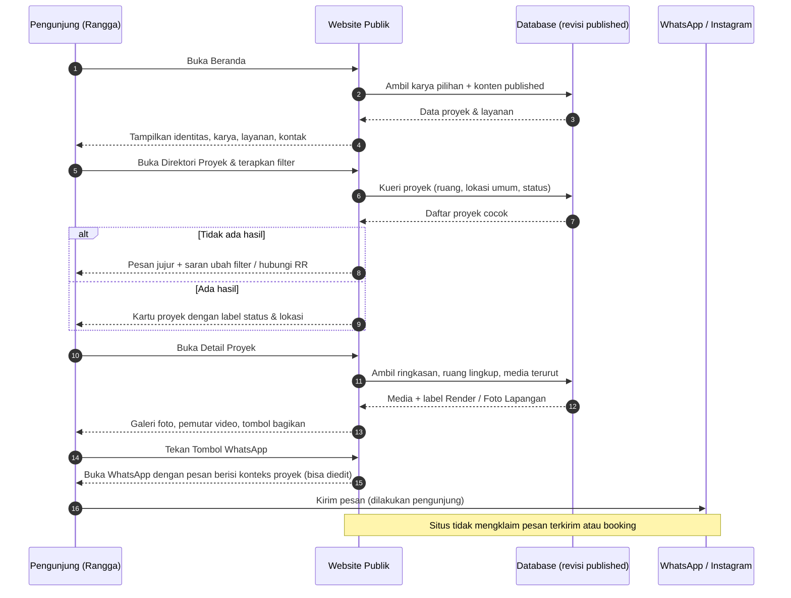
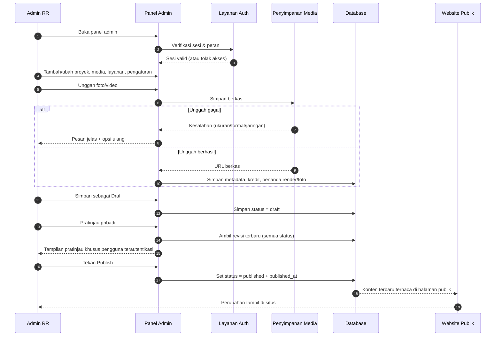
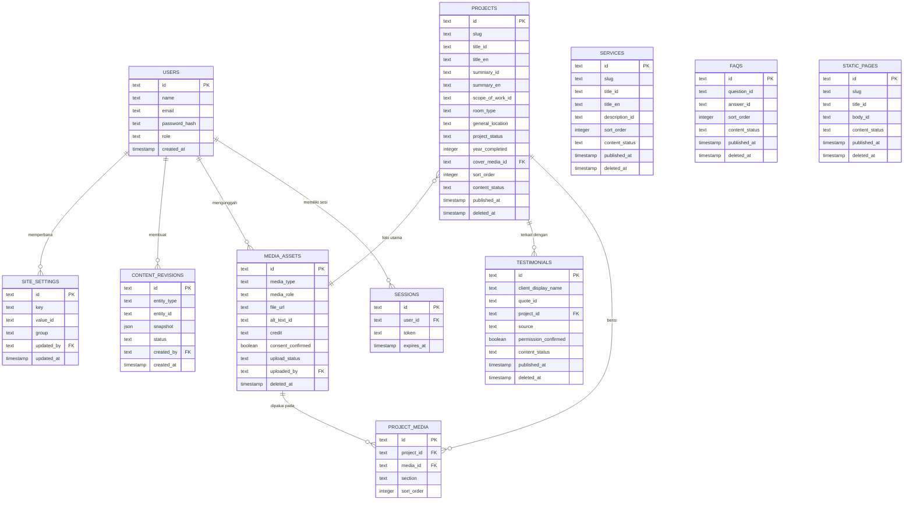

# PRD — Project Requirements Document

## 1. Overview

**Latar Belakang & Masalah**

Calon pelanggan RR (misalnya Rangga, yang sedang merencanakan renovasi rumah) menemukan RR lewat Instagram, tertarik pada tampilannya, tetapi tidak menemukan jawaban cepat atas pertanyaan dasar: apakah gambar yang dilihat itu foto hasil pekerjaan atau render desain, bagian mana yang dikerjakan RR, apakah proyeknya sudah selesai, dan layanan apa saja yang tersedia. Ia harus membuka unggahan satu per satu, membaca caption, menyimpan screenshot, lalu menghubungi WhatsApp untuk bertanya hal-hal dasar. Screenshot mudah kehilangan konteks dan memakan waktu.

**Tujuan Utama**

1. Menjadi satu tempat terpercaya untuk melihat bukti pekerjaan RR: proyek, ruang lingkup, foto lapangan, dan video — dibedakan jelas dari visualisasi render.
2. Menjelaskan layanan yang sudah dikonfirmasi RR dan langkah konsultasi, tanpa membuat persiapan awal terasa rumit.
3. Menghubungkan pengunjung ke WhatsApp dengan pesan yang sudah berisi konteks proyek, sehingga percakapan dimulai lebih jelas.
4. Memberi tim RR panel admin agar bisa mengelola proyek, media, layanan, dan teks situs sendiri tanpa menulis kode, dengan alur draf → pratinjau pribadi → publish.

**Prinsip Non-Negosiasi**

- Tidak mengarang pekerjaan selesai, klien, ulasan, metrik, harga, atau jaminan.
- Media harus disetujui dan punya atribusi; render diberi label terpisah dari dokumentasi lapangan.
- Data yang belum pasti tetap berstatus **Draf** dan tidak muncul di halaman publik.
- WhatsApp hanya **membuka percakapan** dengan pesan yang bisa diedit pengunjung — situs tidak pernah mengklaim pengiriman terkirim atau pemesanan/booking.

**Sukses seperti apa yang diharapkan**

Pengunjung menemukan proyek relevan dalam beberapa menit, memahami layanan dan prosesnya, lalu menghubungi RR dengan referensi proyek yang jelas. Tim RR dapat memperbarui isi situs secara mandiri dan aman.

---

## 2. Requirements

### 2.1 Konfirmasi Sebelum Implementasi (Wajib)

Beberapa hal berikut **harus dikonfirmasi ke RR sebelum implementasi dimulai**:

1. **Bahasa publik situs** — satu bahasa utama (Indonesia) atau bilingual ID/EN. Bilingual bersifat *kondisional*; jika disetujui, berlaku untuk proyek, layanan, halaman statis, dan pengaturan situs.
2. **Identitas & logo resmi** — logo RR (versi terang & gelap), nama entitas yang ditampilkan, dan penulisan nama yang benar.
3. **Cakupan CMS** — entitas apa saja yang boleh dikelola dari panel admin, dan siapa yang berwenang menyetujui publikasi (*approval roles* bersifat kondisional: satu peran admin, atau pemisah editor/penyetuju jika disetujui).
4. **Formulir opsional** — apabila form kontak/newsletter tidak disetujui, situs hanya memakai tautan WhatsApp dan Instagram.
5. **Arsitektur final** — merujuk pada `final architechtrure.md` sebagai acuan otoritatif; bila isinya sudah final, PRD ini mengikuti dan tidak menyimpang.

### 2.2 Persyaratan Fungsional

- Situs publik dengan halaman: Beranda, Direktori Proyek, Detail Proyek, Galeri Foto/Video, Layanan & Proses, Tentang RR, Kebijakan Privasi, dan Halaman Tidak Ditemukan.
- Pencarian & penyaringan proyek (jenis ruang, lokasi umum, jenis pekerjaan, status).
- Label status proyek (Selesai / Berjalan) dan lokasi umum (tanpa alamat detail yang sensitif).
- Penanda eksplisit **Render** vs **Foto Lapangan** pada setiap media.
- Tombol WhatsApp dengan pesan siap edit berisi konteks proyek + cadangan salin nomor bila tautan gagal.
- Nomor WhatsApp **08568122119** dan tautan Instagram resmi ditampilkan sebagai kanal resmi.
- Testimoni & FAQ hanya tampil bila kontennya resmi, terverifikasi, dan diizinkan.
- Mode tampilan: **Default**, **Terang**, dan **Gelap**, dengan override manual yang tersimpan (persisten) di perangkat pengunjung.
- Bagikan tautan proyek (salin tautan / bagikan bawaan perangkat).
- Panel admin: autentikasi, CRUD proyek, media, layanan, dan pengaturan; draf, pratinjau pribadi, publish eksplisit, Trash dengan pemulihan yang aman terhadap dependensi; penanganan kegagalan unggah.

### 2.3 Persyaratan Non-Fungsional

- **Responsif & aksesibel:** nyaman di ponsel, dapat dipakai sepenuhnya dengan papan ketik, kontras teks memadai di mode terang maupun gelap, teks alternatif pada semua media.
- **Kinerja:** gambar dioptimalkan (ukuran responsif, lazy-load); video tidak di-autoplay dengan suara.
- **Desain:** seksi bisnis bernuansa editorial yang bersih dan premium (grid longgar, spasi jelas, gerak tertahan); galeri proyek bernuansa sinematik. Hindari grid template generik, efek glow dekoratif, dan audio otomatis.
- **Keamanan & privasi:** halaman publik hanya membaca revisi yang sudah dipublikasikan; pratinjau pribadi hanya untuk pengguna terautentikasi; data pribadi pengunjung dilindungi dan dijelaskan di Kebijakan Privasi.
- **Keterlacakan konten:** setiap media menyimpan atribusi/kredit dan status persetujuan.
- **Tidak ada klaim berlebih:** tidak ada harga, jaminan, jumlah proyek, atau rating yang tidak memiliki sumber resmi.

### 2.4 Di Luar Cakupan (untuk versi ini)

- Pemesanan/booking langsung, pembayaran, kalkulator harga, atau janji jadwal.
- Blog/berita, halaman harga, dan sistem ulasan publik yang dibuat pengunjung.
- Integrasi CRM atau otomatisasi pesan WhatsApp.

### 2.5 Definisi Selesai (Definition of Done)

- Semua fitur Fase 1–4 berfungsi di lingkungan staging; hasil Fase 5 terdokumentasi beserta daftar kendala.
- **Tidak ada deployment ke produksi tanpa persetujuan RR.**

---

## 3. Core Features

Fitur di bawah ini disusun mengikuti kerangka roadmap yang sudah disepakati. Nama fitur tidak diubah; penjelasan ditambahkan sebagai detail.

### Fase 1 — Halaman Utama
- **Halaman Utama** — Layar pertama yang langsung memperlihatkan identitas RR dan contoh karya terbaiknya.
  - **Identitas & Sambutan** — Nama, logo, dan kesan premium RR di layar paling atas (di atas lipatan).
  - **Karya Pilihan** — Beberapa proyek terbaik dengan tautan langsung ke halaman detail.
  - **Layanan & Proses Singkat** — Ringkasan layanan yang sudah dikonfirmasi RR dan gambaran alur kerjanya.
  - **Sorotan Tentang & Kontak** — Penutup halaman: penjelasan singkat tentang RR dan ajakan menghubungi (WhatsApp/Instagram).

### Fase 2 — Penjelajahan Karya & Layanan
- **Direktori Proyek** — Tempat pengunjung menjelajah semua proyek RR dan memilih yang paling relevan.
  - **Daftar Semua Proyek** — Seluruh proyek dalam bentuk kartu berisi foto utama dan judul.
  - **Cari & Saring** — Penyaringan berdasarkan jenis ruang, lokasi umum, atau jenis pekerjaan.
  - **Label Status & Lokasi** — Penanda proyek selesai atau masih berjalan beserta lokasi umumnya.
  - **Hasil Kosong yang Jujur** — Pesan jelas dan saran tindakan saat tidak ada proyek yang cocok.
- **Detail Proyek & Galeri Media** — Membuat pengunjung yakin dengan memperlihatkan pekerjaan RR dan bukti lapangannya.
  - **Ringkasan & Ruang Lingkup** — Penjelasan bagian mana yang dikerjakan RR pada proyek tersebut.
  - **Galeri Foto** — Melihat foto proyek secara lebar dan bisa diperbesar dengan mudah.
  - **Pemutar Video** — Menonton video proyek, tidak berjalan sendiri, dan tanpa suara otomatis.
  - **Penanda Render vs Foto Lapangan** — Membedakan visualisasi desain dari foto hasil pekerjaan secara jelas.
  - **Bagikan Tautan Proyek** — Memudahkan pengunjung mengirim tautan proyek ke keluarga atau pasangan.
- **Layanan & Proses Konsultasi** — Menjelaskan layanan RR dan langkah berikutnya tanpa membuat persiapan awal terasa rumit.
  - **Daftar Layanan** — Layanan yang sudah dikonfirmasi RR beserta penjelasan singkatnya.
  - **Alur Konsultasi** — Urutan langkah dari menghubungi RR sampai pembahasan kebutuhan.
  - **Persiapan Awal** — Menegaskan pengunjung boleh mulai tanpa ukuran, anggaran, atau desain final.
  - **Testimoni & Tanya Jawab Resmi** — Hanya tampil bila sudah diizinkan dan terverifikasi; jika belum ada, bagian ini disembunyikan (bukan diisi contoh).

### Fase 3 — Kontak & Halaman Pendukung
- **Kontak WhatsApp & Instagram** — Membuka percakapan dengan RR secara cepat lengkap dengan konteks proyek yang diminati.
  - **Tombol WhatsApp** — Sekali sentuh membuka aplikasi WhatsApp menuju nomor RR.
  - **Pesan Siap Edit dengan Konteks** — Pesan terisi rujukan proyek dan tetap bisa diubah sebelum dikirim pengunjung; situs tidak mengirim atas nama pengunjung.
  - **Nomor & Tautan Resmi** — Menampilkan nomor **08568122119** dan tautan Instagram resmi `instagram.com/rrinterior.construction`.
  - **Cadangan Bila Tautan Gagal** — Cara menyalin nomor bila tombol WhatsApp tidak bisa dibuka.
- **Halaman Pendukung & Tema** — Halaman pelengkap yang menjaga kepercayaan pengunjung dan kenyamanan membaca.
  - **Tentang RR** — Siapa RR, cara kerja, dan pengalamannya.
  - **Kebijakan Privasi** — Data pengunjung yang dikumpulkan dan bagaimana dijaga.
  - **Halaman Tidak Ditemukan** — Membantu pengunjung kembali ke jalur saat alamat salah atau halaman hilang.
  - **Mode Terang & Gelap** — Pilihan tampilan Default/Terang/Gelap yang tersimpan sesuai kenyamanan pengunjung.

### Fase 4 — Panel Admin & Publikasi
- **Panel Admin & Publikasi** — Tempat tim RR mengelola isi website sendiri tanpa bantuan teknis.
  - **Masuk Aman** — Hanya tim RR yang bisa membuka panel pengelolaan (peran akses mengikuti kebijakan yang disetujui).
  - **Kelola Proyek** — Menambah, mengubah, dan menghapus proyek tanpa menulis kode.
  - **Kelola Media & Unggahan** — Mengunggah foto atau video, mengatur urutannya, menandai render/foto lapangan, dan menangani kegagalan unggah dengan pesan yang jelas.
  - **Kelola Layanan & Pengaturan** — Mengubah daftar layanan, kontak, dan teks situs.
  - **Draf, Pratinjau & Publish** — Menyimpan draf, melihat pratinjau pribadi, mempublikasikan secara sengaja, serta memulihkan item dari tempat sampah secara aman terhadap dependensi.

### Fase 5 — Pengujian & Kesiapan Rilis
- **Pengujian & Kesiapan Rilis** — Memastikan website nyaman dipakai semua orang sebelum dipublikasikan.
  - **Uji Ponsel & Papan Ketik** — Memastikan halaman nyaman dipakai di ponsel maupun tanpa tetikus.
  - **Uji Kontras & Tema** — Memastikan teks mudah dibaca di mode terang maupun gelap.
  - **Uji Tautan Kontak & Publikasi** — Memastikan tombol kontak berfungsi dan perubahan dari panel admin langsung tampil.
  - **Laporan Hasil & Kendala** — Merangkum temuan dan hambatan sebelum meminta persetujuan publikasi.

### Panduan Desain yang Mengikat (lintas fitur)

- Warna brand: **#70360A** dan **#FFFCEF**.
- **Seksi bisnis (terang):** editorial, bersih, premium — latar `#FFFCEF`, permukaan `#FFFFFF`, teks `#261B13`.
- **Galeri portofolio (gelap):** sinematik, fokus galeri — latar `#130F0B`, permukaan `#1D1712`, teks `#FFFCEF`.
- **Tombol CTA:** mode terang = isian cokelat dengan teks krem; mode gelap = isian krem dengan teks cokelat.
- Hindari grid template generik, glow dekoratif, dan autoplay audio. Semua token visual mengikuti lampiran yang disetujui.

---

## 4. User Flow

### 4.1 Perjalanan Pengunjung (Rangga)

1. **Masuk ke Beranda** — Melihat identitas RR, sambutan singkat, dan karya pilihan dalam beberapa detik pertama.
2. **Menjelajah Direktori Proyek** — Membuka daftar semua proyek, lalu menyaring berdasarkan jenis ruang (mis. kamar, dapur), lokasi umum, atau jenis pekerjaan.
3. **Membuka Detail Proyek** — Membaca ringkasan dan ruang lingkup, melihat galeri foto, menonton video, dan memeriksa label **Render** atau **Foto Lapangan** pada tiap media.
4. **Membagikan Tautan** — Menyalin atau membagikan tautan proyek ke pasangan/keluarga untuk didiskusikan.
5. **Memahami Layanan & Proses** — Membuka halaman Layanan untuk melihat daftar layanan, alur konsultasi, dan penjelasan bahwa ia boleh mulai tanpa ukuran, anggaran, atau desain final.
6. **Membaca Tentang RR** — Menilai pengalaman dan cara kerja RR.
7. **Menghubungi RR** — Menekan tombol WhatsApp; aplikasi terbuka dengan pesan yang sudah memuat referensi proyek, dan Rangga dapat mengeditnya sebelum mengirim. Bila tombol gagal terbuka, ia menyalin nomor **08568122119** atau membuka Instagram resmi.
8. **Jika tersesat** — Halaman Tidak Ditemukan mengarahkannya kembali ke Direktori Proyek atau Beranda.
9. **Jika pencarian kosong** — Pesan hasil kosong yang jujur memberi saran: ubah filter atau hubungi RR langsung.

### 4.2 Perjalanan Tim RR di Panel Admin

1. **Masuk** ke panel admin dengan akun resmi.
2. **Menambah/mengubah data** — Proyek, media, layanan, atau pengaturan situs.
3. **Menyimpan sebagai Draf** — Perubahan belum tampil di publik.
4. **Pratinjau pribadi** — Melihat hasilnya seperti tampilan publik, hanya untuk pengguna yang sudah masuk.
5. **Publish eksplisit** — Menekan Publish; data yang belum pasti tetap dibiarkan berstatus Draf.
6. **Menghapus dengan aman** — Item masuk ke Trash; sistem memperingatkan bila masih dipakai di tempat lain; item dapat dipulihkan.
7. **Menangani kegagalan unggah** — Pesan kesalahan jelas dan aksi ulangi tersedia; tidak ada media setengah jadi yang tampil di publik.

---

## 5. Architecture

**Gambaran Sistem**

- **Situs publik** (Next.js) melayani halaman beranda, direktori, detail proyek, layanan, tentang, privasi, dan 404. Hanya membaca konten dengan status **published**.
- **Panel admin** berada dalam aplikasi yang sama namun berada di balik autentikasi. Menulis ke basis data melalui API internal.
- **Lapisan data** (Drizzle ORM) menyimpan proyek, media, layanan, testimoni, FAQ, halaman statis, dan pengaturan situs, lengkap dengan status draf/publish/trash.
- **Penyimpanan berkas** menampung foto dan video; basis data hanya menyimpan metadata, atribusi, dan penanda render/foto lapangan.
- **Kanal eksternal:** tautan WhatsApp (`wa.me`) dan Instagram dibuka dari sisi pengunjung; tidak ada pengiriman pesan otomatis dari server.
- **Tema & token** dikelola sebagai variabel desain global (Default/Terang/Gelap) dengan penyimpanan preferensi di perangkat pengunjung.

### Diagram Alur Pengunjung (sequence)

### Diagram Publikasi Admin (sequence)

---

## 6. Database Schema

Catatan umum: setiap entitas konten memiliki `content_status` (`draft` / `published` / `trashed`), `published_at`, `created_at`, `updated_at`, dan `deleted_at`. Halaman publik hanya membaca `content_status = published`. Field teks yang berpasangan (`_id` / `_en`) hanya diaktifkan bila **bilingual disetujui**; jika tidak, gunakan field bahasa utama saja.

**1. users** — akun tim RR yang boleh masuk ke panel admin.
- `id` (text, PK)
- `name` (text) — nama pengguna
- `email` (text, unik) — identitas masuk
- `password_hash` (text) — kata sandi terenkripsi
- `role` (text) — `admin` / `editor` / `approver` (mengikuti kebijakan persetujuan)
- `created_at`, `updated_at` (timestamp)

**2. sessions** — sesi login aktif.
- `id` (text, PK)
- `user_id` (text, FK → users.id)
- `token` (text) — token sesi
- `expires_at` (timestamp) — masa berlaku
- `created_at` (timestamp)

**3. projects** — data proyek/portofolio RR.
- `id` (text, PK)
- `slug` (text, unik) — alamat tautan halaman detail
- `title_id`, `title_en` (text) — judul proyek
- `summary_id`, `summary_en` (text) — ringkasan singkat
- `scope_of_work_id`, `scope_of_work_en` (text) — bagian yang dikerjakan RR
- `room_type` (text) — jenis ruang (untuk filter)
- `general_location` (text) — lokasi umum saja, bukan alamat detail
- `project_status` (text) — `selesai` / `berjalan`
- `year_completed` (integer, opsional) — tahun, hanya bila terkonfirmasi
- `cover_media_id` (text, FK → media_assets.id) — foto utama kartu
- `sort_order` (integer) — urutan tampil
- `content_status`, `published_at`, `created_at`, `updated_at`, `deleted_at`

**4. media_assets** — pustaka berkas foto/video beserta atribusinya.
- `id` (text, PK)
- `media_type` (text) — `foto` / `video`
- `media_role` (text) — `render` / `foto_lapangan`
- `file_url` (text) — lokasi berkas
- `thumbnail_url` (text, opsional) — pratinjau video
- `alt_text_id`, `alt_text_en` (text) — deskripsi untuk aksesibilitas
- `caption_id`, `caption_en` (text, opsional)
- `credit` (text) — atribusi/sumber yang disetujui
- `consent_confirmed` (boolean) — penanda konten boleh dipublikasikan
- `mime_type`, `file_size` (text/integer)
- `upload_status` (text) — `sukses` / `gagal` / `diproses`
- `uploaded_by` (text, FK → users.id)
- `created_at`, `updated_at`, `deleted_at`

**5. project_media** — penghubung proyek dan media beserta urutannya.
- `id` (text, PK)
- `project_id` (text, FK → projects.id)
- `media_id` (text, FK → media_assets.id)
- `section` (text) — `sebelum` / `sesudah` / `galeri` (bila tersedia)
- `sort_order` (integer) — urutan tampil di galeri
- `created_at` (timestamp)

**6. services** — daftar layanan yang sudah dikonfirmasi RR.
- `id` (text, PK)
- `slug` (text, unik)
- `title_id`, `title_en` (text)
- `description_id`, `description_en` (text)
- `sort_order` (integer)
- `content_status`, `published_at`, `created_at`, `updated_at`, `deleted_at`

**7. testimonials** — testimoni resmi, hanya bila diizinkan.
- `id` (text, PK)
- `client_display_name` (text) — nama yang boleh ditampilkan
- `quote_id`, `quote_en` (text)
- `project_id` (text, FK → projects.id, opsional)
- `source` (text) — asal testimoni (mis. kanal resmi)
- `permission_confirmed` (boolean) — wajib `true` untuk tampil
- `content_status`, `published_at`, `created_at`, `updated_at`, `deleted_at`

**8. faqs** — pertanyaan umum resmi.
- `id` (text, PK)
- `question_id`, `question_en` (text)
- `answer_id`, `answer_en` (text)
- `sort_order` (integer)
- `content_status`, `published_at`, `created_at`, `updated_at`, `deleted_at`

**9. static_pages** — halaman teks seperti Tentang RR dan Kebijakan Privasi.
- `id` (text, PK)
- `slug` (text, unik) — `tentang`, `kebijakan-privasi`
- `title_id`, `title_en` (text)
- `body_id`, `body_en` (text) — isi halaman
- `content_status`, `published_at`, `created_at`, `updated_at`, `deleted_at`

**10. site_settings** — pengaturan situs yang bisa diubah tanpa kode.
- `id` (text, PK)
- `key` (text, unik) — mis. `whatsapp_number`, `whatsapp_template`, `instagram_url`, `default_theme`, `public_language`
- `value_id`, `value_en` (text)
- `group` (text) — `kontak` / `tampilan` / `umum`
- `updated_by` (text, FK → users.id)
- `updated_at` (timestamp)

**11. content_revisions** (disarankan) — riwayat revisi agar publikasi aman dan bisa ditelusuri.
- `id` (text, PK)
- `entity_type` (text) — `project` / `media` / `service` / `page` / `settings`
- `entity_id` (text) — id entitas terkait
- `snapshot` (json) — isi pada saat itu
- `status` (text) — `draft` / `published` / `trashed`
- `created_by` (text, FK → users.id)
- `created_at` (timestamp)

### Diagram ER

---

## 7. Tech Stack

Tech stack belum ditentukan pada input, sehingga dipakai rekomendasi default yang sesuai dengan skala proyek ini. Pilihan akhir tetap perlu persetujuan RR.

| Lapisan | Rekomendasi | Alasan |
|---|---|---|
| Frontend | **Next.js (App Router) + TypeScript** | Situs publik dan panel admin dalam satu basis kode; unggul untuk SEO dan kecepatan halaman. |
| Styling & Komponen | **Tailwind CSS + shadcn/ui** | Token warna brand (#70360A, #FFFCEF) mudah dijadikan variabel tema untuk mode Default/Terang/Gelap. |
| Basis Data & ORM | **SQLite + Drizzle ORM** | Ringan untuk memulai, mudah dimigrasikan ke Postgres bila trafik tumbuh; skema terdefinisi jelas dan aman bertipe. |
| Autentikasi | **Better Auth** | Login panel admin, sesi aman, dan dukungan peran (admin/editor/penyetuju bila disetujui). |
| Penyimpanan Media | **Object storage (mis. Cloudflare R2 / Vercel Blob)** | Menyimpan foto & video berukuran besar, mendukung unggahan berlapis dan penanganan kegagalan. |
| Optimasi Media | **next/image + komponen galeri aksesibel** | Gambar responsif, teks alternatif, dan navigasi papan ketik. |
| Deployment | **Vercel (staging dulu, produksi setelah persetujuan)** | Preview per perubahan memudahkan uji Fase 5. **Tidak deploy tanpa approval.** |
| Pengujian | **Uji manual terstruktur + alat audit aksesibilitas** | Menjawab Fase 5: ponsel, papan ketik, kontras, tema, tautan kontak, dan publikasi CMS. |
| Analitik & Privasi | **Minim data (atau tanpa analitik pihak ketiga)** | Menjaga janji Kebijakan Privasi; data yang dikumpulkan sesedikit mungkin. |

**Catatan Implementasi**

- Bilingual (ID/EN) bersifat kondisional: bila tidak disetujui, skema cukup memakai satu set field bahasa utama tanpa mengubah struktur data.
- Formulir opsional (kontak/newsletter) hanya ditambahkan bila disetujui; tanpa itu, kanal resmi adalah WhatsApp dan Instagram.
- Peran persetujuan bersifat kondisional: satu peran admin tunggal cukup untuk versi awal, dan dapat ditingkatkan menjadi editor + penyetuju tanpa perubahan besar pada skema.
- Semua item yang belum pasti tetap berstatus **Draf** hingga dikonfirmasi RR, dan publikasi hanya terjadi lewat aksi **Publish** eksplisit.